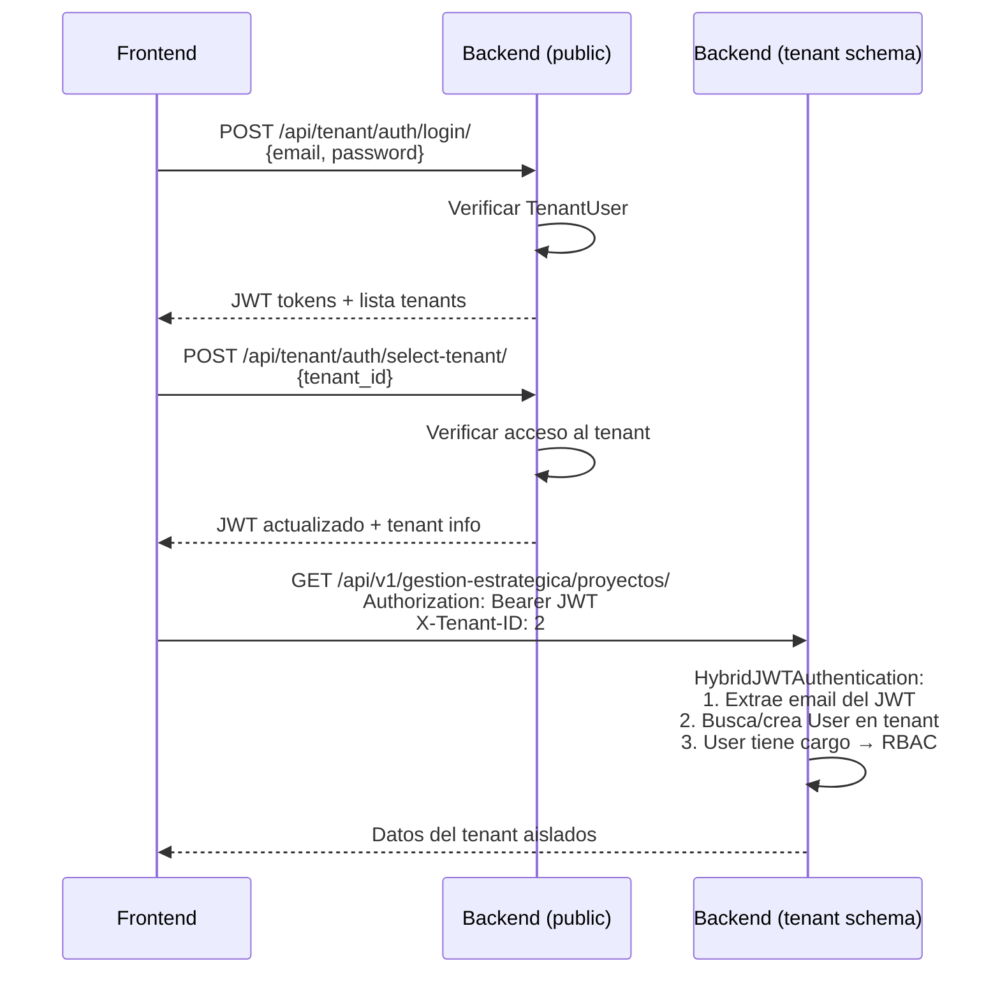
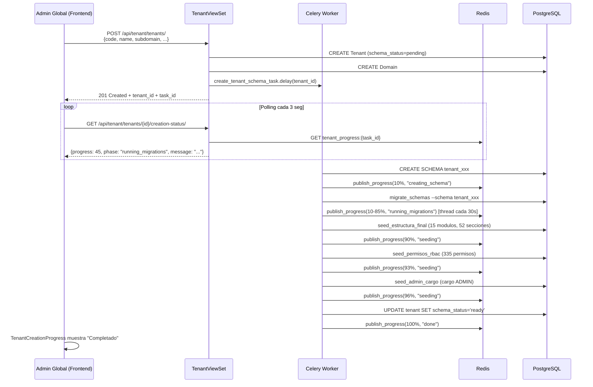

# Multi-Tenant - Arquitectura con django-tenants

> **Version:** 5.0.0 | **Fecha:** 2026-02-06 | **Estado:** Actualizado post-intervencion Fases 0-5

## 1. Overview

StrateKaz usa **django-tenants** con **PostgreSQL schemas** para aislamiento multi-tenant. Cada empresa (tenant) opera en su propio schema, garantizando aislamiento total de datos.

```
PostgreSQL Database: stratekaz
├── Schema: public              → Tenant, Plan, Domain, TenantUser (compartidos)
├── Schema: tenant_empresa_abc  → ~612 tablas de negocio (Empresa A)
├── Schema: tenant_empresa_xyz  → ~612 tablas de negocio (Empresa B)
└── Schema: tenant_nueva_co     → ~612 tablas de negocio (Empresa C)
```

**Caracteristicas clave:**
- Aislamiento total de datos por schema PostgreSQL
- Creacion asincrona de schemas via Celery (~15-25 min)
- Progreso en tiempo real via Redis pub/sub
- Seeds automaticos: modulos, permisos, cargo admin
- Branding per-tenant centralizado en modelo Tenant (schema public)
- Sistema dual de autenticacion (TenantUser global + User por tenant)

---

## 2. Modelos del Schema Public

### 2.1 Plan

Define niveles de suscripcion con limites y modulos habilitados.

| Campo | Tipo | Descripcion |
|-------|------|-------------|
| `code` | CharField(20) unique | Codigo unico (basic, pro, enterprise) |
| `name` | CharField(100) | Nombre del plan |
| `description` | TextField | Descripcion |
| `max_users` | PositiveIntegerField | Maximo usuarios (0=ilimitado) |
| `max_storage_gb` | PositiveIntegerField | Almacenamiento maximo en GB |
| `price_monthly` | DecimalField(10,2) | Precio mensual USD |
| `price_yearly` | DecimalField(10,2) | Precio anual USD |
| `features` | JSONField | Lista de codigos de modulos habilitados |
| `is_active` | BooleanField | Si el plan esta disponible |
| `is_default` | BooleanField | Plan asignado a nuevos tenants |

**Tabla:** `tenant_plan`

### 2.2 Tenant

Modelo principal. Hereda de `TenantMixin` (django-tenants). Contiene toda la configuracion de la empresa incluyendo datos fiscales, contacto, branding y PWA.

**IMPORTANTE:** `auto_create_schema = False` - La creacion del schema se maneja via Celery task de forma asincrona.

#### Campos de Identificacion

| Campo | Tipo | Descripcion |
|-------|------|-------------|
| `schema_name` | (TenantMixin) | Nombre del schema PostgreSQL (`tenant_{code}`) |
| `code` | CharField(50) unique | Codigo interno, genera el schema_name |
| `name` | CharField(200) | Nombre legal de la empresa |
| `nit` | CharField(20) | NIT (Colombia) |

#### Campos de Plan y Limites

| Campo | Tipo | Descripcion |
|-------|------|-------------|
| `plan` | FK(Plan) nullable | Plan de suscripcion asignado |
| `max_users` | PositiveIntegerField | Override de max_users del plan (0=usar plan) |
| `max_storage_gb` | PositiveIntegerField | Override de storage del plan |
| `enabled_modules` | JSONField | Override de modulos del plan |
| `tier` | CharField(20) | Tamano: starter, small, medium, large, enterprise |

#### Campos de Estado

| Campo | Tipo | Descripcion |
|-------|------|-------------|
| `is_active` | BooleanField | Si la empresa esta activa |
| `is_trial` | BooleanField | En periodo de prueba |
| `trial_ends_at` | DateTimeField nullable | Fin del trial |
| `subscription_ends_at` | DateTimeField nullable | Fin de suscripcion |
| `schema_status` | CharField(20) | pending, creating, ready, failed |
| `schema_task_id` | CharField(50) | ID de la tarea Celery de creacion |
| `schema_error` | TextField | Mensaje de error si fallo la creacion |

#### Campos de Datos Fiscales (migrados de EmpresaConfig)

| Campo | Tipo | Descripcion |
|-------|------|-------------|
| `razon_social` | CharField(250) | Nombre legal completo |
| `nombre_comercial` | CharField(200) | Nombre de fantasia |
| `representante_legal` | CharField(200) | Nombre del representante |
| `cedula_representante` | CharField(20) | Cedula del representante |
| `tipo_sociedad` | CharField(30) | SAS, SA, LTDA, ESAL, etc. |
| `actividad_economica` | CharField(10) | Codigo CIIU |
| `regimen_tributario` | CharField(30) | COMUN, SIMPLE, NO_RESPONSABLE, etc. |

#### Campos de Contacto

| Campo | Tipo | Descripcion |
|-------|------|-------------|
| `direccion_fiscal` | TextField | Direccion fiscal |
| `ciudad` | CharField(100) | Ciudad |
| `departamento` | CharField(50) | Departamento (32 de Colombia) |
| `pais` | CharField(100) | Pais (default: Colombia) |
| `telefono_principal` | CharField(20) | Telefono |
| `email_corporativo` | EmailField | Email oficial |
| `sitio_web` | URLField | Sitio web |

#### Campos de Registro Mercantil

| Campo | Tipo | Descripcion |
|-------|------|-------------|
| `matricula_mercantil` | CharField(50) | Numero de matricula |
| `camara_comercio` | CharField(100) | Camara de comercio |
| `fecha_constitucion` | DateField nullable | Fecha de constitucion |

#### Campos de Configuracion Regional

| Campo | Tipo | Default | Descripcion |
|-------|------|---------|-------------|
| `zona_horaria` | CharField(50) | America/Bogota | Zona horaria |
| `formato_fecha` | CharField(20) | DD/MM/YYYY | Formato de fecha |
| `moneda` | CharField(3) | COP | Moneda |
| `simbolo_moneda` | CharField(5) | $ | Simbolo |
| `separador_miles` | CharField(1) | . | Separador de miles |
| `separador_decimales` | CharField(1) | , | Separador decimal |

#### Campos de Branding (migrados de BrandingConfig)

| Campo | Tipo | Default | Descripcion |
|-------|------|---------|-------------|
| `company_slogan` | CharField(200) | | Slogan |
| `logo` | ImageField | | Logo principal |
| `logo_white` | ImageField | | Logo para fondos oscuros |
| `logo_dark` | ImageField | | Logo modo oscuro |
| `favicon` | ImageField | | Favicon |
| `login_background` | ImageField | | Fondo de login |
| `primary_color` | CharField(7) | #ec268f | Color primario (Rosa StrateKaz) |
| `secondary_color` | CharField(7) | #000000 | Color secundario |
| `accent_color` | CharField(7) | #f4ec25 | Color de acento |
| `sidebar_color` | CharField(7) | #1E293B | Color del sidebar |
| `background_color` | CharField(7) | #F5F5F5 | Color de fondo |
| `gradient_mission` | CharField(100) | | Gradiente para mision |
| `gradient_vision` | CharField(100) | | Gradiente para vision |
| `gradient_policy` | CharField(100) | | Gradiente para politica |
| `gradient_values` | JSONField | [] | Gradientes para valores |

#### Campos de PWA

| Campo | Tipo | Descripcion |
|-------|------|-------------|
| `pwa_name` | CharField(200) | Nombre de la PWA |
| `pwa_short_name` | CharField(50) | Nombre corto |
| `pwa_theme_color` | CharField(7) | Color del tema |
| `pwa_background_color` | CharField(7) | Color de fondo |
| `pwa_icon_192` | ImageField | Icono 192x192 |
| `pwa_icon_512` | ImageField | Icono 512x512 |
| `pwa_icon_maskable` | ImageField | Icono maskable |

#### Propiedades Computadas

| Propiedad | Descripcion |
|-----------|-------------|
| `effective_max_users` | max_users del tenant o del plan |
| `effective_modules` | enabled_modules del tenant o features del plan |
| `is_subscription_valid` | Verifica vigencia del trial/suscripcion |
| `primary_domain` | Dominio principal (de tabla Domain) |
| `display_name` | nombre_comercial o name |
| `logo_effective` | logo.url o logo_url (legacy) |
| `get_branding_dict()` | Diccionario completo de branding |

**Tabla:** `tenant_tenant`

### 2.3 Domain

Dominio asociado a un tenant. Hereda de `DomainMixin` (django-tenants).

| Campo | Tipo | Descripcion |
|-------|------|-------------|
| `domain` | (DomainMixin) | Nombre del dominio |
| `tenant` | FK(Tenant) | Tenant al que pertenece |
| `is_primary` | (DomainMixin) | Si es el dominio principal |
| `ssl_enabled` | BooleanField | SSL habilitado |
| `is_active` | BooleanField | Activo |

**Tabla:** `tenant_domain`

### 2.4 TenantUser

Usuario global del sistema. Puede acceder a multiples tenants. Vive en schema public.

| Campo | Tipo | Descripcion |
|-------|------|-------------|
| `email` | EmailField unique | Email (identidad principal) |
| `password` | CharField(128) | Hash de contrasena |
| `first_name` | CharField(150) | Nombre |
| `last_name` | CharField(150) | Apellido |
| `is_active` | BooleanField | Activo |
| `is_superadmin` | BooleanField | Acceso total a todos los tenants |
| `last_login` | DateTimeField nullable | Ultimo login |
| `last_tenant` | FK(Tenant) nullable | Ultimo tenant accedido |
| `tenants` | M2M(Tenant) through TenantUserAccess | Tenants accesibles |

**Tabla:** `tenant_tenantuser`

### 2.5 TenantUserAccess

Tabla intermedia M:N entre TenantUser y Tenant.

| Campo | Tipo | Descripcion |
|-------|------|-------------|
| `tenant_user` | FK(TenantUser) | Usuario global |
| `tenant` | FK(Tenant) | Tenant al que tiene acceso |
| `is_active` | BooleanField | Acceso activo |
| `granted_at` | DateTimeField | Fecha de asignacion |

> **NOTA:** El campo `role` esta **DEPRECATED**. Los permisos reales se manejan via `User.cargo` dentro del schema de cada tenant usando el sistema RBAC de 4 capas. Ver [RBAC-SYSTEM.md](./RBAC-SYSTEM.md).

**Tabla:** `tenant_tenantuseraccess`

---

## 3. Middleware y Deteccion de Tenant

### Pipeline de Middleware

```python
MIDDLEWARE = [
    'django_tenants.middleware.main.TenantMainMiddleware',    # 1. Detecta por dominio
    'apps.tenant.middleware.TenantAuthenticationMiddleware',   # 2. Detecta por X-Tenant-ID
    # ... resto de middleware
]
```

### Prioridad de Deteccion

1. **Dominio/Subdominio** (TenantMainMiddleware): `empresa.stratekaz.com` → busca en tabla Domain
2. **Header X-Tenant-ID** (TenantAuthenticationMiddleware): Para desarrollo y apps moviles
3. **Claim JWT tenant_id** (TenantJWTAuthenticationMiddleware): Extraido del token JWT

### Rutas Publicas (siempre schema public)

```
/api/auth/*           → Login general
/api/tenant/auth/*    → Auth multi-tenant
/api/tenant/public/*  → Datos publicos de tenants
/api/tenant/plans/*   → Planes disponibles
/api/health/*         → Health check
/api/docs/*           → Documentacion API (protegida con login)
/admin/*              → Django Admin
```

### Flujo de Request

```
Request entrante
  │
  ├─ TenantMainMiddleware
  │   └─ Detecta tenant por dominio → SET search_path = tenant_xxx, public
  │
  ├─ TenantAuthenticationMiddleware
  │   └─ Si hay X-Tenant-ID header → connection.set_tenant(tenant)
  │
  ├─ View/ViewSet
  │   └─ Procesa request con datos aislados del tenant
  │
  └─ Response
```

---

## 4. Sistema Dual de Autenticacion

StrateKaz tiene dos sistemas de autenticacion que trabajan juntos:

### 4.1 TenantUser → JWT (Login Global)

```
POST /api/tenant/auth/login/
{ "email": "user@empresa.com", "password": "***" }

→ Verifica contra TenantUser (schema public)
→ Retorna JWT con claims: user_id, tenant_user_id, email, is_superadmin
→ Retorna lista de tenants accesibles
→ Frontend selecciona tenant → POST /api/tenant/auth/select-tenant/
```

### 4.2 HybridJWTAuthentication (Dentro del Tenant)

Una vez seleccionado el tenant, las requests van con header `X-Tenant-ID`. El `HybridJWTAuthentication` hace lo siguiente:

```
Request con JWT + X-Tenant-ID
  │
  ├─ Extrae email del JWT claim
  ├─ Busca User en schema del tenant por email
  │
  ├─ Si User NO existe:
  │   ├─ Crea User automaticamente
  │   ├─ Copia first_name, last_name desde TenantUser
  │   └─ Asigna cargo ADMIN si corresponde
  │
  └─ Retorna User del tenant (con cargo, permisos RBAC, etc.)
```

**Clases de autenticacion:**

| Clase | Archivo | Uso |
|-------|---------|-----|
| `TenantJWTAuthentication` | authentication.py | Endpoints globales (TenantUser) |
| `HybridJWTAuthentication` | authentication.py | Endpoints de negocio (User del tenant) |
| `TenantUserBackend` | authentication.py | Backend Django para TenantUser |

### 4.3 Diagrama de Flujo Completo



---

## 5. Creacion Asincrona de Tenants

### 5.1 Flujo de Creacion

Crear un tenant con ~612 tablas toma ~15-25 minutos. Se hace de forma asincrona con Celery:



### 5.2 Fases de Creacion

| Fase | Progreso | Descripcion |
|------|----------|-------------|
| `queued` | 0% | En cola de Celery |
| `initializing` | 5% | Preparando creacion |
| `creating_schema` | 10% | CREATE SCHEMA en PostgreSQL |
| `running_migrations` | 10-85% | migrate_schemas (~612 tablas, 15-25 min) |
| `seeding` | 85-96% | Seeds: estructura, permisos, cargo admin |
| `finalizing` | 96-99% | Actualizando estado del tenant |
| `done` | 100% | Completado exitosamente |
| `error` | Variable | Fallo - ver schema_error |

### 5.3 Manejo de Errores y Recovery

**Problemas resueltos:**
- **Conexion PostgreSQL cerrada**: `close_old_connections()` antes de seeds y en error handler
- **Error handler no puede guardar**: Fallback con conexion fresca + reconexion forzada
- **Progreso estancado**: Thread de progreso estimado durante migraciones
- **Tenants huerfanos**: Tarea periodica `cleanup_stale_creating_tenants` (cada hora)
- **Comando de branding eliminado**: Se removio la llamada a `create_default_branding` (el branding vive en campos del modelo Tenant con defaults)

### 5.4 Seeds Automaticos

Al crear un tenant, se ejecutan 3 seeds en orden:

1. **`seed_estructura_final`**: 15 modulos del sistema, ~80 tabs, 52 secciones
2. **`seed_permisos_rbac`**: 335 permisos (can_view, can_create, can_edit, can_delete por seccion)
3. **`seed_admin_cargo`**: Cargo ADMIN con acceso full a todas las secciones

---

## 6. APIs del Sistema Multi-Tenant

### 6.1 Autenticacion

| Endpoint | Metodo | Auth | Descripcion |
|----------|--------|------|-------------|
| `/api/tenant/auth/login/` | POST | No | Login con email/password. Rate limit: 5/min |
| `/api/tenant/auth/refresh/` | POST | No | Renovar access token |
| `/api/tenant/auth/logout/` | POST | JWT | Invalidar refresh token |
| `/api/tenant/auth/me/` | GET | JWT | Info del usuario + tenants accesibles |
| `/api/tenant/auth/select-tenant/` | POST | JWT | Seleccionar tenant activo |

### 6.2 Gestion de Tenants (Superadmin)

| Endpoint | Metodo | Descripcion |
|----------|--------|-------------|
| `/api/tenant/tenants/` | GET | Listar tenants (excluye public) |
| `/api/tenant/tenants/` | POST | Crear tenant + enqueue creacion schema |
| `/api/tenant/tenants/{id}/` | GET | Detalle de tenant |
| `/api/tenant/tenants/{id}/` | PUT/PATCH | Actualizar tenant |
| `/api/tenant/tenants/{id}/` | DELETE | Eliminar tenant |
| `/api/tenant/tenants/{id}/creation-status/` | GET | Estado de creacion asincrona |
| `/api/tenant/tenants/{id}/retry-creation/` | POST | Reintentar creacion fallida |
| `/api/tenant/tenants/stats/` | GET | Estadisticas agregadas |

### 6.3 Gestion de Planes (Superadmin)

| Endpoint | Metodo | Descripcion |
|----------|--------|-------------|
| `/api/tenant/plans/` | GET | Listar planes (todos para superadmin, activos para otros) |
| `/api/tenant/plans/` | POST | Crear plan |
| `/api/tenant/plans/{id}/` | GET | Detalle |
| `/api/tenant/plans/{id}/` | PUT/PATCH | Actualizar |
| `/api/tenant/plans/{id}/` | DELETE | Eliminar |

### 6.4 Gestion de Usuarios Globales (Superadmin)

| Endpoint | Metodo | Descripcion |
|----------|--------|-------------|
| `/api/tenant/users/` | GET | Listar TenantUsers |
| `/api/tenant/users/` | POST | Crear usuario global |
| `/api/tenant/users/{id}/` | GET | Detalle con accesos |
| `/api/tenant/users/{id}/` | PUT/PATCH | Actualizar |
| `/api/tenant/users/{id}/grant-access/` | POST | Asignar acceso a tenant |
| `/api/tenant/users/{id}/revoke-access/` | POST | Revocar acceso |
| `/api/tenant/users/stats/` | GET | Estadisticas |

### 6.5 Endpoints Publicos

| Endpoint | Metodo | Auth | Descripcion |
|----------|--------|------|-------------|
| `/api/tenant/public/` | GET | No | Lista de tenants publicos |
| `/api/tenant/public/by-domain/` | GET | No | Buscar tenant por dominio |

---

## 7. Seguridad

### 7.1 Rate Limiting

```python
REST_FRAMEWORK = {
    'DEFAULT_THROTTLE_RATES': {
        'anon': '30/minute',
        'user': '120/minute',
        'login': '5/minute',   # Proteccion anti-brute-force
    },
}
```

El endpoint de login (`TenantLoginView`) tiene throttle especifico con `ScopedRateThrottle` scope=`login`.

### 7.2 CORS

```python
# development.py - Restringido a origenes conocidos
CORS_ALLOW_ALL_ORIGINS = False
CORS_ALLOWED_ORIGINS = [
    'http://localhost:3010',
    'http://127.0.0.1:3010',
    'http://localhost:5173',
]
```

### 7.3 Info Leak Reducido

La respuesta del login retorna solo campos necesarios del tenant. Se eliminaron de `TenantMinimalSerializer`:
- ~~`schema_name`~~ - Informacion interna
- ~~`db_name`~~ - Informacion interna
- ~~`schema_task_id`~~ - Informacion interna
- ~~`schema_error`~~ - Informacion interna
- ~~`user_count`~~ - Informacion sensible

### 7.4 Headers de Seguridad

```python
SECURE_BROWSER_XSS_FILTER = True
X_FRAME_OPTIONS = 'DENY'
SECURE_CONTENT_TYPE_NOSNIFF = True
```

### 7.5 API Docs Protegidos

Los endpoints `/api/docs/`, `/api/schema/` y `/api/redoc/` requieren `login_required`.

---

## 8. Management Commands

### 8.1 Creacion de Tenants

```bash
# Seeds que se ejecutan automaticamente al crear tenant:
python manage.py seed_estructura_final   # 15 modulos, ~80 tabs, 52 secciones
python manage.py seed_permisos_rbac      # 335 permisos
python manage.py seed_admin_cargo        # Cargo ADMIN con acceso full
```

### 8.2 Mantenimiento

```bash
# Detectar y limpiar schemas huerfanos
python manage.py cleanup_orphan_schemas --dry-run    # Ver sin ejecutar
python manage.py cleanup_orphan_schemas --confirm    # Ejecutar DROP SCHEMA

# Reparar tenants con status incorrecto
python manage.py repair_tenant_status --dry-run      # Ver sin aplicar
python manage.py repair_tenant_status --confirm      # Aplicar correcciones
python manage.py repair_tenant_status --all          # Verificar TODOS los tenants
```

### 8.3 Migraciones

```bash
# Migrar TODOS los schemas
python manage.py migrate_schemas

# Solo schema public
python manage.py migrate_schemas --shared

# Solo schemas de tenants
python manage.py migrate_schemas --tenant

# Un schema especifico
python manage.py migrate_schemas --schema_name=tenant_empresa_abc
```

---

## 9. Docker y Celery

### 9.1 Servicios Requeridos

```yaml
services:
  db:       # PostgreSQL 15 - Una BD, multiples schemas
  redis:    # Redis 7 - Broker Celery + cache progreso
  backend:  # Django + Gunicorn
  celery_worker:   # Worker con queues: celery, tenant_ops
  celery_beat:     # Scheduler para tareas periodicas
```

### 9.2 Configuracion Celery

```python
# Conexiones persistentes para tareas largas (migraciones ~25 min)
DATABASES['default']['CONN_MAX_AGE'] = 600  # 10 minutos

# Tarea periodica para limpieza automatica
CELERY_BEAT_SCHEDULE = {
    'cleanup-stale-creating-tenants': {
        'task': 'apps.tenant.tasks.cleanup_stale_creating_tenants',
        'schedule': 3600.0,  # Cada hora
    },
}
```

### 9.3 Redis Databases

| DB | Uso |
|----|-----|
| 0 | Broker de Celery |
| 1 | Backend de resultados Celery |
| 2 | Cache Django + Progreso de creacion |
| 3 | Sesiones Django |

---

## 10. Consideraciones para Desarrollo

1. **Modelos compartidos** (`SHARED_APPS`): Viven en schema `public`, accesibles desde cualquier tenant
2. **Modelos de tenant** (`TENANT_APPS`): Viven en schema `tenant_xxx`, aislados por empresa
3. **Foreign Keys cross-schema**: NO permitidas. Usar ID de referencia
4. **Queries**: django-tenants configura automaticamente el `search_path` de PostgreSQL
5. **Celery tasks**: Deben usar `schema_context(schema_name)` para ejecutar en el contexto correcto
6. **Branding**: Vive en campos del modelo `Tenant` (schema public), NO en el tenant schema
7. **Permisos**: Se manejan via `User.cargo` dentro del tenant, NO via `TenantUserAccess.role`
8. **Seeds**: Cada tenant nuevo recibe automaticamente: 15 modulos, 335 permisos, 1 cargo ADMIN
9. **Archivos**: Upload paths incluyen `tenants/branding/` para logos, favicons y PWA icons

---

## 11. Archivos del Sistema

| Archivo | Descripcion |
|---------|-------------|
| `backend/apps/tenant/models.py` | Tenant, Plan, Domain, TenantUser, TenantUserAccess |
| `backend/apps/tenant/auth_views.py` | Login, logout, refresh, select-tenant, me |
| `backend/apps/tenant/authentication.py` | TenantJWT, HybridJWT, TenantUserBackend |
| `backend/apps/tenant/views.py` | ViewSets: Tenant, Plan, TenantUser, Domain, Public |
| `backend/apps/tenant/serializers.py` | Serializers con campos reducidos |
| `backend/apps/tenant/middleware.py` | TenantAuth, TenantJWTAuth middleware |
| `backend/apps/tenant/tasks.py` | create_tenant_schema_task, cleanup_stale |
| `backend/apps/tenant/urls.py` | Rutas del sistema multi-tenant |
| `backend/apps/tenant/management/commands/` | cleanup_orphan_schemas, repair_tenant_status |
| `frontend/src/features/admin-global/` | Panel de administracion global |

---

## 12. Changelog

| Version | Fecha | Cambios |
|---------|-------|---------|
| 5.0.0 | 2026-02-06 | Reescritura completa post-intervencion Fases 0-5 |
| 4.0.0 | 2026-02-06 | Documento inicial consolidado |
| 3.8.1 | 2025-01-31 | Migracion a PostgreSQL schemas (django-tenants) |
