# Talent Hub - Documentacion Completa

> **Modulo:** `talent_hub` (Nivel 5 - Habilitadores)
> **Version:** 2.1.0
> **Ultima actualizacion:** 2026-02-07
> **Modelos:** 82 | **Sub-apps:** 11 + api/ + services/ + signals/ + management/
> **Compliance:** Ley 2466/2025 (Reforma Laboral Colombia)

---

## 1. Vision General

Talent Hub gestiona el **ciclo de vida completo del empleado** — desde seleccion hasta retiro — en una arquitectura modular de 11 sub-apps. Inspirado en plataformas como BUK, integra funcionalidades de HCM (Human Capital Management) con compliance regulatorio colombiano.

### Ciclo de Vida del Empleado

```
Estructura de Cargos --> Seleccion/Contratacion --> Onboarding
    |                                                    |
    v                                                    v
Formacion/LMS <-- Colaboradores (registro central) --> Control Tiempo
    |                    |                                |
    v                    v                                v
Desempeno           Novedades                         Nomina
    |              (vacaciones,                          |
    v               licencias)                           v
Proceso                                          Off-boarding
Disciplinario                                   (retiro/liquidacion)
```

### Portales de Autoservicio

| Portal | Audiencia | Endpoints | Descripcion |
|--------|-----------|-----------|-------------|
| Mi Portal (ESS) | Todos los colaboradores | 6 | Perfil, vacaciones, permisos, recibos, capacitaciones, evaluaciones |
| Mi Equipo (MSS) | Jefes de area | 5 | Equipo, aprobaciones, asistencia, evaluaciones |
| People Analytics | RRHH / Gerencia | 1 | KPIs: headcount, rotacion, antiguedad, genero, formacion |

### Flujo de Navegacion

```
Login → Seleccion Tenant → /mi-portal (HOME del empleado)
                                │
                 ┌──────────────┼──────────────┐
                 │              │              │
            Sidebar        Mi Portal      Mi Equipo
          (modulos)      (6 tabs ESS)   (3 tabs MSS)
                 │              │        solo jefes
                 ▼              ▼
            Dashboard     Perfil, Vacaciones,
          (grid modulos)  Permisos, Recibos,
                          Capacitaciones,
                          Evaluaciones
```

**Navegacion del Sidebar (items fijos):**

| Item | Ruta | Icono | Visible para | Color |
|------|------|-------|-------------|-------|
| Dashboard | `/dashboard` | LayoutDashboard | Todos los usuarios | Primary |
| **Mi Portal** | `/mi-portal` | UserCircle | **Todos los usuarios** | Teal |
| **Mi Equipo** | `/mi-equipo` | Users | Solo cargos con `is_jefatura=true` | Blue |
| Admin Global | `/admin-global` | Shield | Solo superusuarios | Purple |

> Despues de los items fijos, el sidebar muestra los **modulos dinamicos** cargados desde la API
> segun los permisos RBAC del cargo del usuario (`CargoSectionAccess`).

**Auto-creacion de Colaborador:**

Cuando se crea un User con cargo asignado, un signal (`colaboradores/signals.py`) crea
automaticamente un registro `Colaborador` vinculado. Esto permite que Mi Portal funcione
inmediatamente sin configuracion manual. Requisitos: cargo con area asignada + EmpresaConfig existente.

---

## 2. Inventario de Modelos (82 modelos)

### 2.1 `estructura_cargos` — 4 modelos

| Modelo | Descripcion |
|--------|-------------|
| Profesiograma | Perfil de cargo con competencias, requisitos, riesgos |
| MatrizCompetencia | Competencia asociada a profesiograma con nivel requerido |
| RequisitoEspecial | Requisitos adicionales (certificaciones, licencias) |
| Vacante | Definicion de vacante vinculada a profesiograma |

### 2.2 `seleccion_contratacion` — 10 modelos

| Modelo | Descripcion |
|--------|-------------|
| TipoContrato | Catalogo: indefinido, fijo, obra/labor, aprendizaje |
| TipoEntidad | Catalogo: EPS, AFP, ARL, CCF, SENA |
| EntidadSeguridadSocial | Entidades registradas (Colpatria, Sura, etc.) |
| TipoPrueba | Catalogo de pruebas (psicotecnica, tecnica, medica) |
| VacanteActiva | Vacante en proceso de seleccion activo |
| Candidato | Postulante con evaluacion, documentos, pretension salarial |
| Entrevista | Entrevista programada/ejecutada con calificacion |
| Prueba | Prueba aplicada con resultado y aprobacion |
| AfiliacionSS | Afiliacion a seguridad social del candidato |
| **HistorialContrato** | **Ley 2466/2025:** Trazabilidad de contratos, renovaciones, tope 4 anos |

### 2.3 `colaboradores` — 4 modelos

| Modelo | Descripcion |
|--------|-------------|
| Colaborador | Registro central del empleado (datos basicos, cargo, area, estado) |
| HojaVida | Hoja de vida del colaborador |
| InfoPersonal | Informacion personal extendida (contacto emergencia, RH, etc.) |
| HistorialLaboral | Historial de movimientos (ascensos, traslados, cambios) |

### 2.4 `onboarding_induccion` — 8 modelos

| Modelo | Descripcion |
|--------|-------------|
| ModuloInduccion | Modulo de induccion (general, area, cargo) |
| AsignacionPorCargo | Modulos asignados automaticamente segun cargo |
| ItemChecklist | Items del checklist de ingreso |
| ChecklistIngreso | Checklist de ingreso del colaborador |
| EjecucionIntegral | Ejecucion de modulos de induccion por colaborador |
| EntregaEPP | Entrega de elementos de proteccion personal |
| EntregaActivo | Entrega de activos (laptop, celular, etc.) |
| FirmaDocumento | Firma de documentos de ingreso (reglamento, contrato, etc.) |

### 2.5 `formacion_reinduccion` — 9 modelos

| Modelo | Descripcion |
|--------|-------------|
| PlanFormacion | Plan anual de formacion |
| Capacitacion | Capacitacion (curso, taller, seminario) |
| ProgramacionCapacitacion | Sesion programada con fecha, lugar, instructor |
| EjecucionCapacitacion | Asistencia y evaluacion por colaborador |
| Badge | Insignia de gamificacion |
| GamificacionColaborador | Perfil de gamificacion (puntos, nivel, racha) |
| BadgeColaborador | Badges obtenidos por colaborador |
| EvaluacionEficacia | Evaluacion de eficacia de la capacitacion |
| Certificado | Certificado generado (con UUID verificable) |

### 2.6 `desempeno` — 13 modelos

| Modelo | Descripcion |
|--------|-------------|
| CicloEvaluacion | Ciclo de evaluacion (anual, semestral) |
| CompetenciaEvaluacion | Competencia a evaluar en el ciclo |
| CriterioEvaluacion | Criterios de evaluacion por competencia |
| EscalaCalificacion | Escala de calificacion (1-5, A-E, etc.) |
| EvaluacionDesempeno | Evaluacion 360: autoevaluacion + jefe + pares |
| DetalleEvaluacion | Calificacion por competencia/criterio |
| EvaluadorPar | Evaluadores pares asignados |
| PlanMejora | Plan de mejora individual (PIP) |
| ActividadPlanMejora | Actividades dentro del plan de mejora |
| SeguimientoPlanMejora | Seguimiento periodico del plan |
| TipoReconocimiento | Catalogo de reconocimientos |
| Reconocimiento | Reconocimiento otorgado a colaborador |
| MuroReconocimientos | Muro publico de reconocimientos con likes |

### 2.7 `control_tiempo` — 6 modelos

| Modelo | Descripcion |
|--------|-------------|
| Turno | Definicion de turno (horario, dias, recargo nocturno) |
| AsignacionTurno | Asignacion de turno a colaborador (rotativo/fijo) |
| RegistroAsistencia | Registro diario de entrada/salida/almuerzo |
| HoraExtra | Horas extras con tipo, justificacion y aprobacion |
| ConsolidadoAsistencia | Consolidado mensual (dias, horas, indicadores) |
| **ConfiguracionRecargo** | **Ley 2466/2025:** Recargos graduales dominicales/festivos (80%/90%/100%) |

### 2.8 `novedades` — 7 modelos

| Modelo | Descripcion |
|--------|-------------|
| TipoIncapacidad | Catalogo de incapacidades (general, laboral, maternidad) |
| TipoLicencia | Catalogo de licencias (luto, matrimonio, calamidad) |
| Incapacidad | Registro de incapacidad con soporte medico |
| Licencia | Solicitud de licencia con aprobacion |
| Permiso | Solicitud de permiso (horas/dias) |
| PeriodoVacaciones | Periodo de vacaciones acumulado |
| SolicitudVacaciones | Solicitud de vacaciones con flujo de aprobacion |

### 2.9 `nomina` — 7 modelos

| Modelo | Descripcion |
|--------|-------------|
| ConfiguracionNomina | Configuracion general (periodicidad, calendario, topes) |
| ConceptoNomina | Conceptos de nomina (devengados, deducciones) |
| PeriodoNomina | Periodo de nomina (quincenal, mensual) |
| LiquidacionNomina | Liquidacion individual por colaborador |
| DetalleLiquidacion | Detalle por concepto de la liquidacion |
| Prestacion | Prestaciones sociales (prima, cesantias, intereses) |
| PagoNomina | Pago de nomina con archivo plano bancario |

### 2.10 `proceso_disciplinario` — 7 modelos

| Modelo | Descripcion |
|--------|-------------|
| TipoFalta | Catalogo de faltas (leve, grave, gravissima) |
| LlamadoAtencion | Llamado de atencion verbal/escrito |
| **Descargo** | **Ley 2466/2025:** Minimo 5 dias habiles, acompanante, apelacion |
| Memorando | Memorando disciplinario con sancion |
| HistorialDisciplinario | Historial consolidado con nivel de riesgo |
| **NotificacionDisciplinaria** | **Ley 2466/2025:** Acuse de recibo formal, testigos, soporte digital |
| **PruebaDisciplinaria** | **Ley 2466/2025:** Pruebas (documental, testimonial, tecnica) |

### 2.11 `off_boarding` — 7 modelos

| Modelo | Descripcion |
|--------|-------------|
| TipoRetiro | Catalogo (renuncia, despido, mutuo acuerdo, pension) |
| ProcesoRetiro | Proceso de retiro con flujo y estados |
| ChecklistRetiro | Items de checklist de salida |
| PazSalvo | Paz y salvos por area/responsable |
| ExamenEgreso | Examen medico de egreso |
| EntrevistaRetiro | Entrevista de salida (motivos, retroalimentacion) |
| LiquidacionFinal | Liquidacion final (salarios, prestaciones, indemnizacion) |

---

## 3. API Reference

### 3.1 Employee Self-Service (ESS) — Mi Portal

**Base URL:** `/api/talent-hub/mi-portal/`
**Seguridad:** Filtra por `request.user` — nunca acepta IDs del cliente.

| Endpoint | Metodo | View | Descripcion |
|----------|--------|------|-------------|
| `mi-perfil/` | GET | MiPerfilView | Ver perfil propio |
| `mi-perfil/` | PUT | MiPerfilView | Actualizar informacion personal |
| `mis-vacaciones/` | GET | MisVacacionesView | Saldo y solicitudes de vacaciones |
| `mis-vacaciones/` | POST | MisVacacionesView | Crear solicitud de vacaciones |
| `solicitar-permiso/` | POST | SolicitarPermisoView | Crear solicitud de permiso |
| `mis-recibos/` | GET | MisRecibosView | Recibos de nomina (ultimos 24 meses) |
| `mis-capacitaciones/` | GET | MisCapacitacionesView | Historial de capacitaciones (ultimas 20) |
| `mi-evaluacion/` | GET | MiEvaluacionView | Evaluaciones de desempeno (ultimas 5) |

### 3.2 Manager Self-Service (MSS) — Mi Equipo

**Base URL:** `/api/talent-hub/mi-equipo/`
**Seguridad:** Filtra por colaboradores de la misma area con cargo de nivel inferior.

| Endpoint | Metodo | View | Descripcion |
|----------|--------|------|-------------|
| `/` | GET | MiEquipoView | Listar miembros del equipo directo |
| `aprobaciones/` | GET | AprobacionesPendientesView | Solicitudes pendientes de aprobacion |
| `aprobar/<tipo>/<id>/` | POST | AprobarSolicitudView | Aprobar o rechazar solicitud |
| `asistencia/` | GET | AsistenciaEquipoView | Consolidado de asistencia del equipo |
| `evaluaciones/` | GET | EvaluacionesEquipoView | Estado de evaluaciones del equipo |

### 3.3 People Analytics

**Base URL:** `/api/talent-hub/people-analytics/`

| Endpoint | Metodo | View | Descripcion |
|----------|--------|------|-------------|
| `/` | GET | PeopleAnalyticsView | KPIs de RRHH |

**KPIs retornados:**
- `headcount_activo`, `headcount_inactivo`, `headcount_total`
- `rotacion_12m` — tasa de rotacion 12 meses
- `retiros_12m`, `ingresos_12m`
- `antiguedad_promedio_meses`
- `genero_distribucion` — distribucion por genero
- `por_area` — headcount por area
- `cumplimiento_formacion` — tasa de cumplimiento de formacion

### 3.4 URLs de Sub-apps (CRUD)

**Base URL:** `/api/talent-hub/`

| Prefijo | Sub-app | Descripcion |
|---------|---------|-------------|
| `estructura-cargos/` | estructura_cargos | Profesiogramas, competencias, vacantes |
| `seleccion/` | seleccion_contratacion | Vacantes activas, candidatos, entrevistas, pruebas |
| `empleados/` | colaboradores | Colaboradores, hojas de vida, historial |
| `onboarding/` | onboarding_induccion | Modulos, checklists, EPP, firmas |
| `formacion/` | formacion_reinduccion | Planes, capacitaciones, badges, certificados |
| `desempeno/` | desempeno | Ciclos, evaluaciones 360, reconocimientos |
| `control-tiempo/` | control_tiempo | Turnos, asistencia, horas extras |
| `novedades/` | novedades | Incapacidades, licencias, permisos, vacaciones |
| `proceso-disciplinario/` | proceso_disciplinario | Faltas, llamados, descargos, memorandos |
| `nomina/` | nomina | Configuracion, liquidacion, pagos |
| `off-boarding/` | off_boarding | Retiro, checklist, paz y salvo, liquidacion final |

---

## 4. Servicio NotificadorTH

**Archivo:** `services/notificador_th.py`
**Patron:** Metodos estaticos que crean notificaciones usando el sistema centralizado de `audit_system`.

| # | Metodo | Evento | Tipo Notificacion |
|---|--------|--------|-------------------|
| 1 | `notificar_citacion_descargos(descargo)` | Citacion a descargos | TH_CITACION_DESCARGOS |
| 2 | `notificar_sancion_aplicada(memorando)` | Sancion disciplinaria | TH_SANCION_APLICADA |
| 3 | `notificar_contrato_por_vencer(colaborador, dias)` | Contrato por vencer | TH_CONTRATO_POR_VENCER |
| 4 | `notificar_contrato_firmado(historial_contrato)` | Contrato firmado | TH_CONTRATO_FIRMADO |
| 5 | `notificar_vacaciones_solicitud(solicitud)` | Nueva solicitud de vacaciones | TH_VACACIONES_SOLICITUD |
| 6 | `notificar_vacaciones_aprobadas(solicitud)` | Vacaciones aprobadas | TH_VACACIONES_APROBADAS |
| 7 | `notificar_vacaciones_rechazadas(solicitud)` | Vacaciones rechazadas | TH_VACACIONES_RECHAZADAS |
| 8 | `notificar_permiso_solicitud(permiso)` | Nueva solicitud de permiso | TH_PERMISO_SOLICITUD |
| 9 | `notificar_incapacidad_registrada(incapacidad)` | Incapacidad registrada | TH_INCAPACIDAD_REGISTRADA |
| 10 | `notificar_capacitacion_programada(programacion)` | Capacitacion programada | TH_CAPACITACION_PROGRAMADA |
| 11 | `notificar_evaluacion_pendiente(evaluacion)` | Evaluacion pendiente | TH_EVALUACION_PENDIENTE |
| 12 | `notificar_onboarding_tarea(checklist)` | Tarea de onboarding | TH_ONBOARDING_TAREA |
| 13 | `notificar_periodo_prueba(colaborador, dias)` | Periodo de prueba por vencer | TH_PERIODO_PRUEBA |
| 14 | `notificar_horas_extra_limite(colaborador, horas)` | Limite de horas extras | TH_HORAS_EXTRA_LIMITE |
| 15 | `notificar_nomina_liquidada(liquidacion)` | Nomina disponible | TH_NOMINA_LIQUIDADA |

---

## 5. Celery Tasks

**Archivo:** `tasks.py`

| Tarea | Schedule | Descripcion | Time Limits |
|-------|----------|-------------|-------------|
| `check_contratos_por_vencer` | Diaria | Revisa contratos que vencen en 30, 15 o 7 dias. Notifica via NotificadorTH. | 10 min hard / 8 min soft |
| `check_periodos_prueba` | Diaria | Revisa periodos de prueba que terminan en 15 o 7 dias. Notifica al jefe. | 10 min hard / 8 min soft |

**Configuracion:** Max retries: 2, Autoretry for: ConnectionError, TimeoutError

---

## 6. Signals

**8 archivos de signals** con 12 receivers que automatizan eventos del modulo:

| Archivo | Signal | Modelo(s) | Accion |
|---------|--------|-----------|--------|
| `proceso_disciplinario/signals.py` | post_save | LlamadoAtencion, Descargo, Memorando | Actualiza HistorialDisciplinario |
| `proceso_disciplinario/signals.py` | post_delete | LlamadoAtencion, Descargo, Memorando | Recalcula HistorialDisciplinario |
| `seleccion_contratacion/signals.py` | post_save | HistorialContrato | Notifica contrato firmado |
| `novedades/signals.py` | post_save | SolicitudVacaciones | Notifica solicitud/aprobacion/rechazo |
| `novedades/signals.py` | post_save | Permiso | Notifica solicitud al jefe |
| `novedades/signals.py` | post_save | Incapacidad | Notifica incapacidad registrada |
| `desempeno/signals.py` | post_save | EvaluacionDesempeno | Notifica evaluacion nueva |
| `formacion_reinduccion/signals.py` | post_save | ProgramacionCapacitacion | Notifica capacitacion programada |
| `onboarding_induccion/signals.py` | post_save | ChecklistIngreso | Notifica tarea de onboarding |
| `control_tiempo/signals.py` | post_save | HoraExtra | Verifica limite semanal (10/12 horas) |
| `colaboradores/signals.py` | post_save | User (AUTH_USER_MODEL) | Auto-crea Colaborador al crear User con cargo |

---

## 7. Seed Data Command

**Comando:** `python manage.py seed_th_enhancements [--company-id N]`

### Datos que genera:

#### 7.1 Tipos de Notificacion (15)

| Codigo | Categoria | Color | Tipo |
|--------|-----------|-------|------|
| TH_CITACION_DESCARGOS | Disciplinario | Rojo | Alerta |
| TH_SANCION_APLICADA | Disciplinario | Rojo | Alerta |
| TH_CONTRATO_POR_VENCER | Contratos | Amarillo | Recordatorio |
| TH_CONTRATO_FIRMADO | Contratos | Verde | Sistema |
| TH_VACACIONES_SOLICITUD | Novedades | Azul | Aprobacion |
| TH_VACACIONES_APROBADAS | Novedades | Verde | Sistema |
| TH_VACACIONES_RECHAZADAS | Novedades | Rojo | Sistema |
| TH_PERMISO_SOLICITUD | Novedades | Azul | Aprobacion |
| TH_INCAPACIDAD_REGISTRADA | Novedades | Naranja | Alerta |
| TH_CAPACITACION_PROGRAMADA | Formacion | Morado | Recordatorio |
| TH_EVALUACION_PENDIENTE | Desempeno | Teal | Tarea |
| TH_ONBOARDING_TAREA | Onboarding | Verde | Tarea |
| TH_PERIODO_PRUEBA | Contratos | Amarillo | Recordatorio |
| TH_HORAS_EXTRA_LIMITE | Control Tiempo | Naranja | Alerta |
| TH_NOMINA_LIQUIDADA | Nomina | Verde | Sistema |

#### 7.2 Configuracion de Recargos — Ley 2466/2025 (6)

| Tipo | Vigente | Fase 1 (Jul-2025) | Fase 2 (Jul-2026) | Fase 3 (Jul-2027) |
|------|---------|-------|-------|-------|
| Extra diurna | 1.25x | 1.25x | 1.25x | 1.25x |
| Extra nocturna | 1.75x | 1.75x | 1.75x | 1.75x |
| Extra dominical diurna | 2.00x | 2.00x | 2.00x | 2.00x |
| Extra dominical nocturna | 2.50x | 2.50x | 2.50x | 2.50x |
| Recargo nocturno | 1.35x | 1.35x | 1.35x | 1.35x |
| **Recargo dominical** | **1.75x** | **1.80x** | **1.90x** | **2.00x** |

> Solo el recargo dominical implementa incremento gradual. Los demas mantienen factor constante.

#### 7.3 RBAC Tabs y Sections (2 tabs, 8 sections)

**Tab: mi_portal (Employee Self-Service)**
- mi_perfil (User icon)
- mis_vacaciones (Calendar icon)
- mis_permisos (FileText icon)
- mis_recibos (DollarSign icon)
- mis_capacitaciones (GraduationCap icon)

**Tab: mi_equipo (Manager Self-Service)**
- equipo_resumen (Users icon)
- aprobaciones (ClipboardCheck icon)
- evaluaciones_equipo (BarChart3 icon)

---

## 8. Compliance Ley 2466/2025 (Reforma Laboral Colombia)

### 8.1 ConfiguracionRecargo — Recargos Graduales

**Modelo:** `control_tiempo.ConfiguracionRecargo`

Implementa el incremento gradual de recargos dominicales y festivos:
- **Fase 1 (Julio 2025):** 80% de recargo
- **Fase 2 (Julio 2026):** 90% de recargo
- **Fase 3 (Julio 2027):** 100% de recargo

**unique_together:** `(empresa, tipo_hora_extra)` — un registro por tipo por empresa.

### 8.2 HistorialContrato — Trazabilidad de Contratos

**Modelo:** `seleccion_contratacion.HistorialContrato`

- Tipo de movimiento: inicial, renovacion, prorroga, modificacion
- Tope acumulado: 4 anos para contratos a termino fijo
- `justificacion_tipo_contrato`: requerido para contratos que no son a termino indefinido
- `contrato_padre` FK: trazabilidad de renovaciones
- Propiedades calculadas: `esta_vigente`, `dias_para_vencer`, `duracion_meses`

### 8.3 Descargo — Garantias Procesales

**Modelo:** `proceso_disciplinario.Descargo`

- Minimo 5 dias habiles para preparar defensa
- Derecho a acompanante (sindical, familiar o abogado)
- Campo `acompanante` y `tipo_acompanante`
- Derecho a apelacion
- Decision: absuelto, sancion, archivo

### 8.4 NotificacionDisciplinaria — Notificacion Formal

**Modelo:** `proceso_disciplinario.NotificacionDisciplinaria`

- Acuse de recibo formal con fecha
- Registro de testigos de entrega
- Soporte digital (archivo adjunto)
- Vinculada a descargo o memorando

### 8.5 PruebaDisciplinaria — Gestion de Pruebas

**Modelo:** `proceso_disciplinario.PruebaDisciplinaria`

- Tipos: documental, testimonial, tecnica
- Presentada por: empresa o colaborador
- Admision con observaciones
- Archivo de soporte adjunto

---

## 9. Frontend

### 9.1 Componentes

| Componente | Ruta | Descripcion |
|------------|------|-------------|
| PeopleAnalyticsDashboard | `/people-analytics/` | Dashboard de KPIs de RRHH con graficas |

> **Nota:** Los componentes de Mi Portal (ESS) y Mi Equipo (MSS) se construyen con los hooks especializados
> y componentes genericos del Design System (DataTable, FormBuilder, etc.)

### 9.2 Custom Hooks (11 archivos, 366+ exports)

| Hook | Sub-app | Exports |
|------|---------|---------|
| useColaboradores | colaboradores | 23 (CRUD, hojas de vida, historial laboral) |
| useDesempeno | desempeno | 69 (ciclos, evaluaciones 360, planes mejora, reconocimientos, muro) |
| useNovedades | novedades | 47 (incapacidades, licencias, permisos, vacaciones con aprobacion) |
| useOffBoarding | off_boarding | 43 (retiro, checklist, paz y salvo, examen, entrevista, liquidacion) |
| useNomina | nomina | 43 (configuracion, conceptos, periodos, liquidacion, prestaciones, pagos) |
| useControlTiempo | control_tiempo | 37 (turnos, asistencia, horas extras, consolidados) |
| useProcesoDisciplinario | proceso_disciplinario | 37 (faltas, llamados, descargos, memorandos, historial) |
| useSeleccionContratacion | seleccion_contratacion | 32 (catalogos, vacantes, candidatos, entrevistas, pruebas) |
| useFormacionReinduccion | formacion_reinduccion | 25 (planes, capacitaciones, gamificacion, certificados) |
| useOnboardingInduccion | onboarding_induccion | 22 (modulos, checklists, EPP, activos, firmas) |
| useEstructuraCargos | estructura_cargos | 13 (profesiogramas, competencias, vacantes) |

**Patron comun:** Cada hook exporta query keys, queries (useX, useXs), y mutations (useCreateX, useUpdateX, useDeleteX) usando TanStack Query v5.

### 9.3 Types (12 archivos)

| Archivo | Contenido |
|---------|-----------|
| colaboradores.types.ts | Colaborador, HojaVida, InfoPersonal, HistorialLaboral |
| desempeno.types.ts | CicloEvaluacion, EvaluacionDesempeno, PlanMejora, Reconocimiento, MuroReconocimientos |
| novedades.types.ts | Incapacidad, Licencia, Permiso, PeriodoVacaciones, SolicitudVacaciones |
| offBoarding.types.ts | ProcesoRetiro, ChecklistRetiro, PazSalvo, ExamenEgreso, EntrevistaRetiro, LiquidacionFinal |
| nomina.types.ts | ConfiguracionNomina, ConceptoNomina, PeriodoNomina, LiquidacionNomina, PagoNomina |
| controlTiempo.types.ts | Turno, AsignacionTurno, RegistroAsistencia, HoraExtra, ConsolidadoAsistencia, ConfiguracionRecargo |
| procesoDisciplinario.types.ts | TipoFalta, LlamadoAtencion, Descargo, Memorando, NotificacionDisciplinaria, PruebaDisciplinaria |
| seleccionContratacion.types.ts | VacanteActiva, Candidato, Entrevista, Prueba, AfiliacionSS, HistorialContrato |
| formacionReinduccion.types.ts | PlanFormacion, Capacitacion, Badge, Certificado, EvaluacionEficacia |
| onboardingInduccion.types.ts | ModuloInduccion, ChecklistIngreso, EntregaEPP, EntregaActivo, FirmaDocumento |
| estructuraCargos.types.ts | Profesiograma, MatrizCompetencia, RequisitoEspecial, Vacante |
| index.ts | Barrel export de todos los tipos |

---

## 10. Arquitectura del Modulo

```mermaid
graph TB
    subgraph "Frontend (React + TypeScript)"
        ESS["Mi Portal (ESS)<br/>6 endpoints"]
        MSS["Mi Equipo (MSS)<br/>5 endpoints"]
        PA["People Analytics<br/>1 endpoint"]
        HOOKS["11 Custom Hooks<br/>366+ exports"]
        TYPES["12 Type Files"]
    end

    subgraph "API Layer (Django REST Framework)"
        ESS_API["api/employee_self_service.py"]
        MSS_API["api/manager_self_service.py"]
        PA_API["api/people_analytics.py"]
        CRUD["11 sub-app ViewSets"]
    end

    subgraph "Business Logic"
        NOTIF["NotificadorTH<br/>15 metodos"]
        SIGNALS["8 Signal Files<br/>12 receivers"]
        TASKS["2 Celery Tasks<br/>(contratos, prueba)"]
    end

    subgraph "Data Layer (82 modelos)"
        EC["estructura_cargos (4)"]
        SC["seleccion_contratacion (10)"]
        COL["colaboradores (4)"]
        ONB["onboarding_induccion (8)"]
        FOR["formacion_reinduccion (9)"]
        DES["desempeno (13)"]
        CT["control_tiempo (6)"]
        NOV["novedades (7)"]
        NOM["nomina (7)"]
        PD["proceso_disciplinario (7)"]
        OFF["off_boarding (7)"]
    end

    subgraph "External"
        AUDIT["audit_system<br/>(notificaciones)"]
        CELERY["Celery + Redis<br/>(tareas diarias)"]
        SEED["seed_th_enhancements<br/>(datos iniciales)"]
    end

    ESS --> ESS_API
    MSS --> MSS_API
    PA --> PA_API
    HOOKS --> CRUD

    ESS_API --> COL
    MSS_API --> COL
    PA_API --> COL

    SIGNALS --> NOTIF
    TASKS --> NOTIF
    NOTIF --> AUDIT
    TASKS --> CELERY
```



---

## 11. Integraciones con Otros Modulos

| Modulo | Nivel | Integracion |
|--------|-------|-------------|
| `core` | 0 | User, Cargo, Role — autenticacion y RBAC |
| `tenant` | 0 | Multi-tenancy por schema, empresa FK |
| `gestion_estrategica` | 1 | EmpresaConfig, Area, Sede, Cargo |
| `hseq_management` | 3 | medicina_laboral.ExamenMedico referencia Colaborador |
| `audit_system` | 6 | Sistema de notificaciones centralizado |

### Dependencias de Nivel

```
talent_hub (Nivel 5) puede importar de:
  - core (N0): User, Cargo
  - tenant (N0): Tenant
  - gestion_estrategica (N1): EmpresaConfig, Area
  - motor_cumplimiento (N2): -
  - motor_riesgos (N2): -
  - hseq_management (N3): -
  - supply_chain (N4): -

talent_hub (Nivel 5) NO puede importar de:
  - analytics (N6)
  - audit_system (N6) — usa signals, no import directo
```

---

## 12. Estadisticas del Modulo

| Metrica | Valor |
|---------|-------|
| Sub-apps | 11 |
| Modelos Django | 82 |
| API Views (ESS) | 6 |
| API Views (MSS) | 5 |
| API Views (Analytics) | 1 |
| Notificaciones | 15 tipos |
| Celery Tasks | 2 |
| Signal Files | 8 (12 receivers) |
| Frontend Hooks | 11 (366+ exports) |
| Frontend Types | 12 archivos |
| Frontend Components | 1 (PeopleAnalyticsDashboard) |
| Ley 2466/2025 Features | 5 (ConfiguracionRecargo, HistorialContrato, Descargo, NotificacionDisciplinaria, PruebaDisciplinaria) |
| Management Commands | 1 (seed_th_enhancements) |

---

## Referencias

- [CATALOGO-MODULOS.md](../../01-arquitectura/CATALOGO-MODULOS.md) — Resumen del modulo en catalogo general
- [ARQUITECTURA-SISTEMA.md](../../01-arquitectura/ARQUITECTURA-SISTEMA.md) — Arquitectura de 6 niveles
- [RBAC-SYSTEM.md](../../01-arquitectura/RBAC-SYSTEM.md) — Sistema de permisos (CargoSectionAccess)
- [POLITICAS-REACT-QUERY.md](../../02-desarrollo/frontend/POLITICAS-REACT-QUERY.md) — Patrones TanStack Query v5
- [CONVENCIONES-NOMENCLATURA.md](../../02-desarrollo/CONVENCIONES-NOMENCLATURA.md) — Nomenclatura de codigo
