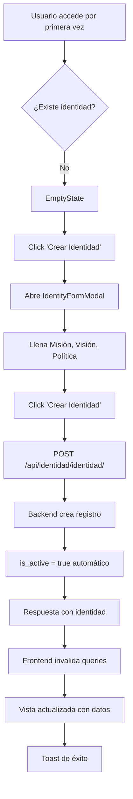
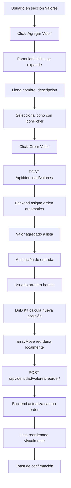
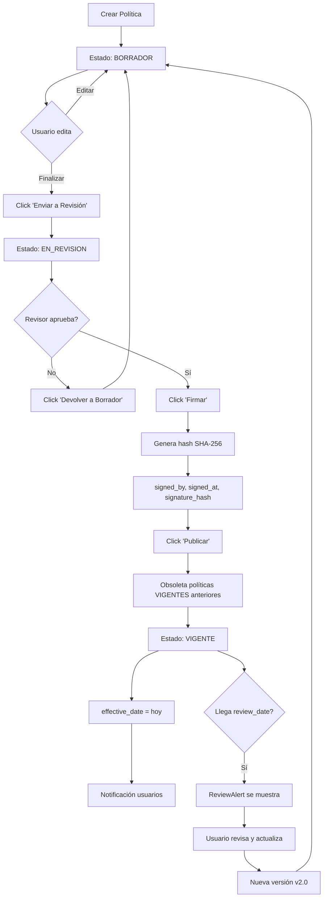
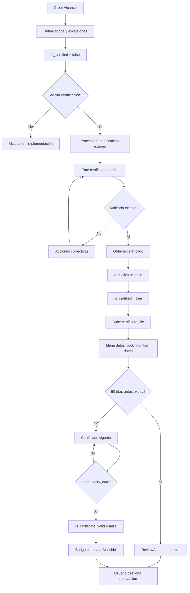

# DOCUMENTACIÓN EXHAUSTIVA - MÓDULO IDENTIDAD CORPORATIVA

**Sistema:** StrateKaz - Sistema de Gestión Integral
**Módulo:** Identidad Corporativa (Dirección Estratégica)
**Fecha:** 2026-01-09
**Versión:** 2.0 (Post-refactorización)

---

## ÍNDICE

1. [Visión General](#visión-general)
2. [Sección 1: Misión y Visión](#sección-1-misión-y-visión-mision_vision)
3. [Sección 2: Valores Corporativos](#sección-2-valores-corporativos-valores)
4. [Sección 3: Política Integral (Legacy)](#sección-3-política-integral-legacy-politica)
5. [Sección 4: Políticas (Manager Completo)](#sección-4-políticas-manager-completo-politicas)
6. [Sección 5: Alcances del Sistema](#sección-5-alcances-del-sistema-alcances)
7. [Flujos de Trabajo](#flujos-de-trabajo)
8. [Diagrama de Relaciones](#diagrama-de-relaciones)

---

## VISIÓN GENERAL

El módulo de **Identidad Corporativa** es el corazón del sistema de gestión estratégica, donde se definen los elementos fundamentales de la organización:

- **Misión y Visión**: Propósito y aspiraciones de la empresa
- **Valores Corporativos**: Principios que guían el comportamiento organizacional
- **Política Integral**: Compromiso con sistemas de gestión (ISO, SST, etc.)
- **Políticas Específicas**: Políticas por área/norma con workflow de aprobación
- **Alcances del Sistema**: Certificaciones ISO y alcance de cada norma

### Secciones Dinámicas (Códigos de BD)

Las secciones se mapean desde la base de datos usando `TabSection.code`:

| Código BD | Nombre UI | Componente Principal |
|-----------|-----------|---------------------|
| `mision_vision` | Misión y Visión | `MisionVisionSection` |
| `valores` | Valores Corporativos | `ValoresSection` |
| `politica` | Política Integral | `PoliticaSection` (Legacy) |
| `politicas` | Políticas | `PoliticasSection` |
| `alcances` | Alcances del Sistema | `AlcancesSection` |

---

## SECCIÓN 1: MISIÓN Y VISIÓN (`mision_vision`)

### 🎯 Objetivo
Definir la razón de ser (misión) y la aspiración a futuro (visión) de la organización.

---

### 📊 BACKEND

#### Modelo: `CorporateIdentity`
**Archivo:** `backend/apps/gestion_estrategica/identidad/models.py`

```python
class CorporateIdentity(AuditModel, SoftDeleteModel):
    """Identidad Corporativa - Misión, Visión, Política Integral"""

    # Multi-tenancy
    empresa = models.OneToOneField('configuracion.EmpresaConfig', ...)

    # Campos principales
    mission = models.TextField()
    vision = models.TextField()
    integral_policy = models.TextField()

    # Firma digital de la política
    policy_signed_by = models.ForeignKey(User, ...)
    policy_signed_at = models.DateTimeField(null=True)
    policy_signature_hash = models.CharField(max_length=255)

    # Versionamiento
    effective_date = models.DateField()
    version = models.CharField(max_length=20, default='1.0')

    # Heredados de AuditModel
    created_at, updated_at, created_by, updated_by

    # Heredados de SoftDeleteModel
    is_active, deleted_at
```

**Campos principales:**
- `mission`: Texto enriquecido con la declaración de misión
- `vision`: Texto enriquecido con la declaración de visión
- `integral_policy`: Texto enriquecido con la política integral
- `policy_signed_by`: Usuario que firmó la política
- `policy_signed_at`: Fecha y hora de la firma
- `policy_signature_hash`: Hash SHA-256 de la firma digital
- `effective_date`: Fecha desde la cual la identidad está vigente
- `version`: Versión del documento (ej: 1.0, 2.1)
- `is_active`: Solo una identidad puede estar activa por empresa

**Validaciones:**
- Solo puede existir una identidad activa por empresa (OneToOne con `empresa`)
- Al activar una identidad, las demás se desactivan automáticamente
- El hash de firma se genera concatenando: `policy + user_id + timestamp`

#### Endpoints

**ViewSet:** `CorporateIdentityViewSet`
**Base URL:** `/api/identidad/identidad/`

| Método | Endpoint | Descripción | Permisos |
|--------|----------|-------------|----------|
| GET | `/` | Lista de identidades | IsAuthenticated |
| POST | `/` | Crear identidad | IsAuthenticated |
| GET | `/{id}/` | Detalle de identidad | IsAuthenticated |
| PATCH | `/{id}/` | Actualizar identidad | IsAuthenticated |
| DELETE | `/{id}/` | Eliminar identidad | IsAuthenticated |
| GET | `/active/` | Obtener identidad activa | **AllowAny** (público) |
| POST | `/{id}/sign/` | Firmar política | IsAuthenticated |
| POST | `/{id}/toggle-active/` | Activar/desactivar | IsAuthenticated |
| GET | `/{id}/dashboard/` | Estadísticas | IsAuthenticated |

**Nota importante:** El endpoint `/active/` es **público** porque se muestra en la página de login antes de autenticarse.

#### Serializers

**Lista completa (`CorporateIdentitySerializer`):**
```python
fields = [
    'id', 'mission', 'vision', 'integral_policy',
    'policy_signed_by', 'policy_signed_by_name',
    'policy_signed_at', 'policy_signature_hash',
    'effective_date', 'version', 'is_active', 'is_signed',
    'values',  # Lista de valores corporativos anidados
    'alcances',  # Lista de alcances anidados
    'values_count', 'alcances_count', 'politicas_count',
    'created_by', 'created_by_name',
    'created_at', 'updated_at'
]
```

**Crear/Editar (`CorporateIdentityCreateUpdateSerializer`):**
```python
fields = [
    'mission', 'vision', 'integral_policy',
    'effective_date', 'version', 'is_active'
]
```

#### Acciones Especiales

**1. Firmar Política (`/identidad/{id}/sign/`)**

**Request:**
```json
{
  "confirm": true
}
```

**Response:**
```json
{
  "detail": "Política firmada exitosamente",
  "signed_by": "Juan Pérez",
  "signed_at": "2026-01-09T10:30:00Z",
  "signature_hash": "a7f5c8d9e..."
}
```

**Lógica interna:**
```python
def sign_policy(self, user):
    import hashlib
    content = f"{self.integral_policy}|{user.id}|{timezone.now().isoformat()}"
    self.policy_signature_hash = hashlib.sha256(content.encode()).hexdigest()
    self.policy_signed_by = user
    self.policy_signed_at = timezone.now()
    self.save()
```

**2. Dashboard (`/identidad/{id}/dashboard/`)**

**Response:**
```json
{
  "identity_id": 1,
  "version": "1.0",
  "is_signed": true,
  "values_count": 5,
  "alcances": {
    "total": 3,
    "certified": 2
  },
  "politicas": {
    "integrales": 1,
    "especificas": 8,
    "vigentes": 7
  }
}
```

---

### 🎨 FRONTEND

#### Componente Principal: `MisionVisionSection`
**Archivo:** `frontend/src/features/gestion-estrategica/components/IdentidadTab.tsx` (líneas 64-138)

**Props:**
```typescript
interface MisionVisionSectionProps {
  identity: CorporateIdentity;
  onEdit: () => void;
}
```

**Estructura visual:**

```
┌─────────────────────────────────────────────────────────────┐
│ [Badge: Firmada/Pendiente]  v1.0 - Vigente desde 01/01/2026│
│                                                  [Editar]    │
├─────────────────────┬───────────────────────────────────────┤
│   MISIÓN            │   VISIÓN                              │
│ ┌─────────────────┐ │ ┌─────────────────────────────────┐  │
│ │ [Compass Icon]  │ │ │ [Eye Icon]                      │  │
│ │ Misión          │ │ │ Visión                          │  │
│ │                 │ │ │                                 │  │
│ │ Texto rico...   │ │ │ Texto rico...                   │  │
│ └─────────────────┘ │ └─────────────────────────────────┘  │
└─────────────────────┴───────────────────────────────────────┘
```

**Estados visuales:**

1. **Identidad Firmada (badge verde):**
   - Icono: `CheckCircle2`
   - Color: Verde
   - Texto: "Identidad Firmada"
   - Info adicional: Versión + Fecha de vigencia

2. **Pendiente de Firma (badge amarillo):**
   - Icono: `AlertTriangle`
   - Color: Amarillo
   - Texto: "Pendiente de Firma"

**Renderizado de contenido:**
```tsx
<div
  className="prose prose-sm max-w-none dark:prose-invert"
  dangerouslySetInnerHTML={{ __html: identity.mission }}
/>
```

El contenido HTML ya viene formateado desde el editor TipTap (backend almacena HTML).

#### Hooks Utilizados

**1. `useActiveIdentity()`**
```typescript
const { data: identity, isLoading } = useActiveIdentity();
```

- **Query Key:** `['identity', 'active']`
- **Endpoint:** `GET /api/identidad/identidad/active/`
- **Retry:** `false` (no reintenta en 404)
- **Retorna:** `CorporateIdentity | null`

**2. `useUpdateIdentity()`**
```typescript
const updateMutation = useUpdateIdentity();

// Uso:
await updateMutation.mutateAsync({
  id: identity.id,
  data: { mission, vision, ... }
});
```

- **Invalidaciones:**
  - `['identities']`
  - `['identity', id]`
  - `['identity', 'active']`
- **Toast:** "Identidad corporativa actualizada exitosamente"

**3. `useSignPolicy()`**
```typescript
const signPolicyMutation = useSignPolicy();

// Uso:
await signPolicyMutation.mutateAsync(identity.id);
```

#### Modal de Edición: `IdentityFormModal`
**Archivo:** `frontend/src/features/gestion-estrategica/components/modals/IdentityFormModal.tsx`

**Características:**
- Editor de texto enriquecido (TipTap) para misión, visión y política
- Validación: Contenido no puede estar vacío (quita tags HTML vacíos)
- Soporte para negrita, cursiva, listas, enlaces, etc.
- Tamaño: `4xl` (modal grande)

**Campos:**
```typescript
{
  mission: string (HTML),
  vision: string (HTML),
  integral_policy: string (HTML),
  effective_date: string (date),
  version: string (default: '1.0')
}
```

**Validación:**
```typescript
const stripHtml = (html: string) => {
  const tmp = document.createElement('div');
  tmp.innerHTML = html;
  return tmp.textContent || tmp.innerText || '';
};

const isValid =
  stripHtml(formData.mission).trim().length > 0 &&
  stripHtml(formData.vision).trim().length > 0 &&
  stripHtml(formData.integral_policy).trim().length > 0;
```

---

### 🔄 UI/UX

#### Estados de Carga

**1. Loading (skeleton):**
```tsx
<div className="grid grid-cols-1 lg:grid-cols-2 gap-6">
  {[1, 2].map(i => (
    <Card key={i}>
      <div className="p-6 animate-pulse">
        <div className="h-6 bg-gray-200 rounded w-1/3 mb-4" />
        <div className="space-y-2">
          <div className="h-4 bg-gray-200 rounded w-full" />
          <div className="h-4 bg-gray-200 rounded w-5/6" />
        </div>
      </div>
    </Card>
  ))}
</div>
```

**2. Empty State (sin identidad):**
```tsx
<EmptyState
  icon={<Compass className="h-12 w-12" />}
  title="Sin Identidad Corporativa"
  description="No hay una identidad corporativa configurada..."
  action={{
    label: 'Crear Identidad Corporativa',
    onClick: () => setShowIdentityModal(true),
    icon: <Plus className="h-4 w-4" />,
  }}
/>
```

**3. Con Datos:**
- Grid de 2 columnas (misión | visión)
- Cards con iconos y colores distintivos
- Texto con formato rico (prose)
- Badge de estado de firma

#### Acciones del Usuario

1. **Editar Identidad:**
   - Botón: "Editar" (esquina superior derecha)
   - Abre modal con editor de texto enriquecido
   - Guarda cambios y actualiza vista

2. **Firmar Política:**
   - Botón solo visible si no está firmada
   - Confirmación con `window.confirm()`
   - Genera firma digital SHA-256
   - Actualiza estado visual

3. **Ver Información de Firma:**
   - Si está firmada, muestra:
     - Nombre del firmante
     - Fecha y hora de firma
     - Hash de verificación

---

## SECCIÓN 2: VALORES CORPORATIVOS (`valores`)

### 🎯 Objetivo
Gestionar los valores organizacionales con drag & drop para reordenar, iconos dinámicos y descripciones.

---

### 📊 BACKEND

#### Modelo: `CorporateValue`
**Archivo:** `backend/apps/gestion_estrategica/identidad/models.py`

```python
class CorporateValue(TimestampedModel, SoftDeleteModel, OrderedModel):
    """Valores Corporativos con orden y iconos"""

    identity = models.ForeignKey(
        CorporateIdentity,
        on_delete=models.CASCADE,
        related_name='values'
    )
    name = models.CharField(max_length=100)
    description = models.TextField()
    icon = models.CharField(max_length=50, blank=True, null=True)

    # Heredado de OrderedModel
    orden = models.PositiveIntegerField(default=0, db_index=True)

    # Heredados
    created_at, updated_at
    is_active, deleted_at
```

**Campos:**
- `identity`: FK a la identidad corporativa
- `name`: Nombre del valor (ej: "Integridad", "Compromiso")
- `description`: Descripción detallada del valor
- `icon`: Nombre del icono de Lucide (ej: "Heart", "Shield")
- `orden`: Orden de visualización (usado en drag & drop)

**Validaciones:**
- `name` y `description` son requeridos
- `icon` es opcional (dinámico desde BD)
- `orden` se asigna automáticamente al crear

#### Endpoints

**ViewSet:** `CorporateValueViewSet`
**Base URL:** `/api/identidad/valores/`

| Método | Endpoint | Descripción | Mixins |
|--------|----------|-------------|--------|
| GET | `/` | Lista de valores | Filtro por `identity` |
| POST | `/` | Crear valor | - |
| GET | `/{id}/` | Detalle de valor | - |
| PATCH | `/{id}/` | Actualizar valor | - |
| DELETE | `/{id}/` | Eliminar valor | - |
| POST | `/reorder/` | Reordenar valores | `OrderingMixin` |
| POST | `/{id}/toggle-active/` | Activar/desactivar | `StandardViewSetMixin` |

**Filtros disponibles:**
```python
filterset_fields = ['identity', 'is_active']
search_fields = ['name', 'description']
ordering_fields = ['orden', 'name', 'created_at']
ordering = ['orden', 'name']  # Default
```

#### Acción de Reordenamiento

**Request a `/reorder/`:**
```json
{
  "order_data": [
    { "id": 1, "orden": 1 },
    { "id": 2, "orden": 2 },
    { "id": 3, "orden": 3 }
  ]
}
```

**Response:**
```json
{
  "detail": "Orden actualizado exitosamente",
  "updated_count": 3
}
```

**Implementación (OrderingMixin):**
```python
@action(detail=False, methods=['post'], url_path='reorder')
def reorder(self, request):
    order_data = request.data.get('order_data', [])

    with transaction.atomic():
        for item in order_data:
            obj_id = item.get('id')
            new_orden = item.get('orden')
            obj = self.get_queryset().get(pk=obj_id)
            obj.orden = new_orden
            obj.save(update_fields=['orden', 'updated_at'])

    return Response({
        'detail': 'Orden actualizado exitosamente',
        'updated_count': len(order_data)
    })
```

---

### 🎨 FRONTEND

#### Componente Principal: `ValoresDragDrop`
**Archivo:** `frontend/src/features/gestion-estrategica/components/ValoresDragDrop.tsx`

**Tecnologías:**
- **@dnd-kit/core**: Sistema de drag & drop
- **@dnd-kit/sortable**: Estrategia de ordenamiento
- **Framer Motion**: Animaciones suaves
- **Lucide React**: Iconos (dinámicos desde BD)

**Props:**
```typescript
interface ValoresDragDropProps {
  values: CorporateValue[];
  identityId: number;
  onReorder: (newOrder: { id: number; orden: number }[]) => Promise<void>;
  onCreate: (data: CreateCorporateValueDTO & { identity: number }) => Promise<void>;
  onUpdate: (id: number, data: UpdateCorporateValueDTO) => Promise<void>;
  onDelete: (id: number) => Promise<void>;
  isLoading?: boolean;
}
```

#### Estructura Visual

```
┌─────────────────────────────────────────────────────────────┐
│ Valores Corporativos              5 valores   [+ Agregar]   │
│ Arrastra para reordenar...                                  │
├─────────────────────────────────────────────────────────────┤
│                                                              │
│ [Formulario de creación - expandible]                       │
│                                                              │
├─────────────────────────────────────────────────────────────┤
│ ≡ [Heart] Integridad                           #1  [✏] [🗑]│
│   Actuar siempre con honestidad y transparencia...         │
├─────────────────────────────────────────────────────────────┤
│ ≡ [Shield] Compromiso                          #2  [✏] [🗑]│
│   Dedicación total a nuestros objetivos...                 │
├─────────────────────────────────────────────────────────────┤
│ ≡ [Star] Excelencia                            #3  [✏] [🗑]│
│   Búsqueda continua de la mejora...                        │
└─────────────────────────────────────────────────────────────┘
```

**Elementos interactivos:**
- **Drag Handle (≡):** Cursor `grab`, cambia a `grabbing` al arrastrar
- **Icono dinámico:** Cargado desde BD vía `DynamicIcon`
- **Badge #N:** Número de orden
- **Botón Editar (✏):** Expande formulario inline
- **Botón Eliminar (🗑):** Confirmación con `window.confirm()`

#### Componente Sortable: `SortableValueItem`

**Estados:**
- **Normal:** Borde gris, hover → borde púrpura
- **Arrastran do:** Opacidad 50%, sombra XL, borde púrpura
- **Editando:** Borde púrpura 2px, fondo blanco

**Edición inline:**
```tsx
{isEditing && (
  <div className="p-4 border-2 border-purple-300 rounded-lg">
    <Input label="Nombre del Valor" value={editData.name} ... />
    <Textarea label="Descripción" value={editData.description} ... />
    <IconPicker
      value={editData.icon}
      onChange={onEditIconChange}
      category="VALORES"  // Filtra iconos apropiados
    />
    <Button onClick={onSaveEdit}>Guardar</Button>
    <Button onClick={onCancelEdit}>Cancelar</Button>
  </div>
)}
```

#### IconPicker Dinámico

**Características:**
- Carga iconos desde `/api/configuracion/icons/?category=VALORES`
- Grid de 6 columnas (configurable)
- Vista previa del icono seleccionado
- Búsqueda/filtrado de iconos
- Sin iconos hardcodeados - todo dinámico

**Uso:**
```tsx
<IconPicker
  label="Seleccionar Icono"
  value={formData.icon}
  onChange={(iconName) => setFormData({ ...formData, icon: iconName })}
  category="VALORES"
  columns={6}
/>
```

#### Hooks Utilizados

**1. `useValues(identityId)`**
```typescript
const { data: valuesData, isLoading } = useValues(identity.id);
const values = valuesData?.results || [];
```

**2. `useReorderValues()`**
```typescript
const reorderMutation = useReorderValues();

// Uso interno (automático al soltar):
await reorderMutation.mutateAsync(newOrder);
```

**3. CRUD Hooks:**
```typescript
const createValueMutation = useCreateValue();
const updateValueMutation = useUpdateValue();
const deleteValueMutation = useDeleteValue();
```

#### Sistema Drag & Drop

**Configuración DnD Kit:**
```typescript
const sensors = useSensors(
  useSensor(PointerSensor, {
    activationConstraint: {
      distance: 8,  // Evita drags accidentales
    },
  }),
  useSensor(KeyboardSensor, {
    coordinateGetter: sortableKeyboardCoordinates,  // Accesibilidad
  })
);
```

**Flujo de reordenamiento:**
```typescript
const handleDragEnd = async (event: DragEndEvent) => {
  const { active, over } = event;

  if (over && active.id !== over.id) {
    const oldIndex = sortedValues.findIndex((v) => v.id === active.id);
    const newIndex = sortedValues.findIndex((v) => v.id === over.id);

    // arrayMove es de @dnd-kit/sortable
    const newArray = arrayMove(sortedValues, oldIndex, newIndex);

    // Reasignar orden secuencial
    const newOrder = newArray.map((v, index) => ({
      id: v.id,
      orden: index + 1,
    }));

    // Guardar en BD
    await onReorder(newOrder);
  }
};
```

**Drag Overlay (preview):**
```tsx
<DragOverlay>
  {activeValue && (
    <div className="p-4 bg-white rounded-lg border-2 border-purple-500 shadow-2xl opacity-90">
      <div className="flex items-center gap-4">
        <DynamicIcon name={activeValue.icon} size={24} />
        <div>
          <h4>{activeValue.name}</h4>
          <p className="text-sm line-clamp-1">{activeValue.description}</p>
        </div>
      </div>
    </div>
  )}
</DragOverlay>
```

---

### 🔄 UI/UX

#### Estados Visuales

**1. Loading:**
```tsx
<Card className="p-6">
  <div className="animate-pulse space-y-4">
    {[1, 2, 3].map((i) => (
      <div key={i} className="h-20 bg-gray-200 rounded-lg" />
    ))}
  </div>
</Card>
```

**2. Empty State:**
```tsx
<div className="text-center py-12">
  <DynamicIcon name="Heart" size={48} className="mx-auto mb-4 opacity-50" />
  <p>No hay valores corporativos definidos.</p>
  <p className="text-sm mt-1">Crea el primer valor para comenzar.</p>
</div>
```

**3. Con Datos:**
- Lista ordenable con animaciones
- Hover effects en cada item
- Acciones visibles al pasar el mouse
- Formulario expandible para creación/edición

#### Animaciones (Framer Motion)

**Entrada de items:**
```tsx
<motion.div
  layout
  initial={{ opacity: 0, y: 20 }}
  animate={{ opacity: 1, y: 0 }}
  exit={{ opacity: 0, y: -20 }}
  className="group flex items-center..."
>
```

**Expansión de formulario:**
```tsx
<motion.div
  initial={{ opacity: 0, height: 0 }}
  animate={{ opacity: 1, height: 'auto' }}
  exit={{ opacity: 0, height: 0 }}
>
```

#### Acciones del Usuario

1. **Crear Valor:**
   - Click en "Agregar Valor"
   - Se expande formulario
   - Llena campos (nombre, descripción, icono)
   - Click en "Crear Valor"
   - Animación de entrada
   - Toast de confirmación

2. **Editar Valor:**
   - Click en botón de editar (✏)
   - El item se expande mostrando formulario
   - Edita campos
   - Click en "Guardar"
   - Animación de actualización
   - Toast de confirmación

3. **Reordenar Valores:**
   - Arrastra el handle (≡)
   - Arrastra a nueva posición
   - Suelta
   - Animación de reordenamiento
   - Actualización automática en BD
   - Toast de confirmación

4. **Eliminar Valor:**
   - Click en botón de eliminar (🗑)
   - Confirmación: "¿Eliminar el valor '{name}'?"
   - Si confirma:
     - Animación de salida
     - Llamada a API
     - Toast de confirmación

---

## SECCIÓN 3: POLÍTICA INTEGRAL (Legacy) (`politica`)

### 🎯 Objetivo
Vista simplificada de la política integral para **backward compatibility** con el sistema antiguo. Esta sección muestra la política almacenada en `CorporateIdentity.integral_policy`.

**NOTA:** Esta sección está siendo **reemplazada gradualmente** por la Sección 4 (Políticas Manager) que incluye versionamiento, workflow y firma digital avanzada.

---

### 📊 BACKEND

#### Modelo: `CorporateIdentity.integral_policy`

Utiliza el mismo modelo que Misión y Visión:
- Campo: `integral_policy` (TextField, HTML)
- Firma: `policy_signed_by`, `policy_signed_at`, `policy_signature_hash`
- Property: `is_signed` (readonly)

**Método de firma:**
```python
def sign_policy(self, user):
    import hashlib
    content = f"{self.integral_policy}|{user.id}|{timezone.now().isoformat()}"
    self.policy_signature_hash = hashlib.sha256(content.encode()).hexdigest()
    self.policy_signed_by = user
    self.policy_signed_at = timezone.now()
    self.save(update_fields=['policy_signature_hash', 'policy_signed_by', 'policy_signed_at'])
```

#### Endpoints

Utiliza los mismos endpoints que la sección de Misión y Visión:
- `POST /api/identidad/identidad/{id}/sign/` - Firma la política

---

### 🎨 FRONTEND

#### Componente: `PoliticaSection`
**Archivo:** `frontend/src/features/gestion-estrategica/components/IdentidadTab.tsx` (líneas 198-245)

**Props:**
```typescript
interface PoliticaSectionProps {
  identity: CorporateIdentity;
  onSign: () => void;
  isSigningPolicy: boolean;
}
```

**Estructura Visual:**

```
┌─────────────────────────────────────────────────────────────┐
│ [FileCheck Icon] Política Integral       [Firmar Digitalmente]│
├─────────────────────────────────────────────────────────────┤
│ [Alert Verde] Firmada por Juan Pérez el 09/01/2026         │
├─────────────────────────────────────────────────────────────┤
│                                                              │
│ Texto completo de la política integral con formato rico...  │
│                                                              │
│ - Calidad (ISO 9001)                                        │
│ - Seguridad y Salud en el Trabajo (ISO 45001)              │
│ - Medio Ambiente (ISO 14001)                                │
│ - Seguridad Vial (PESV)                                     │
│                                                              │
└─────────────────────────────────────────────────────────────┘
```

**Estados:**

1. **Sin Firmar:**
   - Botón "Firmar Digitalmente" visible
   - Sin alert de firma
   - Contenido de la política editable

2. **Firmada:**
   - Botón de firmar oculto
   - Alert verde con info: "Firmada por {nombre} el {fecha}"
   - Contenido de la política (no editable directamente)

**Renderizado:**
```tsx
<div
  className="prose prose-sm max-w-none dark:prose-invert"
  dangerouslySetInnerHTML={{ __html: identity.integral_policy }}
/>
```

#### Flujo de Firma

```typescript
const handleSignPolicy = async () => {
  if (!identity) return;

  if (window.confirm('Esta acción firmará digitalmente la Política Integral. ¿Desea continuar?')) {
    await signPolicyMutation.mutateAsync(identity.id);
  }
};
```

**Hook utilizado:**
```typescript
const signPolicyMutation = useSignPolicy();
```

---

### 🔄 UI/UX

#### Acciones del Usuario

1. **Ver Política:**
   - Texto con formato HTML
   - Estilos aplicados vía `prose` (TailwindCSS)

2. **Firmar Política:**
   - Click en "Firmar Digitalmente"
   - Confirmación con dialog nativo
   - Si acepta:
     - Genera hash SHA-256
     - Registra usuario y timestamp
     - Actualiza vista
     - Muestra alert de confirmación

3. **Verificar Firma:**
   - Si está firmada, muestra:
     - Nombre del firmante
     - Fecha y hora exacta
     - (Hash visible en el backend/BD)

---

## SECCIÓN 4: POLÍTICAS (Manager Completo) (`politicas`)

### 🎯 Objetivo
Sistema completo de gestión de políticas con:
- **Políticas Integrales:** Con versionamiento y workflow de aprobación
- **Políticas Específicas:** Por área/norma/sistema de gestión
- **Workflow de Estados:** BORRADOR → EN_REVISION → VIGENTE → OBSOLETO
- **Firma Digital:** Con hash SHA-256
- **Revisión Periódica:** Alertas de vencimiento
- **Historial:** Trazabilidad de cambios

---

### 📊 BACKEND

#### Modelo 1: `PoliticaIntegral`
**Archivo:** `backend/apps/gestion_estrategica/identidad/models.py`

```python
class PoliticaIntegral(AuditModel, SoftDeleteModel, OrderedModel):
    """Política Integral con versionamiento y firma digital"""

    identity = models.ForeignKey(
        CorporateIdentity,
        on_delete=models.CASCADE,
        related_name='politicas_integrales'
    )

    # Contenido
    version = models.CharField(max_length=20)
    title = models.CharField(max_length=200, default='Política Integral del Sistema de Gestión')
    content = models.TextField()

    # Estado y workflow
    status = models.CharField(
        max_length=20,
        choices=POLICY_STATUS_CHOICES,
        default='BORRADOR',
        db_index=True
    )
    effective_date = models.DateField(blank=True, null=True)
    expiry_date = models.DateField(blank=True, null=True)
    review_date = models.DateField(blank=True, null=True)

    # Firma digital
    signed_by = models.ForeignKey(User, ...)
    signed_at = models.DateTimeField(null=True, blank=True)
    signature_hash = models.CharField(max_length=255, blank=True, null=True)

    # Normas aplicables
    applicable_standards = models.JSONField(default=list)

    # Documentación
    document_file = models.FileField(upload_to='policies/integral/', blank=True)
    change_reason = models.TextField(blank=True, null=True)

    # Heredados
    orden, created_at, updated_at, is_active
```

**Choices de Estado:**
```python
POLICY_STATUS_CHOICES = [
    ('BORRADOR', 'Borrador'),
    ('EN_REVISION', 'En Revisión'),
    ('VIGENTE', 'Vigente'),
    ('OBSOLETO', 'Obsoleto'),
]
```

**Métodos principales:**
```python
def sign(self, user):
    """Firma digitalmente la política"""
    content = f"{self.content}|{user.id}|{timezone.now().isoformat()}"
    self.signature_hash = hashlib.sha256(content.encode()).hexdigest()
    self.signed_by = user
    self.signed_at = timezone.now()
    self.save()

def publish(self, user):
    """Publica la política (cambia a VIGENTE y obsoleta las anteriores)"""
    if self.status not in ['BORRADOR', 'EN_REVISION']:
        raise ValueError("Solo se pueden publicar políticas en borrador o en revisión")

    # Obsoleta las políticas vigentes anteriores
    PoliticaIntegral.objects.filter(
        identity=self.identity,
        status='VIGENTE'
    ).update(status='OBSOLETO')

    self.status = 'VIGENTE'
    self.effective_date = timezone.now().date()
    self.updated_by = user
    self.save()

@classmethod
def get_current(cls, identity):
    """Obtiene la política vigente actual"""
    return cls.objects.filter(
        identity=identity,
        status='VIGENTE',
        is_active=True
    ).first()
```

#### Modelo 2: `PoliticaEspecifica`

```python
class PoliticaEspecifica(AuditModel, SoftDeleteModel, OrderedModel):
    """Políticas Específicas por área o módulo"""

    identity = models.ForeignKey(
        CorporateIdentity,
        on_delete=models.CASCADE,
        related_name='politicas_especificas'
    )

    # Norma ISO (dinámico desde BD)
    norma_iso = models.ForeignKey(
        'configuracion.NormaISO',
        on_delete=models.PROTECT,
        null=True, blank=True,
        related_name='politicas_especificas'
    )

    # Identificación
    code = models.CharField(max_length=20)  # POL-SST-001
    title = models.CharField(max_length=200)
    content = models.TextField()
    version = models.CharField(max_length=20, default='1.0')

    # Estado y fechas
    status = models.CharField(max_length=20, choices=POLICY_STATUS_CHOICES, default='BORRADOR')
    effective_date = models.DateField(blank=True, null=True)
    review_date = models.DateField(blank=True, null=True)

    # Responsables
    area = models.ForeignKey('organizacion.Area', ...)
    responsible = models.ForeignKey(User, ...)
    responsible_cargo = models.ForeignKey('core.Cargo', ...)

    # Aprobación
    approved_by = models.ForeignKey(User, ...)
    approved_at = models.DateTimeField(null=True, blank=True)

    # Extras
    document_file = models.FileField(upload_to='policies/specific/', blank=True)
    keywords = models.JSONField(default=list, blank=True)

    # Heredados
    orden, created_at, updated_at, is_active
```

**Método de aprobación:**
```python
def approve(self, user):
    """Aprueba la política"""
    self.approved_by = user
    self.approved_at = timezone.now()
    self.status = 'VIGENTE'
    self.effective_date = timezone.now().date()
    self.updated_by = user
    self.save()

@property
def needs_review(self):
    """Indica si la política necesita revisión"""
    if not self.review_date:
        return False
    return self.review_date <= timezone.now().date()
```

#### Endpoints

**ViewSet 1: `PoliticaIntegralViewSet`**
**Base URL:** `/api/identidad/politicas-integrales/`

| Método | Endpoint | Descripción |
|--------|----------|-------------|
| GET | `/` | Lista de políticas integrales |
| POST | `/` | Crear nueva política |
| GET | `/{id}/` | Detalle de política |
| PATCH | `/{id}/` | Actualizar política |
| DELETE | `/{id}/` | Eliminar política |
| GET | `/current/?identity={id}` | Política vigente actual |
| POST | `/{id}/sign/` | Firmar política |
| POST | `/{id}/publish/` | Publicar política |
| GET | `/versions/?identity={id}` | Historial de versiones |
| POST | `/{id}/toggle-active/` | Activar/desactivar |

**Filtros:**
```python
filterset_fields = ['identity', 'status', 'is_active']
search_fields = ['title', 'content', 'version']
ordering_fields = ['version', 'effective_date', 'created_at', 'orden']
ordering = ['-version']  # Más reciente primero
```

**ViewSet 2: `PoliticaEspecificaViewSet`**
**Base URL:** `/api/identidad/politicas-especificas/`

| Método | Endpoint | Descripción |
|--------|----------|-------------|
| GET | `/` | Lista de políticas específicas |
| POST | `/` | Crear nueva política |
| GET | `/{id}/` | Detalle de política |
| PATCH | `/{id}/` | Actualizar política |
| DELETE | `/{id}/` | Eliminar política |
| POST | `/{id}/approve/` | Aprobar política |
| GET | `/by-standard/` | Políticas agrupadas por norma ISO |
| GET | `/pending-review/` | Políticas pendientes de revisión |
| GET | `/stats/` | Estadísticas de políticas |
| POST | `/{id}/toggle-active/` | Activar/desactivar |

**Filtros:**
```python
filterset_fields = ['identity', 'norma_iso', 'status', 'area', 'is_active']
search_fields = ['code', 'title', 'content', 'keywords']
ordering_fields = ['code', 'norma_iso', 'status', 'effective_date', 'orden', 'created_at']
ordering = ['norma_iso', 'orden', 'code']
```

#### Acciones Especiales

**1. Firmar Política Integral (`/{id}/sign/`)**

**Request:**
```json
{
  "confirm": true
}
```

**Response:**
```json
{
  "detail": "Política firmada exitosamente",
  "signed_by": "Juan Pérez",
  "signed_at": "2026-01-09T14:30:00Z",
  "signature_hash": "a7f5c8d9e..."
}
```

**2. Publicar Política Integral (`/{id}/publish/`)**

**Request:**
```json
{
  "confirm": true
}
```

**Response:**
```json
{
  "detail": "Política publicada exitosamente",
  "status": "VIGENTE",
  "effective_date": "2026-01-09"
}
```

**Validación:** Solo se puede publicar si:
- Estado actual es `BORRADOR` o `EN_REVISION`
- Si es requerido, debe estar firmada

**3. Aprobar Política Específica (`/{id}/approve/`)**

**Request:**
```json
{
  "confirm": true
}
```

**Response:**
```json
{
  "detail": "Política aprobada exitosamente",
  "approved_by": "María García",
  "approved_at": "2026-01-09T15:00:00Z",
  "status": "VIGENTE"
}
```

**4. Políticas por Norma ISO (`/by-standard/`)**

**Response:**
```json
{
  "ISO_9001": {
    "label": "ISO 9001:2015",
    "total": 5,
    "vigentes": 4,
    "borradores": 1
  },
  "ISO_45001": {
    "label": "ISO 45001:2018",
    "total": 8,
    "vigentes": 7,
    "borradores": 1
  }
}
```

**5. Pendientes de Revisión (`/pending-review/`)**

**Response:**
```json
{
  "count": 3,
  "policies": [
    {
      "id": 1,
      "code": "POL-SST-001",
      "title": "Política de Seguridad y Salud",
      "review_date": "2026-01-15",
      "days_until_review": 6
    }
  ]
}
```

---

### 🎨 FRONTEND

#### Componente Principal: `PoliticasManager`
**Archivo:** `frontend/src/features/gestion-estrategica/components/PoliticasManager.tsx`

**Características:**
- Gestión completa de políticas integrales y específicas
- Sistema de tabs para separar tipos de políticas
- Workflow visual con timeline
- Editor de texto enriquecido
- Sistema de revisión periódica con alertas
- Filtros por estado

**Props:**
```typescript
interface PoliticasManagerProps {
  identityId: number;
  // Políticas Integrales
  politicasIntegrales: PoliticaIntegral[];
  onCreateIntegral: (data: CreatePoliticaIntegralDTO) => Promise<void>;
  onUpdateIntegral: (id: number, data: UpdatePoliticaIntegralDTO) => Promise<void>;
  onDeleteIntegral: (id: number) => Promise<void>;
  onSignIntegral: (id: number) => Promise<void>;
  onPublishIntegral: (id: number) => Promise<void>;
  // Políticas Específicas
  politicasEspecificas: PoliticaEspecifica[];
  onCreateEspecifica: (data: CreatePoliticaEspecificaDTO) => Promise<void>;
  onUpdateEspecifica: (id: number, data: UpdatePoliticaEspecificaDTO) => Promise<void>;
  onDeleteEspecifica: (id: number) => Promise<void>;
  onApproveEspecifica: (id: number) => Promise<void>;
  isLoading?: boolean;
}
```

#### Estructura Visual

```
┌─────────────────────────────────────────────────────────────────────┐
│ [Alert] Política "POL-SST-001" requiere revisión en 5 días [Revisar]│
├─────────────────────────────────────────────────────────────────────┤
│ [Tab: Política Integral (1)] [Tab: Políticas Específicas (8)]      │
│                              [Filtro: Estado] [+ Nueva Política]    │
├─────────────────────────────────────────────────────────────────────┤
│                                                                      │
│ ┌──────────────────────────────────────────────────────────────┐   │
│ │ Política Integral del Sistema de Gestión v2.0                │   │
│ │ [Badge: En Revisión] [Badge: Firmada]                        │   │
│ │                                                               │   │
│ │ v2.0 · Vigente desde 01/01/2026 · Revisión: 01/07/2026      │   │
│ │ Firmada por Juan Pérez el 09/01/2026 10:30                  │   │
│ │                                                               │   │
│ │ [Ver] [Editar] [Firmar] [Eliminar]                          │   │
│ │                                                               │   │
│ │ Solo se pueden publicar políticas en borrador o en revisión  │   │
│ │ [Enviar a Revisión] [Publicar]                              │   │
│ └──────────────────────────────────────────────────────────────┘   │
│                                                                      │
│ ┌──────────────────────────────────────────────────────────────┐   │
│ │ POL-SST-001 - Política de Seguridad y Salud en el Trabajo   │   │
│ │ [Badge: Vigente] [Badge: ISO 45001]                         │   │
│ │                                                               │   │
│ │ v1.0 · Vigente desde 15/12/2025 · Revisión: 15/12/2026      │   │
│ │                                                               │   │
│ │ [Ver] [Aprobar] [Eliminar]                                   │   │
│ └──────────────────────────────────────────────────────────────┘   │
│                                                                      │
└──────────────────────────────────────────────────────────────────────┘
```

#### Sub-componentes

**1. `PolicyStatusBadge`**

Muestra el estado de la política con color e icono:

| Estado | Color | Icono | Descripción |
|--------|-------|-------|-------------|
| BORRADOR | Gris | Edit | Política en edición |
| EN_REVISION | Amarillo | Eye | Pendiente de aprobación |
| VIGENTE | Verde | CheckCircle | Política activa |
| OBSOLETO | Rojo | Archive | Reemplazada por nueva versión |

```tsx
<PolicyStatusBadge status="VIGENTE" size="md" />
```

**2. `ReviewAlert`**

Alertas de revisión periódica:

```tsx
<ReviewAlert
  reviewDate="2026-01-15"
  policyTitle="Política de Seguridad"
  onReview={() => handleReview()}
/>
```

**Lógica:**
```typescript
const daysUntilReview = differenceInDays(new Date(reviewDate), new Date());
const isOverdue = isPast(new Date(reviewDate));

// No muestra si faltan más de 30 días
if (daysUntilReview > 30 && !isOverdue) return null;

// Variante según urgencia:
// - Vencida: "error"
// - <= 7 días: "warning"
// - 8-30 días: "info"
```

**3. `WorkflowTimeline`**

Timeline visual del workflow de estados:

```
BORRADOR → EN_REVISION → VIGENTE → OBSOLETO
  [✓]      [→ Enviar]    [ ]       [ ]
```

**Transiciones permitidas:**
- BORRADOR → EN_REVISION (Enviar a revisión)
- EN_REVISION → VIGENTE (Publicar - requiere firma)
- EN_REVISION → BORRADOR (Devolver para corrección)
- VIGENTE → OBSOLETO (Automático al publicar nueva versión)

```tsx
<WorkflowTimeline
  currentStatus="EN_REVISION"
  onTransition={(newStatus) => handleTransition(newStatus)}
  isSigned={true}
  canTransition={true}
/>
```

**4. `PolicyCard`**

Card individual de política con acciones:

```tsx
<PolicyCard
  policy={policy}
  type="integral"  // o "especifica"
  onEdit={() => {}}
  onView={() => {}}
  onSign={() => {}}
  onDelete={() => {}}
  onTransition={(status) => {}}
/>
```

**Características:**
- Borde izquierdo coloreado si necesita revisión
- Badges de estado y firma
- Acciones contextuales según estado
- Mini workflow para acciones rápidas

**5. `PolicyFormModal`**

Modal de creación/edición con editor rico:

```tsx
<PolicyFormModal
  isOpen={showForm}
  onClose={() => setShowForm(false)}
  type="integral"  // o "especifica"
  policy={editingPolicy}  // null para crear
  identityId={identityId}
  onCreate={handleCreate}
  onUpdate={handleUpdate}
  isLoading={isLoading}
/>
```

**Campos (Política Integral):**
- Título (opcional - default: "Política Integral del Sistema de Gestión")
- Versión (ej: "1.0", "2.1")
- Contenido (editor rico TipTap)
- Fecha de vigencia
- Próxima revisión
- Normas aplicables (multiselect ISO)

**Campos (Política Específica):**
- Código (ej: "POL-SST-001") *
- Título *
- Norma ISO (select dinámico desde BD)
- Versión
- Contenido (editor rico) *
- Fecha de vigencia
- Próxima revisión

#### Hooks Utilizados

**1. Políticas Integrales:**
```typescript
const { data: politicasIntegralesData, isLoading: loadingIntegrales } = usePoliticasIntegrales({
  identity: identity.id,
});

const createIntegralMutation = useCreatePoliticaIntegral();
const updateIntegralMutation = useUpdatePoliticaIntegral();
const deleteIntegralMutation = useDeletePoliticaIntegral();
const signIntegralMutation = useSignPoliticaIntegral();
const publishIntegralMutation = usePublishPoliticaIntegral();
```

**2. Políticas Específicas:**
```typescript
const { data: politicasEspecificasData, isLoading: loadingEspecificas } = usePoliticasEspecificas({
  identity: identity.id,
});

const createEspecificaMutation = useCreatePoliticaEspecifica();
const updateEspecificaMutation = useUpdatePoliticaEspecifica();
const deleteEspecificaMutation = useDeletePoliticaEspecifica();
const approveEspecificaMutation = useApprovePoliticaEspecifica();
```

**3. Normas ISO (Dinámico):**
```typescript
const { data: normasISOData } = useNormasISOChoices();

// Transforma a opciones de select:
const normasISOOptions = normasISOData?.normas.map((norma) => ({
  value: String(norma.value),
  label: `${norma.code} - ${norma.short_name || norma.name}`,
}));
```

#### Filtrado y Búsqueda

**Filtro por estado:**
```tsx
<Select
  value={statusFilter}
  onChange={(e) => setStatusFilter(e.target.value)}
  options={[
    { value: 'ALL', label: 'Todos los estados' },
    { value: 'BORRADOR', label: 'Borradores' },
    { value: 'EN_REVISION', label: 'En Revisión' },
    { value: 'VIGENTE', label: 'Vigentes' },
    { value: 'OBSOLETO', label: 'Obsoletos' },
  ]}
/>
```

**Filtrado memo:**
```typescript
const filteredIntegrales = useMemo(
  () =>
    statusFilter === 'ALL'
      ? politicasIntegrales
      : politicasIntegrales.filter((p) => p.status === statusFilter),
  [politicasIntegrales, statusFilter]
);
```

#### Sistema de Alertas de Revisión

**Identificación de políticas que necesitan revisión:**
```typescript
const policiesNeedingReview = useMemo(() => {
  const all = [...politicasIntegrales, ...politicasEspecificas];
  return all.filter(
    (p) =>
      p.status === 'VIGENTE' &&
      p.review_date &&
      differenceInDays(new Date(p.review_date), new Date()) <= 30
  );
}, [politicasIntegrales, politicasEspecificas]);
```

**Renderizado de alertas:**
```tsx
{policiesNeedingReview.map((policy) => (
  <ReviewAlert
    key={`review-${policy.id}`}
    reviewDate={policy.review_date!}
    policyTitle={policy.title}
    onReview={() => {
      setEditingPolicy(policy);
      setShowForm(true);
    }}
  />
))}
```

---

### 🔄 UI/UX

#### Flujos de Trabajo

**1. Crear Política Integral:**
```
1. Usuario → Click "Nueva Política"
2. Sistema → Abre modal con formulario
3. Usuario → Llena campos (título, contenido, fechas)
4. Usuario → Click "Crear Política"
5. Sistema → POST /api/identidad/politicas-integrales/
6. Sistema → Estado inicial: BORRADOR
7. Sistema → Cierra modal, muestra toast
8. Sistema → Actualiza lista
```

**2. Workflow de Aprobación (Política Integral):**
```
1. Estado: BORRADOR
2. Usuario → Click "Enviar a Revisión"
3. Sistema → PATCH status: EN_REVISION
4. Usuario revisor → Click "Firmar"
5. Sistema → POST /sign/ (genera hash SHA-256)
6. Usuario revisor → Click "Publicar"
7. Sistema → POST /publish/
   - Obsoleta políticas vigentes anteriores
   - Cambia status: VIGENTE
   - Establece effective_date
8. Sistema → Notificación + actualización vista
```

**3. Workflow de Aprobación (Política Específica):**
```
1. Estado: BORRADOR
2. Usuario → Click "Enviar a Revisión"
3. Sistema → PATCH status: EN_REVISION
4. Usuario aprobador → Click "Aprobar"
5. Sistema → POST /approve/
   - Registra approved_by y approved_at
   - Cambia status: VIGENTE
   - Establece effective_date
6. Sistema → Notificación + actualización vista
```

**4. Revisión Periódica:**
```
1. Sistema → Calcula días hasta review_date
2. Si <= 30 días → Muestra ReviewAlert
3. Usuario → Click "Revisar ahora"
4. Sistema → Abre modal de edición
5. Usuario → Actualiza contenido
6. Usuario → Actualiza review_date (próxima revisión)
7. Sistema → Guarda cambios
8. Sistema → Oculta alerta si review_date > 30 días
```

#### Estados Visuales

**1. Loading:**
```tsx
<Card className="p-6">
  <div className="animate-pulse space-y-4">
    <div className="h-12 bg-gray-200 rounded w-1/3" />
    {[1, 2].map((i) => (
      <div key={i} className="h-32 bg-gray-200 rounded-lg" />
    ))}
  </div>
</Card>
```

**2. Empty State:**
```tsx
<EmptyState
  icon={<FileText className="w-12 h-12" />}
  title="Sin Políticas Integrales"
  description="Crea tu primera política integral para definir los compromisos de la organización"
  action={{
    label: 'Crear Política Integral',
    onClick: () => setShowForm(true),
    icon: <Plus className="w-4 h-4" />,
  }}
/>
```

**3. Con Datos:**
- Lista de PolicyCards
- Alertas de revisión en la parte superior
- Tabs para separar tipos
- Filtros activos

#### Acciones del Usuario

**Políticas Integrales:**
1. **Crear:** Modal con editor rico → Estado BORRADOR
2. **Editar:** Solo en estado BORRADOR
3. **Enviar a Revisión:** BORRADOR → EN_REVISION
4. **Firmar:** Genera hash SHA-256 (requerido para publicar)
5. **Publicar:** EN_REVISION → VIGENTE (obsoleta anteriores)
6. **Ver Detalle:** Modal con workflow visual completo
7. **Eliminar:** Solo BORRADOR o OBSOLETO

**Políticas Específicas:**
1. **Crear:** Modal con código + norma ISO
2. **Editar:** Solo en estado BORRADOR
3. **Enviar a Revisión:** BORRADOR → EN_REVISION
4. **Aprobar:** EN_REVISION → VIGENTE
5. **Ver Detalle:** Modal de visualización
6. **Eliminar:** Solo BORRADOR o OBSOLETO

---

## SECCIÓN 5: ALCANCES DEL SISTEMA (`alcances`)

### 🎯 Objetivo
Definir el alcance de cada sistema de gestión (norma ISO), certificaciones, exclusiones y datos de auditoría.

---

### 📊 BACKEND

#### Modelo: `AlcanceSistema`

```python
class AlcanceSistema(AuditModel, SoftDeleteModel):
    """Alcance del Sistema de Gestión por norma ISO"""

    identity = models.ForeignKey(
        CorporateIdentity,
        on_delete=models.CASCADE,
        related_name='alcances'
    )

    # Norma ISO (dinámico desde BD)
    norma_iso = models.ForeignKey(
        'configuracion.NormaISO',
        on_delete=models.PROTECT,
        null=True, blank=True,
        related_name='alcances_sistema',
        db_index=True
    )

    # Alcance
    scope = models.TextField()
    exclusions = models.TextField(blank=True, null=True)
    exclusion_justification = models.TextField(blank=True, null=True)

    # Certificación
    is_certified = models.BooleanField(default=False, db_index=True)
    certification_date = models.DateField(blank=True, null=True)
    certification_body = models.CharField(max_length=200, blank=True)
    certificate_number = models.CharField(max_length=100, blank=True)
    expiry_date = models.DateField(blank=True, null=True)

    # Auditorías
    last_audit_date = models.DateField(blank=True, null=True)
    next_audit_date = models.DateField(blank=True, null=True)

    # Archivo
    certificate_file = models.FileField(upload_to='certificates/', blank=True)

    # Heredados
    created_at, updated_at, created_by, is_active
```

**Constraints:**
```python
unique_together = [['identity', 'norma_iso']]  # Un alcance por norma
```

**Properties calculadas:**
```python
@property
def is_certificate_valid(self):
    """Verifica si el certificado está vigente"""
    if not self.is_certified or not self.expiry_date:
        return False
    return self.expiry_date >= timezone.now().date()

@property
def days_until_expiry(self):
    """Días hasta el vencimiento del certificado"""
    if not self.expiry_date:
        return None
    delta = self.expiry_date - timezone.now().date()
    return delta.days
```

#### Endpoints

**ViewSet:** `AlcanceSistemaViewSet`
**Base URL:** `/api/identidad/alcances/`

| Método | Endpoint | Descripción |
|--------|----------|-------------|
| GET | `/` | Lista de alcances |
| POST | `/` | Crear alcance |
| GET | `/{id}/` | Detalle de alcance |
| PATCH | `/{id}/` | Actualizar alcance |
| DELETE | `/{id}/` | Eliminar alcance |
| GET | `/by-standard/` | Alcances agrupados por norma ISO |
| GET | `/certifications/` | Resumen de certificaciones |
| POST | `/{id}/toggle-active/` | Activar/desactivar |

**Filtros:**
```python
filterset_fields = ['identity', 'norma_iso', 'is_certified', 'is_active']
search_fields = ['scope', 'exclusions', 'certification_body', 'certificate_number']
ordering_fields = ['norma_iso', 'certification_date', 'expiry_date', 'created_at']
ordering = ['norma_iso']
```

#### Acciones Especiales

**1. Alcances por Norma (`/by-standard/`)**

**Response:**
```json
{
  "ISO_9001": {
    "label": "ISO 9001:2015",
    "has_scope": true,
    "is_certified": true,
    "is_valid": true,
    "expiry_date": "2027-03-15",
    "days_until_expiry": 430
  },
  "ISO_45001": {
    "label": "ISO 45001:2018",
    "has_scope": true,
    "is_certified": false,
    "is_valid": false,
    "expiry_date": null,
    "days_until_expiry": null
  }
}
```

**2. Resumen de Certificaciones (`/certifications/`)**

**Response:**
```json
{
  "total_alcances": 5,
  "certified": 3,
  "pending": 2,
  "expiring_soon": [
    {
      "id": 1,
      "norma_iso": "ISO_9001",
      "norma_iso_display": "ISO 9001:2015",
      "expiry_date": "2026-02-15",
      "days_until_expiry": 37
    }
  ]
}
```

**Lógica:** Filtra certificados que vencen en <= 90 días.

---

### 🎨 FRONTEND

**NOTA:** Esta sección está parcialmente implementada. El componente principal `AlcancesSection` aún no existe en los archivos revisados, pero la estructura de hooks y API está lista.

#### Hooks Disponibles

```typescript
// Hooks para alcances
const { data: alcancesData, isLoading } = useAlcances({ identity: identityId });
const createAlcanceMutation = useCreateAlcance();
const updateAlcanceMutation = useUpdateAlcance();
const deleteAlcanceMutation = useDeleteAlcance();

// Resúmenes
const { data: alcancesByStandard } = useAlcancesByStandard(identityId);
const { data: certifications } = useAlcancesCertifications(identityId);
```

#### Estructura Visual Propuesta

```
┌─────────────────────────────────────────────────────────────────┐
│ Alcances del Sistema de Gestión                    [+ Agregar] │
├─────────────────────────────────────────────────────────────────┤
│ [Alert] El certificado ISO 9001 vence en 37 días [Renovar]    │
├─────────────────────────────────────────────────────────────────┤
│                                                                  │
│ ┌────────────────────────────────────────────────────────────┐ │
│ │ ✓ ISO 9001:2015 - Gestión de la Calidad                  │ │
│ │ [Badge: Certificado] [Badge: Vigente]                     │ │
│ │                                                            │ │
│ │ Alcance: Comercialización y distribución de...           │ │
│ │ Exclusiones: 7.1.5.2 - No aplica trazabilidad            │ │
│ │                                                            │ │
│ │ Certificado por: ICONTEC                                  │ │
│ │ Número: CO-SC-9001-123456                                 │ │
│ │ Vigente hasta: 15/02/2027 (430 días)                     │ │
│ │ Próxima auditoría: 15/08/2026                            │ │
│ │                                                            │ │
│ │ [Ver Certificado] [Editar] [Eliminar]                    │ │
│ └────────────────────────────────────────────────────────────┘ │
│                                                                  │
│ ┌────────────────────────────────────────────────────────────┐ │
│ │ ○ ISO 45001:2018 - Seguridad y Salud en el Trabajo       │ │
│ │ [Badge: En Implementación]                                 │ │
│ │                                                            │ │
│ │ Alcance: Todas las actividades administrativas...        │ │
│ │ Sin exclusiones                                            │ │
│ │                                                            │ │
│ │ No certificado                                             │ │
│ │                                                            │ │
│ │ [Solicitar Certificación] [Editar] [Eliminar]            │ │
│ └────────────────────────────────────────────────────────────┘ │
│                                                                  │
└──────────────────────────────────────────────────────────────────┘
```

**Elementos clave:**
- **Icono de certificación:** ✓ (certificado) o ○ (sin certificar)
- **Badges de estado:** Certificado, Vigente, En implementación, Vencido
- **Datos de certificación:** Solo si `is_certified = true`
- **Alertas:** Si el certificado vence en <= 90 días
- **Colores:**
  - Verde: Certificado vigente (> 90 días)
  - Amarillo: Certificado próximo a vencer (<= 90 días)
  - Rojo: Certificado vencido
  - Gris: Sin certificar

---

## FLUJOS DE TRABAJO

### Flujo 1: Configuración Inicial de Identidad Corporativa



### Flujo 2: Agregar y Reordenar Valores



### Flujo 3: Workflow de Política Integral



### Flujo 4: Gestión de Certificación ISO



---

## DIAGRAMA DE RELACIONES

```
┌─────────────────────────────────────────────────────────────────┐
│                     CorporateIdentity                           │
│  ┌───────────────────────────────────────────────────────────┐ │
│  │ id, empresa (OneToOne)                                    │ │
│  │ mission, vision, integral_policy (TextField HTML)         │ │
│  │ policy_signed_by, policy_signed_at, policy_signature_hash │ │
│  │ effective_date, version                                   │ │
│  │ is_active (Solo una activa por empresa)                  │ │
│  └───────────────────────────────────────────────────────────┘ │
│                            │                                     │
│              ┌─────────────┼─────────────┬────────────────┐    │
│              │             │             │                 │    │
│              ▼             ▼             ▼                 ▼    │
│    ┌─────────────┐  ┌──────────────┐  ┌──────────────┐  ┌─────┐
│    │CorporateValue│  │AlcanceSistema│  │PoliticaInt...│  │Pol..│
│    ├─────────────┤  ├──────────────┤  ├──────────────┤  ├─────┤
│    │name         │  │norma_iso FK  │  │version       │  │code │
│    │description  │  │scope         │  │title         │  │title│
│    │icon         │  │exclusions    │  │content       │  │norma│
│    │orden        │  │is_certified  │  │status        │  │stat.│
│    └─────────────┘  │cert_date     │  │signed_by     │  └─────┘
│         │           │cert_body     │  │signed_at     │     │
│         │           │cert_number   │  │signature_hash│     │
│         │           │expiry_date   │  │review_date   │     │
│         │           └──────────────┘  └──────────────┘     │
│         │                  │                  │             │
│         │                  │                  │             │
│         ▼                  ▼                  ▼             ▼
│    [Drag&Drop]       [Certificados]     [Workflow]   [Aprobac.]
│    [IconPicker]      [Alertas 90d]      [Firmas]     [Revisión]
│    [Reorder API]     [by-standard]      [Versiones]  [by-ISO]
└─────────────────────────────────────────────────────────────────┘
```

**Relaciones clave:**

1. **CorporateIdentity ← CorporateValue (1:N)**
   - Un valor pertenece a una identidad
   - Ordenamiento con campo `orden`
   - Iconos dinámicos desde BD

2. **CorporateIdentity ← AlcanceSistema (1:N)**
   - Un alcance por norma ISO
   - `unique_together = [identity, norma_iso]`
   - Properties calculadas: `is_certificate_valid`, `days_until_expiry`

3. **CorporateIdentity ← PoliticaIntegral (1:N)**
   - Múltiples versiones de la política
   - Solo una puede estar VIGENTE
   - Firma digital opcional
   - Review periódico

4. **CorporateIdentity ← PoliticaEspecifica (1:N)**
   - Políticas por área/norma
   - Código único por identidad
   - Aprobación sin firma digital
   - Responsables por área/cargo

5. **Normas ISO (Dinámico)**
   - `NormaISO` es un modelo en BD (no choices hardcoded)
   - Se usa en `AlcanceSistema.norma_iso` y `PoliticaEspecifica.norma_iso`
   - Permite agregar/modificar normas sin cambiar código

---

## RESUMEN TÉCNICO

### Tecnologías Backend
- **Django 4.x** con Django REST Framework
- **PostgreSQL** como base de datos
- **Pillow** para imágenes
- **Autenticación:** JWT con `djangorestframework-simplejwt`
- **Mixins propios:** `StandardViewSetMixin`, `OrderingMixin`, `SoftDeleteMixin`

### Tecnologías Frontend
- **React 18** con TypeScript 5
- **Vite** como bundler
- **TanStack Query v5** para estado del servidor
- **Zustand** para estado local
- **@dnd-kit** para drag & drop
- **Framer Motion** para animaciones
- **TipTap** para editor de texto enriquecido
- **Lucide React** para iconos
- **date-fns** para manejo de fechas
- **Tailwind CSS** + **shadcn/ui** para estilos

### Convenciones de Código

**Backend:**
- Nombres de modelos: PascalCase
- Nombres de campos: snake_case
- Serializers: `{Model}Serializer`, `{Model}CreateUpdateSerializer`
- ViewSets: `{Model}ViewSet`
- URLs: kebab-case (`/politicas-integrales/`)

**Frontend:**
- Componentes: PascalCase (`IdentidadTab.tsx`)
- Hooks: camelCase con prefijo `use` (`useActiveIdentity`)
- Tipos: PascalCase con sufijo `DTO` o sin sufijo
- Archivos de API: camelCase (`strategicApi.ts`)
- Query keys: arrays con constantes (`strategicKeys.activeIdentity`)

### Estructura de Archivos

```
backend/apps/gestion_estrategica/identidad/
├── models.py                    # Todos los modelos
├── serializers.py              # Todos los serializers
├── views.py                    # Todos los viewsets
├── urls.py                     # Router principal
├── admin.py                    # Configuración Django Admin
└── migrations/

frontend/src/features/gestion-estrategica/
├── components/
│   ├── IdentidadTab.tsx        # Componente principal
│   ├── ValoresDragDrop.tsx     # Drag & drop de valores
│   ├── PoliticasManager.tsx    # Gestión de políticas
│   └── modals/
│       ├── IdentityFormModal.tsx
│       └── ValueFormModal.tsx
├── hooks/
│   └── useStrategic.ts         # Todos los hooks de React Query
├── api/
│   └── strategicApi.ts         # Cliente API
└── types/
    └── strategic.types.ts      # Tipos TypeScript
```

---

## CONCLUSIONES

Este módulo de **Identidad Corporativa** es fundamental para el sistema StrateKaz porque:

1. **Centraliza la identidad organizacional:** Misión, visión, valores y políticas en un solo lugar
2. **Cumple con ISO 9001, 14001, 45001, etc.:** Requisitos de documentación y revisión
3. **Trazabilidad completa:** Versionamiento, firma digital, historial de cambios
4. **Workflow robusto:** Estados de aprobación con validaciones
5. **Multi-tenant seguro:** Una identidad activa por empresa
6. **Dinámico y extensible:** Normas ISO desde BD, iconos dinámicos
7. **UX moderna:** Drag & drop, animaciones, editor rico

**Próximas mejoras sugeridas:**
- Implementar `AlcancesSection` completo en frontend
- Sistema de notificaciones push para revisiones
- Integración con sistema de firmas digitales externo (Certicamara, GSE)
- Dashboard de cumplimiento de políticas
- Exportación masiva de políticas a PDF/DOCX
- Comparación de versiones (diff)
- Workflow de comentarios y aprobaciones multi-nivel

---

**Documento generado:** 2026-01-09
**Versión:** 2.0
**Sistema:** StrateKaz - Sistema de Gestión Integral
