# Diagrama Entidad-Relación (ER) - Sistema ERP Grasas y Huesos del Norte

**Fecha de generación:** 2025-12-23
**Versión:** 1.0
**Base de datos:** MySQL 8.0
**ORM:** Django 5.1

---

## Tabla de Contenido

1. [Diagrama ER Completo (Mermaid)](#diagrama-er-completo)
2. [Módulos por Nivel del ERP](#módulos-por-nivel-del-erp)
3. [Tablas por Módulo](#tablas-por-módulo)
4. [Relaciones Principales](#relaciones-principales)
5. [Índices y Optimizaciones](#índices-y-optimizaciones)

---

## Diagrama ER Completo

```mermaid
erDiagram
    %% ========================================================================
    %% NIVEL 0: CORE - Base del Sistema
    %% ========================================================================

    User ||--o{ Cargo : "tiene asignado"
    User ||--o{ UsuarioEmpresa : "pertenece a"
    User }o--|| Role : "tiene rol"

    Cargo ||--o{ Cargo : "reporta a (parent_cargo)"
    Cargo }o--|| Area : "pertenece a"
    Cargo }o--|| Role : "tiene rol_sistema"
    Cargo }o--o{ RiesgoOcupacional : "expuesto a"

    Area ||--o{ Area : "parent (jerárquica)"
    Area }o--|| User : "manager (responsable)"

    Role ||--o{ Permission : "tiene permisos"

    %% ========================================================================
    %% NIVEL 1: DIRECCIÓN ESTRATÉGICA
    %% ========================================================================

    %% Organización
    TipoDocumento }o--|| CategoriaDocumento : "pertenece a"
    TipoDocumento ||--o| ConsecutivoConfig : "tiene consecutivo"

    %% Identidad Corporativa
    CorporateIdentity ||--o{ CorporateValue : "tiene valores"
    CorporateIdentity }o--|| User : "policy_signed_by"

    %% Planeación Estratégica
    StrategicPlan ||--o{ StrategicObjective : "contiene objetivos"
    StrategicObjective }o--|| User : "responsible"
    StrategicObjective }o--|| Cargo : "responsible_cargo"

    %% ========================================================================
    %% NIVEL 2: MOTOR DE CUMPLIMIENTO
    %% ========================================================================

    %% Matriz Legal
    TipoNorma ||--o{ NormaLegal : "clasifica normas"
    NormaLegal ||--o{ EmpresaNorma : "aplicable a empresas"
    EmpresaNorma }o--|| User : "responsable"

    %% Requisitos Legales
    TipoRequisito ||--o{ RequisitoLegal : "clasifica requisitos"
    RequisitoLegal ||--o{ EmpresaRequisito : "cumplimiento empresa"
    EmpresaRequisito }o--|| User : "responsable"
    EmpresaRequisito ||--o{ AlertaVencimiento : "genera alertas"

    %% ========================================================================
    %% NIVEL 2: MOTOR DE RIESGOS
    %% ========================================================================

    %% IPEVR (Identificación Peligros y Riesgos)
    ClasificacionPeligro ||--o{ Peligro : "clasifica"
    Peligro ||--o{ MatrizIPEVR : "identifica en matriz"
    MatrizIPEVR ||--o{ ControlPropuesto : "requiere controles"
    ControlPropuesto }o--|| User : "responsable"

    %% Riesgos de Procesos (ISO 31000)
    CategoriaRiesgo ||--o{ RiesgoProceso : "clasifica"
    RiesgoProceso }o--|| User : "propietario"
    RiesgoProceso ||--o{ TratamientoRiesgo : "tiene tratamientos"
    RiesgoProceso ||--o{ MonitoreoRiesgo : "monitoreado"
    TratamientoRiesgo }o--|| User : "responsable"
    MonitoreoRiesgo }o--|| User : "monitoreado_por"

    %% Mapa de Calor
    MapaCalor }o--|| User : "elaborado_por"
    MapaCalor }o--|| User : "aprobado_por"

    %% ========================================================================
    %% NIVEL 2: WORKFLOW ENGINE
    %% ========================================================================

    CategoriaFlujo ||--o{ PlantillaFlujo : "categoriza flujos"
    PlantillaFlujo ||--o{ NodoFlujo : "contiene nodos"
    PlantillaFlujo ||--o{ TransicionFlujo : "define transiciones"
    PlantillaFlujo ||--|| PlantillaFlujo : "versiones (plantilla_origen)"

    NodoFlujo ||--o{ CampoFormulario : "tiene campos"
    NodoFlujo }o--|| RolFlujo : "rol_asignado"

    TransicionFlujo }o--|| NodoFlujo : "nodo_origen"
    TransicionFlujo }o--|| NodoFlujo : "nodo_destino"

    %% ========================================================================
    %% NIVEL 3: HSEQ MANAGEMENT
    %% ========================================================================

    %% Accidentalidad (ATEL)
    AccidenteTrabajo }o--|| User : "trabajador"
    AccidenteTrabajo }o--|| User : "reportado_por"
    AccidenteTrabajo ||--o| InvestigacionATEL : "investigado"

    EnfermedadLaboral }o--|| User : "trabajador"
    EnfermedadLaboral }o--|| User : "reportado_por"
    EnfermedadLaboral ||--o| InvestigacionATEL : "investigado"

    IncidenteTrabajo }o--|| User : "reportado_por"
    IncidenteTrabajo ||--o| InvestigacionATEL : "investigado"

    InvestigacionATEL }o--|| User : "lider_investigacion"
    InvestigacionATEL }o--o{ User : "equipo_investigacion"
    InvestigacionATEL ||--o{ CausaRaiz : "identifica causas"
    InvestigacionATEL ||--o{ LeccionAprendida : "genera lecciones"
    InvestigacionATEL ||--o{ PlanAccionATEL : "genera planes"

    PlanAccionATEL }o--|| User : "responsable"
    PlanAccionATEL ||--o{ AccionPlan : "contiene acciones"

    AccionPlan }o--|| CausaRaiz : "atiende causa"
    AccionPlan }o--|| User : "responsable"

    %% ========================================================================
    %% NIVEL 4: SUPPLY CHAIN - Proveedores
    %% ========================================================================

    UnidadNegocio }o--|| User : "responsable"
    UnidadNegocio ||--o{ Proveedor : "puede ser proveedor"

    Proveedor }o--|| UnidadNegocio : "si tipo=UNIDAD_NEGOCIO"
    Proveedor ||--o{ PrecioMateriaPrima : "precios por tipo materia"
    Proveedor ||--o{ HistorialPrecioProveedor : "historial precios"
    Proveedor ||--o{ CondicionComercialProveedor : "condiciones comerciales"
```



---

## Módulos por Nivel del ERP

### Nivel 0: Core (Fundacional)
- **core**: Usuarios, Cargos, Roles, Permisos, Áreas

### Nivel 1: Dirección Estratégica
- **gestion_estrategica.organizacion**: Áreas, Tipos de Documento, Consecutivos
- **gestion_estrategica.identidad**: Misión, Visión, Valores, Política Integral
- **gestion_estrategica.planeacion**: Planes Estratégicos, Objetivos (BSC), Mapa Estratégico
- **gestion_estrategica.configuracion**: Configuraciones del sistema
- **gestion_estrategica.gestion_proyectos**: Proyectos estratégicos
- **gestion_estrategica.revision_direccion**: Revisiones por la dirección

### Nivel 2: Motores Transversales
- **motor_cumplimiento.matriz_legal**: Normas Legales, Cumplimiento por Empresa
- **motor_cumplimiento.requisitos_legales**: Licencias, Permisos, Alertas de Vencimiento
- **motor_cumplimiento.partes_interesadas**: Stakeholders
- **motor_cumplimiento.reglamentos_internos**: Reglamentos corporativos
- **motor_riesgos.ipevr**: Matriz IPEVR (GTC-45), Peligros, Controles
- **motor_riesgos.riesgos_procesos**: Riesgos ISO 31000, Tratamientos, Monitoreo
- **motor_riesgos.contexto_organizacional**: Análisis FODA, Contexto
- **motor_riesgos.aspectos_ambientales**: Aspectos e Impactos Ambientales
- **motor_riesgos.riesgos_viales**: Riesgos PESV
- **motor_riesgos.sagrilaft_ptee**: SAGRILAFT (Anti-lavado)
- **motor_riesgos.seguridad_informacion**: ISO 27001
- **workflow_engine.disenador_flujos**: Plantillas BPMN, Nodos, Transiciones, Formularios
- **workflow_engine.ejecucion**: Instancias de flujo en ejecución
- **workflow_engine.monitoreo**: Monitoreo de workflows

### Nivel 3: HSEQ Management (Gestión Integrada)
- **hseq_management.accidentalidad**: AT, EL, Incidentes, Investigaciones ATEL
- **hseq_management.higiene_industrial**: Mediciones ambientales
- **hseq_management.medicina_laboral**: Exámenes médicos ocupacionales
- **hseq_management.emergencias**: Plan de emergencias, Brigadas
- **hseq_management.gestion_ambiental**: Programas ambientales
- **hseq_management.gestion_comites**: COPASST, Convivencia, Ambiental
- **hseq_management.planificacion_sistema**: Planificación HSEQ
- **hseq_management.calidad**: No Conformidades, Auditorías, Mejora Continua
- **hseq_management.sistema_documental**: Documentos, Control de versiones
- **hseq_management.seguridad_industrial**: Inspecciones, EPP, Permisos de trabajo
- **hseq_management.mejora_continua**: Acciones correctivas, preventivas

### Nivel 4: Operaciones Core
- **supply_chain.catalogos**: Catálogos de productos
- **supply_chain.gestion_proveedores**: Evaluación de proveedores
- **supply_chain.almacenamiento**: Bodegas, Inventarios
- **supply_chain.compras**: Órdenes de compra, Solicitudes
- **supply_chain.programacion_abastecimiento**: Planificación de compras
- **proveedores**: Proveedores, Unidades de Negocio, Precios
- **production_ops.recepcion**: Recepción de materia prima
- **production_ops.procesamiento**: Producción, Transformación
- **production_ops.producto_terminado**: Productos finales
- **production_ops.mantenimiento_industrial**: Mantenimiento preventivo/correctivo
- **logistics_fleet.gestion_flota**: Vehículos, Conductores
- **logistics_fleet.gestion_transporte**: Rutas, Despachos
- **logistics_fleet.despachos**: Entrega de productos
- **logistics_fleet.pesv_operativo**: PESV Operativo
- **sales_crm.gestion_clientes**: CRM, Clientes
- **sales_crm.pipeline_ventas**: Oportunidades, Cotizaciones
- **sales_crm.pedidos_facturacion**: Pedidos, Facturas
- **sales_crm.servicio_cliente**: PQRs, Soporte

### Nivel 5: Talento Humano
- **talent_hub.colaboradores**: Empleados, Información personal
- **talent_hub.estructura_cargos**: Cargos, Competencias
- **talent_hub.seleccion_contratacion**: Vacantes, Candidatos
- **talent_hub.onboarding_induccion**: Inducción de personal
- **talent_hub.control_tiempo**: Asistencia, Ausentismo
- **talent_hub.desempeno**: Evaluaciones de desempeño
- **talent_hub.formacion_reinduccion**: Capacitaciones
- **talent_hub.novedades**: Novedades de nómina
- **talent_hub.proceso_disciplinario**: Procesos disciplinarios
- **talent_hub.nomina**: Liquidación de nómina
- **talent_hub.off_boarding**: Retiro de personal

### Nivel 6: Finanzas y Análisis
- **admin_finance.activos_fijos**: Activos, Depreciación
- **admin_finance.presupuesto**: Presupuestos, Control
- **admin_finance.tesoreria**: Flujo de caja, Bancos
- **admin_finance.servicios_generales**: Servicios generales
- **accounting.config_contable**: Plan de cuentas, Centros de costo
- **accounting.movimientos**: Comprobantes contables
- **accounting.informes_contables**: Balance, Estado de resultados
- **accounting.integracion**: Integración con otros módulos
- **analytics.config_indicadores**: Definición de KPIs
- **analytics.dashboard_gerencial**: Dashboards ejecutivos
- **analytics.indicadores_area**: Indicadores por área
- **analytics.acciones_indicador**: Planes de mejora
- **analytics.analisis_tendencias**: Análisis de tendencias
- **analytics.exportacion_integracion**: Exportación de datos
- **analytics.generador_informes**: Generador de reportes
- **audit_system.logs_sistema**: Logs de auditoría
- **audit_system.centro_notificaciones**: Notificaciones
- **audit_system.config_alertas**: Configuración de alertas
- **audit_system.tareas_recordatorios**: Tareas y recordatorios

---

## Tablas por Módulo

### Core (Nivel 0)

| Tabla | Descripción | Campos Clave |
|-------|-------------|--------------|
| `core_user` | Usuarios del sistema (AbstractUser) | id, username, email, first_name, last_name, cargo, is_active |
| `core_cargo` | Cargos organizacionales con manual de funciones | id, code, name, area, parent_cargo, nivel_jerarquico, rol_sistema |
| `core_area` | Áreas/departamentos | id, code, name, parent, manager, cost_center |
| `core_role` | Roles del sistema RBAC | id, code, name, permissions |
| `core_permission` | Permisos del sistema | id, code, name, module |
| `core_riesgo_ocupacional` | Catálogo de riesgos GTC-45 | id, code, name, clasificacion, nivel_riesgo |

### Dirección Estratégica (Nivel 1)

| Tabla | Descripción | Campos Clave |
|-------|-------------|--------------|
| `organizacion_area` | Áreas de la organización | id, code, name, parent, manager, cost_center |
| `organizacion_categoria_documento` | Categorías de documentos | id, code, name, color, icon |
| `organizacion_tipo_documento` | Tipos de documentos (17 universales) | id, code, name, categoria, prefijo_sugerido |
| `organizacion_consecutivo_config` | Configuración de consecutivos | id, tipo_documento, prefix, current_number, padding |
| `identidad_corporate_identity` | Identidad corporativa | id, mission, vision, integral_policy, version |
| `identidad_corporate_value` | Valores corporativos | id, identity, name, description, icon |
| `planeacion_strategic_plan` | Planes estratégicos | id, name, period_type, start_date, end_date |
| `planeacion_strategic_objective` | Objetivos estratégicos (BSC) | id, plan, code, name, bsc_perspective, iso_standards, progress |

### Motor de Cumplimiento (Nivel 2)

| Tabla | Descripción | Campos Clave |
|-------|-------------|--------------|
| `cumplimiento_tipo_norma` | Tipos de norma (Ley, Decreto, Res) | id, codigo, nombre |
| `cumplimiento_norma_legal` | Normas legales colombianas | id, tipo_norma, numero, anio, titulo, vigente, aplica_sst |
| `cumplimiento_empresa_norma` | Cumplimiento por empresa | id, empresa_id, norma, aplica, porcentaje_cumplimiento |
| `motor_cumplimiento_tipo_requisito` | Tipos de requisitos legales | id, codigo, nombre, requiere_renovacion |
| `motor_cumplimiento_requisito_legal` | Requisitos legales | id, tipo, codigo, nombre, entidad_emisora |
| `motor_cumplimiento_empresa_requisito` | Cumplimiento empresa | id, empresa_id, requisito, fecha_vencimiento, estado |
| `motor_cumplimiento_alerta_vencimiento` | Alertas de vencimiento | id, empresa_requisito, dias_antes, enviada |

### Motor de Riesgos (Nivel 2)

| Tabla | Descripción | Campos Clave |
|-------|-------------|--------------|
| `ipevr_clasificacion_peligro` | Clasificación GTC-45 | id, codigo, tipo, nombre |
| `ipevr_peligro` | Peligros identificados | id, empresa_id, clasificacion, codigo, descripcion |
| `ipevr_matriz` | Matriz IPEVR | id, empresa_id, codigo, proceso, peligro, nivel_riesgo, aceptabilidad |
| `ipevr_control_propuesto` | Controles propuestos | id, matriz, tipo_control, responsable, estado |
| `motor_riesgos_categoria_riesgo` | Categorías ISO 31000 | id, codigo, nombre, tipo |
| `motor_riesgos_riesgo_proceso` | Riesgos de procesos | id, empresa_id, codigo, categoria, nivel_inherente, nivel_residual |
| `motor_riesgos_tratamiento_riesgo` | Tratamientos de riesgos | id, riesgo, estrategia, responsable, estado |
| `motor_riesgos_monitoreo_riesgo` | Monitoreo de riesgos | id, riesgo, fecha_monitoreo, nivel_actual, tendencia |
| `motor_riesgos_mapa_calor` | Mapas de calor | id, empresa_id, nombre, tipo_mapa, datos_matriz |

### Workflow Engine (Nivel 2)

| Tabla | Descripción | Campos Clave |
|-------|-------------|--------------|
| `workflow_categoria_flujo` | Categorías de flujos | id, empresa_id, codigo, nombre |
| `workflow_plantilla_flujo` | Plantillas BPMN | id, empresa_id, categoria, codigo, version, estado, xml_bpmn |
| `workflow_nodo_flujo` | Nodos BPMN | id, plantilla, tipo, codigo, rol_asignado |
| `workflow_transicion_flujo` | Transiciones entre nodos | id, plantilla, nodo_origen, nodo_destino, condicion |
| `workflow_campo_formulario` | Campos de formularios dinámicos | id, nodo, nombre, tipo, requerido, validaciones |
| `workflow_rol_flujo` | Roles de flujo | id, empresa_id, codigo, tipo_asignacion, rol_sistema_id |

### HSEQ Management (Nivel 3)

| Tabla | Descripción | Campos Clave |
|-------|-------------|--------------|
| `hseq_accidentes_trabajo` | Accidentes de trabajo (AT) | id, empresa_id, codigo_at, trabajador, fecha_evento, gravedad, mortal |
| `hseq_enfermedades_laborales` | Enfermedades laborales (EL) | id, empresa_id, codigo_el, trabajador, tipo_enfermedad, porcentaje_pcl |
| `hseq_incidentes_trabajo` | Incidentes de trabajo | id, empresa_id, codigo_incidente, tipo_incidente, potencial_gravedad |
| `hseq_investigaciones_atel` | Investigaciones ATEL | id, empresa_id, codigo_investigacion, lider_investigacion, metodologia |
| `hseq_causas_raiz` | Causas raíz identificadas | id, investigacion, tipo_causa, descripcion, prioridad |
| `hseq_lecciones_aprendidas` | Lecciones aprendidas | id, investigacion, codigo_leccion, titulo, estado_divulgacion |
| `hseq_planes_accion_atel` | Planes de acción ATEL | id, investigacion, codigo_plan, responsable, estado |
| `hseq_acciones_plan` | Acciones del plan | id, plan_accion, tipo_accion, responsable, causa_raiz, estado |

### Proveedores (Nivel 4)

| Tabla | Descripción | Campos Clave |
|-------|-------------|--------------|
| `proveedores_unidad_negocio` | Unidades de negocio internas | id, codigo, nombre, tipo_unidad, responsable |
| `proveedores_proveedor` | Proveedores (3 tipos) | id, codigo_interno, tipo_proveedor, nombre_comercial, nit, unidad_negocio |
| `proveedores_precio_materia_prima` | Precios por tipo de MP | id, proveedor, codigo_materia_prima, precio_kg |
| `proveedores_historial_precio` | Historial de precios | id, proveedor, codigo_materia_prima, precio_anterior, precio_nuevo |
| `proveedores_condicion_comercial` | Condiciones comerciales | id, proveedor, producto_servicio, precio_unitario |

---

## Relaciones Principales

### Relaciones Core

```
User 1 ──── N UsuarioEmpresa (multi-tenant)
User N ──── 1 Cargo (asignación)
User N ──── 1 Role (permisos RBAC)
Cargo N ──── 1 Area (ubicación organizacional)
Cargo 1 ──── N Cargo (jerarquía reporta_a)
Cargo N ──── N RiesgoOcupacional (exposición SST)
Area 1 ──── N Area (jerarquía parent)
Role 1 ──── N Permission (permisos)
```

### Relaciones Dirección Estratégica

```
TipoDocumento N ──── 1 CategoriaDocumento
TipoDocumento 1 ──── 1 ConsecutivoConfig
CorporateIdentity 1 ──── N CorporateValue
StrategicPlan 1 ──── N StrategicObjective
StrategicObjective N ──── 1 User (responsable)
StrategicObjective N ──── 1 Cargo (responsable_cargo)
```

### Relaciones Motor de Cumplimiento

```
TipoNorma 1 ──── N NormaLegal
NormaLegal 1 ──── N EmpresaNorma (multi-tenant)
EmpresaNorma N ──── 1 User (responsable)
TipoRequisito 1 ──── N RequisitoLegal
RequisitoLegal 1 ──── N EmpresaRequisito (multi-tenant)
EmpresaRequisito 1 ──── N AlertaVencimiento
```

### Relaciones Motor de Riesgos

```
ClasificacionPeligro 1 ──── N Peligro
Peligro 1 ──── N MatrizIPEVR
MatrizIPEVR 1 ──── N ControlPropuesto
CategoriaRiesgo 1 ──── N RiesgoProceso
RiesgoProceso 1 ──── N TratamientoRiesgo
RiesgoProceso 1 ──── N MonitoreoRiesgo
RiesgoProceso N ──── 1 User (propietario)
```

### Relaciones Workflow Engine

```
CategoriaFlujo 1 ──── N PlantillaFlujo
PlantillaFlujo 1 ──── N NodoFlujo
PlantillaFlujo 1 ──── N TransicionFlujo
PlantillaFlujo 1 ──── 1 PlantillaFlujo (versionamiento)
NodoFlujo 1 ──── N CampoFormulario
NodoFlujo N ──── 1 RolFlujo (asignación)
TransicionFlujo N ──── 1 NodoFlujo (origen)
TransicionFlujo N ──── 1 NodoFlujo (destino)
```

### Relaciones HSEQ Management

```
AccidenteTrabajo N ──── 1 User (trabajador)
AccidenteTrabajo 1 ──── 1 InvestigacionATEL
EnfermedadLaboral N ──── 1 User (trabajador)
EnfermedadLaboral 1 ──── 1 InvestigacionATEL
IncidenteTrabajo 1 ──── 1 InvestigacionATEL
InvestigacionATEL N ──── 1 User (líder)
InvestigacionATEL N ──── N User (equipo)
InvestigacionATEL 1 ──── N CausaRaiz
InvestigacionATEL 1 ──── N LeccionAprendida
InvestigacionATEL 1 ──── N PlanAccionATEL
PlanAccionATEL 1 ──── N AccionPlan
AccionPlan N ──── 1 CausaRaiz (atiende)
```

### Relaciones Proveedores

```
UnidadNegocio N ──── 1 User (responsable)
UnidadNegocio 1 ──── N Proveedor (si tipo=UNIDAD_NEGOCIO)
Proveedor 1 ──── N PrecioMateriaPrima
Proveedor 1 ──── N HistorialPrecioProveedor
Proveedor 1 ──── N CondicionComercialProveedor
```

---

## Índices y Optimizaciones

### Índices Multi-Tenancy
Todas las tablas de aplicación tienen:
```sql
INDEX idx_empresa_id (empresa_id)
INDEX idx_empresa_id_created_at (empresa_id, created_at)
INDEX idx_empresa_id_estado (empresa_id, estado)  -- si aplica
```

### Índices de Búsqueda
```sql
-- Core
INDEX idx_user_email (email)
INDEX idx_user_username (username)
INDEX idx_cargo_code (code)
INDEX idx_cargo_area (area_id)
INDEX idx_cargo_is_active (is_active)

-- Proveedores
INDEX idx_proveedor_tipo (tipo_proveedor)
INDEX idx_proveedor_codigo_interno (codigo_interno)
INDEX idx_proveedor_numero_documento (numero_documento)

-- HSEQ
INDEX idx_accidente_fecha_evento (empresa_id, fecha_evento)
INDEX idx_accidente_gravedad (empresa_id, gravedad)
INDEX idx_incidente_tipo (empresa_id, tipo_incidente)

-- Riesgos
INDEX idx_riesgo_categoria (empresa_id, categoria_id)
INDEX idx_riesgo_nivel_residual (empresa_id, interpretacion_residual)
INDEX idx_ipevr_proceso (empresa_id, proceso)
```

### Índices Compuestos (para queries frecuentes)
```sql
-- Workflows
INDEX idx_plantilla_codigo_version (empresa_id, codigo, version)
INDEX idx_plantilla_estado (empresa_id, estado)

-- Cumplimiento
INDEX idx_empresa_norma_cumplimiento (empresa_id, porcentaje_cumplimiento)
INDEX idx_empresa_requisito_vencimiento (empresa_id, fecha_vencimiento)

-- Objetivos estratégicos
INDEX idx_objetivo_perspectiva (plan_id, bsc_perspective, order)
INDEX idx_objetivo_responsable (responsible_cargo_id, status)
```

### Índices de Texto Completo (para búsqueda)
```sql
FULLTEXT INDEX ft_norma_legal (titulo, entidad_emisora, resumen)
FULLTEXT INDEX ft_requisito_legal (nombre, descripcion, base_legal)
FULLTEXT INDEX ft_riesgo (nombre, descripcion, causas, consecuencias)
```

---

## Convenciones de Nomenclatura

### Tablas
- **Prefijo por módulo**: `core_`, `organizacion_`, `cumplimiento_`, `ipevr_`, etc.
- **Singular**: `core_user`, `core_cargo`, `cumplimiento_norma_legal`
- **Snake_case**: Todas las tablas en minúsculas con guiones bajos

### Campos
- **IDs**: `id` (PK), `user_id`, `cargo_id`, `area_id` (FKs)
- **Multi-tenancy**: `empresa_id` (PositiveBigIntegerField con índice)
- **Códigos**: `code`, `codigo`, `codigo_interno` (únicos con índice)
- **Estados**: `estado`, `status`, `is_active` (con índice)
- **Fechas**: `created_at`, `updated_at`, `deleted_at` (soft delete)
- **Usuarios auditoría**: `created_by`, `updated_by`, `deleted_by`
- **Versiones**: `version` (para control de versiones)

### Relaciones
- **ForeignKey**: `on_delete=models.PROTECT` (para datos críticos)
- **ForeignKey opcional**: `on_delete=models.SET_NULL, null=True, blank=True`
- **Cascade**: `on_delete=models.CASCADE` (solo para dependencias estrictas)
- **ManyToMany**: `related_name` siempre en plural

---

## Notas de Arquitectura

### Multi-Tenancy
- **Estrategia**: Database Shared, Schema Shared, Row-Level Isolation
- **Campo clave**: `empresa_id` en todas las tablas de aplicación
- **Middleware**: Filtrado automático por `empresa_id`
- **Core sin multi-tenancy**: `User`, `Role`, `Permission`, `Cargo`, `Area`, `RiesgoOcupacional`

### Auditoría
- **Campos estándar**: `created_at`, `updated_at`, `created_by`, `updated_by`
- **Soft delete**: `deleted_at`, `deleted_by` (para registros críticos)
- **Versionamiento**: `version` (para documentos con control de cambios)
- **Logs inmutables**: Tabla `audit_system_log` para trazabilidad completa

### Integridad Referencial
- **PROTECT**: Para evitar eliminación accidental (User, Cargo, Area, Normas)
- **CASCADE**: Solo para dependencias 1:N estrictas (hijos sin padre no existen)
- **SET_NULL**: Para relaciones opcionales que deben preservarse históricamente

### Optimizaciones
- **Índices compuestos**: Para queries multi-columna frecuentes
- **JSONField**: Para datos dinámicos (competencias, funciones, configuraciones)
- **Particionamiento**: Considerar para tablas > 10M registros (logs, auditoría)
- **Read replicas**: Para reportes y dashboards sin afectar OLTP

---

**Generado automáticamente por Claude Code**
**Versión del sistema:** v1.0
**Última actualización:** 2025-12-23
