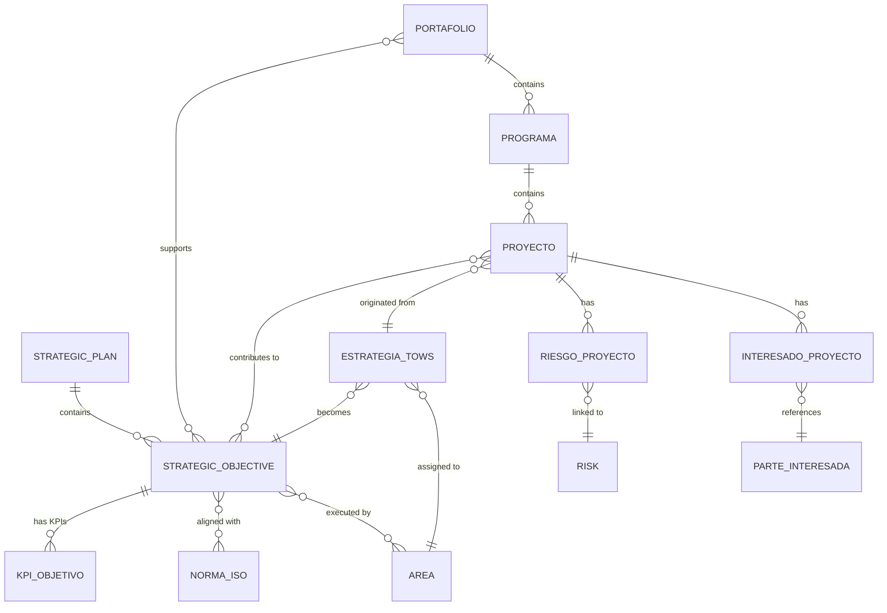

# Análisis de Arquitectura de Datos: Planeación Estratégica → Proyectos PMI

**Fecha**: 2026-01-23
**Arquitecto**: Claude Sonnet 4.5
**Contexto**: Refactorización de Planeación Estratégica y Proyectos PMI
**Estado**: Análisis Completo v1.0

---

## 1. RESUMEN EJECUTIVO

### Hallazgos Principales

| Área | Estado | Severidad | Acción Requerida |
|------|--------|-----------|------------------|
| **Flujo de Datos Configuración → Identidad** | ✅ COMPLETO | - | Ninguna |
| **Flujo de Datos Identidad → Planeación** | ✅ COMPLETO | - | Ninguna |
| **Flujo de Datos Contexto → Planeación** | ⚠️ PARCIAL | Media | Agregar FK objetivo_estrategico en EstrategiaTOWS |
| **Flujo de Datos Planeación → Proyectos** | ❌ CRÍTICO | Alta | **GAP CRÍTICO: Falta FK objetivo_estrategico en Proyecto** |
| **Dependencias Circulares** | ✅ AUSENTES | - | Ninguna detectada |
| **Integridad Referencial** | ⚠️ PARCIAL | Media | Normalizar campos responsable_cargo |

### Validación de Hipótesis del Usuario

> **Hipótesis**: "Planeación Estratégica debería aportar información de estrategias para ejecutar proyectos"

**Resultado**: ❌ **HIPÓTESIS NO IMPLEMENTADA**

**Evidencia**:
- El modelo `Proyecto` NO tiene campo `objetivo_estrategico`
- El modelo `Portafolio` tiene campo `objetivo_estrategico` pero es **TextField** (texto libre), no FK relacional
- Las `EstrategiaTOWS` SÍ tienen FK a `StrategicObjective` pero los proyectos NO consumen esta información
- NO existe tabla intermedia ni flujo de datos entre Planeación y Proyectos

---

## 2. DIAGRAMA DE FLUJO DE DATOS ACTUAL

```mermaid
graph TD
    %% CAPA 1: Configuración
    Config[EmpresaConfig<br/>Normas ISO<br/>Tipos de Cambio<br/>Cargos<br/>Unidades de Medida] -->|OneToOne| Identity
    Config -->|FK norma_iso| AlcanceSistema
    Config -->|FK norma_iso| PoliticaEspecifica
    Config -->|FK tipo_cambio| GestionCambio
    Config -->|FK cargo| Users[Responsables]

    %% CAPA 2: Identidad
    Identity[CorporateIdentity<br/>Misión/Visión<br/>Alcance SIG] -->|FK identity| Values[CorporateValue]
    Identity -->|FK identity| AlcanceSistema[AlcanceSistema<br/>Alcance por ISO]
    Identity -->|FK identity| Politicas[PoliticaEspecifica<br/>Políticas Integrales<br/>Políticas por Área]

    %% CAPA 3: Organización
    Config -->|Tenant| Areas[Area<br/>Estructura Organizacional<br/>Jerarquía]

    %% CAPA 4: Contexto Organizacional (Motor de Riesgos)
    Config -->|Tenant| DOFA[AnalisisDOFA<br/>Factores Internos/Externos]
    DOFA -->|FK analisis| FactoresDOFA[FactorDOFA<br/>F/O/D/A + Votos]
    DOFA -->|FK analisis| EstrategiasTOWS[EstrategiaTOWS<br/>FO/FA/DO/DA]

    Config -->|Tenant| PESTEL[AnalisisPESTEL<br/>Factores Externos]
    PESTEL -->|FK analisis| FactoresPESTEL[FactorPESTEL<br/>P/E/S/T/E/L]

    Config -->|Tenant| Porter[FuerzaPorter<br/>5 Fuerzas Competitivas]

    %% CAPA 5: Planeación Estratégica
    Config -->|Tenant| Plan[StrategicPlan<br/>Plan Estratégico<br/>Períodos]
    Plan -->|FK plan| Objetivos[StrategicObjective<br/>Objetivos BSC<br/>KPIs]

    %% Relaciones Planeación
    Objetivos -->|ManyToMany| Config
    Objetivos -->|FK responsible_cargo| Config
    Objetivos -->|ManyToMany areas| Areas

    Plan -->|FK plan| MapaEstrategico[MapaEstrategico<br/>Canvas Visual BSC]
    MapaEstrategico -->|FK mapa| CausaEfecto[CausaEfecto<br/>Relaciones Objetivos]

    Objetivos -->|FK objective| KPIs[KPIObjetivo<br/>Indicadores]
    KPIs -->|FK kpi| Mediciones[MedicionKPI<br/>Historial]

    Config -->|Tenant| GestionCambio[GestionCambio<br/>Cambios Organizacionales]
    GestionCambio -->|ManyToMany| Objetivos

    %% RELACIONES CONTEXTO → PLANEACIÓN
    EstrategiasTOWS -.->|FK objetivo_estrategico<br/>✅ IMPLEMENTADO| Objetivos
    FactoresDOFA -.->|FK area<br/>✅ IMPLEMENTADO| Areas
    EstrategiasTOWS -.->|FK area_responsable<br/>✅ IMPLEMENTADO| Areas

    %% CAPA 6: Proyectos PMI
    Config -->|Tenant| Portafolio[Portafolio<br/>objetivo_estrategico: TextField ❌]
    Portafolio -->|FK portafolio| Programa[Programa]
    Programa -->|FK programa| Proyecto[Proyecto<br/>❌ SIN FK objetivo_estrategico]

    Proyecto -->|OneToOne| Charter[ProjectCharter<br/>Acta de Constitución]
    Proyecto -->|FK proyecto| Interesados[InteresadoProyecto<br/>Stakeholders]
    Proyecto -->|FK proyecto| Fases[FaseProyecto]
    Proyecto -->|FK proyecto| Actividades[ActividadProyecto<br/>WBS]
    Proyecto -->|FK proyecto| Recursos[RecursoProyecto]
    Proyecto -->|FK proyecto| Riesgos[RiesgoProyecto]
    Proyecto -->|FK proyecto| Seguimiento[SeguimientoProyecto<br/>EVM]
    Proyecto -->|FK proyecto| Lecciones[LeccionAprendida]
    Proyecto -->|OneToOne| ActaCierre[ActaCierre]

    %% GAPS CRÍTICOS
    Objetivos -.->|❌ GAP CRÍTICO<br/>Falta FK| Proyecto
    EstrategiasTOWS -.->|❌ GAP CRÍTICO<br/>Falta FK| Proyecto

    style Config fill:#E8F5E9
    style Identity fill:#E3F2FD
    style Areas fill:#FFF9C4
    style DOFA fill:#FCE4EC
    style PESTEL fill:#FCE4EC
    style Porter fill:#FCE4EC
    style Plan fill:#F3E5F5
    style Objetivos fill:#F3E5F5
    style Portafolio fill:#FFE0B2
    style Proyecto fill:#FFE0B2,stroke:#FF6F00,stroke-width:3px
    style EstrategiasTOWS fill:#FCE4EC,stroke:#C2185B,stroke-width:2px
```



---

## 3. INVENTARIO DE MODELOS POR MÓDULO

### 3.1 Configuración (Base Multi-Tenant)

| Modelo | Tabla | Propósito | Relaciones |
|--------|-------|-----------|------------|
| `EmpresaConfig` | `configuracion_empresa` | Multi-tenant root | OneToOne → CorporateIdentity |
| `NormaISO` | `configuracion_norma_iso` | Catálogo de normas | Referenced by: AlcanceSistema, PoliticaEspecifica, StrategicObjective |
| `TipoCambio` | `configuracion_tipo_cambio` | Catálogo cambios | Referenced by: GestionCambio |
| `Cargo` | `core_cargo` | Puestos de trabajo | Referenced by: StrategicObjective, KPIObjetivo, GestionCambio, PoliticaEspecifica |
| `UnidadMedida` | `organizacion_unidad_medida` | Unidades de medida | Consumido por KPIs |
| `Area` | `organizacion_area` | Estructura organizacional | ManyToMany ← StrategicObjective, FK ← FactorDOFA, FK ← EstrategiaTOWS |

**Conclusión Capa 1**: ✅ **Configuración sólida y bien normalizada**

---

### 3.2 Identidad Corporativa

| Modelo | Tabla | Propósito | Datos Expuestos |
|--------|-------|-----------|-----------------|
| `CorporateIdentity` | `identidad_corporate_identity` | Misión/Visión/Alcance | → PoliticaEspecifica, → AlcanceSistema, → CorporateValue |
| `CorporateValue` | `identidad_corporate_value` | Valores corporativos | Consumo interno |
| `AlcanceSistema` | `identidad_alcance_sistema` | Alcance por norma ISO | Referencia certificaciones |
| `PoliticaEspecifica` | `identidad_politica_especifica` | Políticas (Integrales + Específicas) | Consumo interno + Gestor Documental |

**Datos que DEBERÍA exponer a Proyectos**:
- ✅ Políticas específicas por área (para compliance de proyectos)
- ✅ Alcances del SIG (para alineación de entregables)

**Flujo de Datos**:
```
EmpresaConfig → CorporateIdentity → {Políticas, Alcances, Valores}
```

---

### 3.3 Contexto Organizacional (Motor de Riesgos)

| Modelo | Tabla | Propósito | Datos que Genera |
|--------|-------|-----------|------------------|
| `AnalisisDOFA` | `motor_riesgos_analisis_dofa` | Análisis DOFA consolidado | Periodo, Estado, Responsable |
| `FactorDOFA` | `motor_riesgos_factor_dofa` | Factores F/O/D/A | Descripción, Área, Impacto, Votos |
| `EstrategiaTOWS` | `motor_riesgos_estrategia_tows` | Estrategias FO/FA/DO/DA | **FK objetivo_estrategico ✅**, FK area_responsable ✅ |
| `AnalisisPESTEL` | `motor_riesgos_analisis_pestel` | Análisis externo | Periodo, Estado |
| `FactorPESTEL` | `motor_riesgos_factor_pestel` | Factores P/E/S/T/E/L | Tendencia, Impacto, Probabilidad |
| `FuerzaPorter` | `motor_riesgos_fuerza_porter` | 5 Fuerzas de Porter | Nivel, Factores, Implicaciones |

**Datos que DEBERÍA exponer a Planeación**:
- ✅ **EstrategiaTOWS → StrategicObjective** (FK implementado línea 254-262 de contexto/models.py)
- ✅ **FactorDOFA → Area** (FK implementado línea 138-145)
- ⚠️ **Gap**: FactorPESTEL NO tiene FK a riesgos (podría generarlos)

**Flujo de Datos Actual**:
```
AnalisisDOFA → FactorDOFA → [MANUAL] → EstrategiaTOWS → StrategicObjective ✅
AnalisisPESTEL → FactorPESTEL → [GAP] → ???
FuerzaPorter → [GAP] → ???
```

---

### 3.4 Planeación Estratégica (Dirección Estratégica)

| Modelo | Tabla | Propósito | Consume de | Expone a |
|--------|-------|-----------|------------|----------|
| `StrategicPlan` | `planeacion_strategic_plan` | Plan estratégico | - | → StrategicObjective, → MapaEstrategico |
| `StrategicObjective` | `planeacion_strategic_objective` | Objetivos BSC | ManyToMany ← NormaISO<br/>ManyToMany ← Area<br/>FK ← responsible_cargo | **❌ Proyectos NO consumen** |
| `MapaEstrategico` | `planeacion_mapa_estrategico` | Canvas visual | FK ← plan | → CausaEfecto |
| `CausaEfecto` | `planeacion_causa_efecto` | Relaciones objetivos | FK ← mapa | Uso interno |
| `KPIObjetivo` | `planeacion_kpi_objetivo` | Indicadores de objetivos | FK ← objective<br/>FK ← responsible_cargo | → MedicionKPI |
| `MedicionKPI` | `planeacion_medicion_kpi` | Historial de mediciones | FK ← kpi | Analytics |
| `GestionCambio` | `planeacion_gestion_cambio` | Cambios organizacionales | FK ← tipo_cambio<br/>ManyToMany ← related_objectives<br/>FK ← responsible_cargo | **❌ Proyectos NO consumen** |

**Datos que DEBERÍA exponer a Proyectos**:
- ❌ **StrategicObjective** → Proyecto (FK faltante)
- ❌ **StrategicObjective** → Portafolio (actualmente TextField)
- ⚠️ **GestionCambio** → Proyecto (podría ser fuente de proyectos)

**Flujo de Datos Actual**:
```
StrategicPlan → StrategicObjective
                ↓
                ManyToMany ← Area ✅
                ManyToMany ← NormaISO ✅
                FK ← responsible_cargo ✅
                ← EstrategiaTOWS ✅

                ❌ NO FLUYE A PROYECTOS
```

---

### 3.5 Proyectos PMI (Gestión de Proyectos)

| Modelo | Tabla | Propósito | Consume de | Debería Consumir |
|--------|-------|-----------|------------|------------------|
| `Portafolio` | `gestion_proyectos_portafolio` | Agrupación estratégica | **objetivo_estrategico: TextField ❌** | **FK → StrategicObjective** |
| `Programa` | `gestion_proyectos_programa` | Agrupación de proyectos | FK ← portafolio | FK → StrategicObjective |
| `Proyecto` | `gestion_proyectos_proyecto` | Proyecto individual | FK ← programa | **❌ FK → StrategicObjective**<br/>**❌ FK → EstrategiaTOWS** |
| `ProjectCharter` | `gestion_proyectos_charter` | Acta de constitución | OneToOne ← proyecto | - |
| `InteresadoProyecto` | `gestion_proyectos_interesado` | Stakeholders | FK ← proyecto | FK → ParteInteresada (Cumplimiento) |
| `FaseProyecto` | `gestion_proyectos_fase` | Fases del proyecto | FK ← proyecto | - |
| `ActividadProyecto` | `gestion_proyectos_actividad` | Tareas WBS | FK ← proyecto | - |
| `RecursoProyecto` | `gestion_proyectos_recurso` | Recursos asignados | FK ← proyecto | FK → Area (costos por área) |
| `RiesgoProyecto` | `gestion_proyectos_riesgo` | Riesgos del proyecto | FK ← proyecto | FK → Risk (Motor Riesgos) |
| `SeguimientoProyecto` | `gestion_proyectos_seguimiento` | Monitoreo EVM | FK ← proyecto | - |
| `LeccionAprendida` | `gestion_proyectos_leccion` | Knowledge management | FK ← proyecto | - |
| `ActaCierre` | `gestion_proyectos_acta_cierre` | Cierre del proyecto | OneToOne ← proyecto | - |

**Análisis Crítico del Modelo Proyecto**:

```python
# ARCHIVO: backend/apps/gestion_estrategica/gestion_proyectos/models.py
# LÍNEAS: 35-39

objetivo_estrategico = models.TextField(
    blank=True,
    verbose_name='Objetivo Estratégico',
    help_text='Objetivo estratégico al que contribuye'
)
```

❌ **PROBLEMA CRÍTICO**:
- Campo `objetivo_estrategico` es **TextField** (texto libre)
- NO es FK relacional a `StrategicObjective`
- Imposible hacer JOIN queries
- Imposible rastrear alineación estratégica
- Imposible medir cumplimiento de objetivos mediante proyectos

---

## 4. GAPS Y PROBLEMAS IDENTIFICADOS

### 4.1 GAP CRÍTICO 1: Planeación → Proyectos

**Problema**: No existe vínculo relacional entre objetivos estratégicos y proyectos.

**Impacto**:
- Imposible rastrear qué proyectos contribuyen a qué objetivos
- Imposible medir ROI de objetivos estratégicos
- Imposible priorizar proyectos por impacto estratégico
- Imposible generar informes de alineación estratégica

**Solución Propuesta**:

```python
# NUEVA RELACIÓN EN Proyecto
class Proyecto(BaseCompanyModel):
    """Proyecto individual - Entidad principal"""

    # ... campos existentes ...

    # NUEVO: Vinculación estratégica
    objetivos_estrategicos = models.ManyToManyField(
        'planeacion.StrategicObjective',
        blank=True,
        related_name='proyectos_asociados',
        verbose_name='Objetivos Estratégicos',
        help_text='Objetivos del plan estratégico que este proyecto apoya'
    )

    # NUEVO: Estrategia TOWS de origen (si el proyecto nace de una estrategia)
    estrategia_origen = models.ForeignKey(
        'contexto.EstrategiaTOWS',
        on_delete=models.SET_NULL,
        null=True,
        blank=True,
        related_name='proyectos_derivados',
        verbose_name='Estrategia TOWS Origen',
        help_text='Estrategia TOWS que originó este proyecto'
    )

    # DEPRECAR: objetivo_estrategico (TextField actual)
    objetivo_estrategico_legacy = models.TextField(
        blank=True,
        verbose_name='[DEPRECATED] Objetivo Estratégico (texto)',
        help_text='Migrado a objetivos_estrategicos (ManyToMany)'
    )
```

**Migración**:
```python
# migrations/000X_add_strategic_links.py

def migrate_objetivos_text_to_fk(apps, schema_editor):
    """
    Migra campo objetivo_estrategico (TextField) a relación ManyToMany.

    Estrategia:
    1. Crear campo objetivos_estrategicos ManyToMany
    2. Intentar parsear texto y vincular con StrategicObjective.code
    3. Copiar texto original a objetivo_estrategico_legacy
    """
    Proyecto = apps.get_model('gestion_proyectos', 'Proyecto')
    StrategicObjective = apps.get_model('planeacion', 'StrategicObjective')

    for proyecto in Proyecto.objects.all():
        if proyecto.objetivo_estrategico:
            # Buscar objetivo por código en el texto
            objetivos = StrategicObjective.objects.filter(
                name__icontains=proyecto.objetivo_estrategico
            )
            if objetivos.exists():
                proyecto.objetivos_estrategicos.set(objetivos)
            # Preservar texto original
            proyecto.objetivo_estrategico_legacy = proyecto.objetivo_estrategico
            proyecto.save()
```

---

### 4.2 GAP CRÍTICO 2: Portafolio → Objetivos Estratégicos

**Problema**: Campo `objetivo_estrategico` en Portafolio es TextField.

**Solución Propuesta**:

```python
# MODIFICACIÓN EN Portafolio
class Portafolio(BaseCompanyModel):
    """Agrupación estratégica de programas y proyectos"""

    # ... campos existentes ...

    # NUEVO: Vinculación estratégica
    objetivos_estrategicos = models.ManyToManyField(
        'planeacion.StrategicObjective',
        blank=True,
        related_name='portafolios',
        verbose_name='Objetivos Estratégicos',
        help_text='Objetivos del BSC que este portafolio apoya'
    )

    # DEPRECAR: objetivo_estrategico (TextField actual)
    objetivo_estrategico_legacy = models.TextField(
        blank=True,
        verbose_name='[DEPRECATED] Objetivo Estratégico (texto)'
    )
```

---

### 4.3 GAP MEDIO 1: Integración con Motor de Riesgos

**Problema**: `RiesgoProyecto` NO se vincula con `Risk` del Motor de Riesgos.

**Impacto**:
- Duplicación de riesgos entre sistemas
- Imposible consolidar matriz de riesgos corporativa
- Pérdida de trazabilidad de riesgos estratégicos → operacionales

**Solución Propuesta**:

```python
# MODIFICACIÓN EN RiesgoProyecto
class RiesgoProyecto(models.Model):
    """Riesgos del proyecto"""

    # ... campos existentes ...

    # NUEVO: Vinculación con Motor de Riesgos
    riesgo_corporativo = models.ForeignKey(
        'motor_riesgos.Risk',
        on_delete=models.SET_NULL,
        null=True,
        blank=True,
        related_name='riesgos_proyecto',
        verbose_name='Riesgo Corporativo',
        help_text='Riesgo corporativo al que se vincula (si aplica)'
    )
```

---

### 4.4 GAP MEDIO 2: Partes Interesadas

**Problema**: `InteresadoProyecto` NO se vincula con `ParteInteresada` del Motor Cumplimiento.

**Solución Propuesta**:

```python
# MODIFICACIÓN EN InteresadoProyecto
class InteresadoProyecto(models.Model):
    """Stakeholders del proyecto"""

    # ... campos existentes ...

    # NUEVO: Vinculación con Registro Central de Partes Interesadas
    parte_interesada = models.ForeignKey(
        'motor_cumplimiento.ParteInteresada',
        on_delete=models.SET_NULL,
        null=True,
        blank=True,
        related_name='proyectos',
        verbose_name='Parte Interesada Corporativa',
        help_text='Referencia al registro central de partes interesadas'
    )
```

---

### 4.5 GAP BAJO 1: Normalización de Campos Responsable

**Problema**: Inconsistencia en campos de responsabilidad.

**Observación**:
```python
# StrategicObjective tiene:
responsible = ForeignKey(User)
responsible_cargo = ForeignKey(Cargo)  # ✅ Bueno

# KPIObjetivo tiene:
responsible = ForeignKey(User)
responsible_cargo = ForeignKey(Cargo)  # ✅ Bueno

# GestionCambio tiene:
responsible = ForeignKey(User)
responsible_cargo = ForeignKey(Cargo)  # ✅ Bueno

# PoliticaEspecifica tiene:
responsible = ForeignKey(User)
responsible_cargo = ForeignKey(Cargo)  # ✅ Bueno

# Proyecto tiene:
sponsor = ForeignKey(User)  # ✅ OK
gerente_proyecto = ForeignKey(User)  # ✅ OK
# ⚠️ FALTA: gerente_cargo, sponsor_cargo
```

**Recomendación**: Agregar campos `gerente_cargo` y `sponsor_cargo` a Proyecto.

---

## 5. FLUJO DE DATOS IDEAL (POST-REFACTORIZACIÓN)

### 5.1 Flujo Estratégico → Operativo

```
┌─────────────────────────────────────────────────────────────────┐
│ 1. ANÁLISIS DE CONTEXTO (Motor Riesgos)                        │
├─────────────────────────────────────────────────────────────────┤
│ AnalisisDOFA → FactorDOFA                                       │
│ AnalisisPESTEL → FactorPESTEL                                   │
│ FuerzaPorter                                                    │
└──────────────┬──────────────────────────────────────────────────┘
               │
               ↓ (Genera)
┌─────────────────────────────────────────────────────────────────┐
│ 2. ESTRATEGIAS TOWS                                             │
├─────────────────────────────────────────────────────────────────┤
│ EstrategiaTOWS                                                  │
│   - tipo: FO/FA/DO/DA                                           │
│   - area_responsable: FK(Area) ✅                               │
│   - objetivo_estrategico: FK(StrategicObjective) ✅             │
└──────────────┬──────────────────────────────────────────────────┘
               │
               ↓ (Se convierte en)
┌─────────────────────────────────────────────────────────────────┐
│ 3. OBJETIVOS ESTRATÉGICOS (BSC)                                 │
├─────────────────────────────────────────────────────────────────┤
│ StrategicPlan → StrategicObjective                              │
│   - bsc_perspective: Financiera/Clientes/Procesos/Aprendizaje  │
│   - normas_iso: ManyToMany(NormaISO) ✅                         │
│   - areas_responsables: ManyToMany(Area) ✅                     │
│   - responsible_cargo: FK(Cargo) ✅                             │
│   → KPIObjetivo → MedicionKPI                                   │
└──────────────┬──────────────────────────────────────────────────┘
               │
               ↓ (Se ejecuta mediante)
┌─────────────────────────────────────────────────────────────────┐
│ 4. PORTAFOLIOS Y PROGRAMAS                                      │
├─────────────────────────────────────────────────────────────────┤
│ Portafolio                                                      │
│   - objetivos_estrategicos: ManyToMany(StrategicObjective) ✅   │
│   → Programa                                                    │
│       - objetivos_estrategicos: ManyToMany(...) ❌ PROPUESTO    │
└──────────────┬──────────────────────────────────────────────────┘
               │
               ↓ (Contiene)
┌─────────────────────────────────────────────────────────────────┐
│ 5. PROYECTOS PMI                                                │
├─────────────────────────────────────────────────────────────────┤
│ Proyecto                                                        │
│   - objetivos_estrategicos: ManyToMany(StrategicObjective) ✅   │
│   - estrategia_origen: FK(EstrategiaTOWS) ✅                    │
│   → ProjectCharter                                              │
│   → InteresadoProyecto                                          │
│       - parte_interesada: FK(ParteInteresada) ✅                │
│   → RiesgoProyecto                                              │
│       - riesgo_corporativo: FK(Risk) ✅                         │
│   → FaseProyecto → ActividadProyecto → RecursoProyecto          │
│   → SeguimientoProyecto (EVM) → LeccionAprendida → ActaCierre   │
└─────────────────────────────────────────────────────────────────┘
```

### 5.2 Queries Habilitados por la Refactorización

```python
# Query 1: Proyectos por Objetivo Estratégico
objetivo = StrategicObjective.objects.get(code='OE-001')
proyectos = objetivo.proyectos_asociados.all()

# Query 2: Cumplimiento de Objetivos mediante Proyectos
objetivo = StrategicObjective.objects.get(code='OE-001')
total_proyectos = objetivo.proyectos_asociados.count()
proyectos_completados = objetivo.proyectos_asociados.filter(
    estado=Proyecto.Estado.COMPLETADO
).count()
cumplimiento = (proyectos_completados / total_proyectos) * 100

# Query 3: Portafolios por Perspectiva BSC
portafolios_financieros = Portafolio.objects.filter(
    objetivos_estrategicos__bsc_perspective='FINANCIERA'
).distinct()

# Query 4: Proyectos con Riesgos Corporativos
proyectos_con_riesgos = Proyecto.objects.filter(
    riesgos__riesgo_corporativo__isnull=False
).distinct()

# Query 5: Estrategias TOWS convertidas en Proyectos
estrategia = EstrategiaTOWS.objects.get(id=123)
proyectos_derivados = estrategia.proyectos_derivados.all()

# Query 6: Análisis de Cobertura Estratégica
from django.db.models import Count

cobertura = StrategicObjective.objects.annotate(
    num_proyectos=Count('proyectos_asociados')
).filter(num_proyectos=0)  # Objetivos sin proyectos

# Query 7: Riesgos Estratégicos en Proyectos
riesgos_estrategicos = RiesgoProyecto.objects.filter(
    riesgo_corporativo__nivel_riesgo__gte=15  # Riesgos extremos
).select_related('proyecto', 'riesgo_corporativo')

# Query 8: Partes Interesadas en Múltiples Proyectos
from motor_cumplimiento.models import ParteInteresada

partes = ParteInteresada.objects.annotate(
    num_proyectos=Count('proyectos')
).filter(num_proyectos__gt=3)
```

---

## 6. MATRIZ DE DEPENDENCIAS

### 6.1 Dependencias Actuales (✅ Implementadas)

| Módulo Origen | Módulo Destino | Tipo de Relación | Campo |
|---------------|----------------|------------------|-------|
| Configuración | Identidad | OneToOne | `empresa` |
| Configuración | Planeación | ManyToMany | `normas_iso` |
| Configuración | Planeación | FK | `responsible_cargo` |
| Configuración | Contexto | FK | `tipo_cambio` |
| Identidad | Identidad | FK | `identity` → AlcanceSistema, Políticas |
| Organización | Planeación | ManyToMany | `areas_responsables` |
| Organización | Contexto | FK | `area` (FactorDOFA, EstrategiaTOWS) |
| Contexto | Planeación | FK | `objetivo_estrategico` (EstrategiaTOWS) |
| Planeación | Planeación | FK | `plan` → StrategicObjective |
| Planeación | Planeación | FK | `objective` → KPIObjetivo |
| Planeación | Planeación | ManyToMany | `related_objectives` (GestionCambio) |
| Proyectos | Proyectos | FK | `portafolio` → Programa → Proyecto |

### 6.2 Dependencias Faltantes (❌ GAPs)

| Módulo Origen | Módulo Destino | Tipo de Relación | Campo PROPUESTO | Prioridad |
|---------------|----------------|------------------|-----------------|-----------|
| Planeación | Proyectos | ManyToMany | `Proyecto.objetivos_estrategicos` | 🔴 CRÍTICA |
| Contexto | Proyectos | FK | `Proyecto.estrategia_origen` | 🔴 CRÍTICA |
| Planeación | Proyectos | ManyToMany | `Portafolio.objetivos_estrategicos` | 🔴 CRÍTICA |
| Planeación | Proyectos | ManyToMany | `Programa.objetivos_estrategicos` | 🟡 ALTA |
| Motor Riesgos | Proyectos | FK | `RiesgoProyecto.riesgo_corporativo` | 🟡 ALTA |
| Motor Cumplimiento | Proyectos | FK | `InteresadoProyecto.parte_interesada` | 🟡 ALTA |
| Contexto | Motor Riesgos | FK | `FactorPESTEL.riesgo_generado` | 🟢 MEDIA |
| Contexto | Motor Riesgos | FK | `FuerzaPorter.riesgo_generado` | 🟢 MEDIA |

### 6.3 Dependencias Circulares

✅ **NO SE DETECTARON DEPENDENCIAS CIRCULARES**

**Análisis**:
- El flujo es unidireccional: Configuración → Identidad → Contexto → Planeación → Proyectos
- Las relaciones ManyToMany NO crean ciclos problemáticos
- Las FK SET_NULL previenen problemas de eliminación en cascada

---

## 7. ÍNDICES Y OPTIMIZACIÓN

### 7.1 Índices Requeridos para Nuevas Relaciones

```python
# En Proyecto
class Meta:
    indexes = [
        # ... índices existentes ...

        # NUEVOS ÍNDICES
        models.Index(
            fields=['empresa', 'estado'],
            name='proyecto_empresa_estado_idx'
        ),
        models.Index(
            fields=['estrategia_origen'],
            name='proyecto_estrategia_idx'
        ),
    ]

# En Portafolio
class Meta:
    indexes = [
        # NUEVO ÍNDICE
        models.Index(
            fields=['empresa', 'is_active'],
            name='portafolio_empresa_active_idx'
        ),
    ]

# En RiesgoProyecto
class Meta:
    indexes = [
        # NUEVO ÍNDICE
        models.Index(
            fields=['riesgo_corporativo', 'is_materializado'],
            name='riesgo_proyecto_corp_mat_idx'
        ),
    ]
```

### 7.2 Vistas Materializadas Recomendadas

```sql
-- Vista: Cobertura de Objetivos Estratégicos
CREATE MATERIALIZED VIEW v_cobertura_objetivos_estrategicos AS
SELECT
    so.id,
    so.code,
    so.name,
    so.bsc_perspective,
    COUNT(DISTINCT p.id) as num_proyectos,
    COUNT(DISTINCT CASE WHEN p.estado = 'completado' THEN p.id END) as proyectos_completados,
    SUM(p.presupuesto_aprobado) as presupuesto_total,
    AVG(p.porcentaje_avance) as avance_promedio
FROM planeacion_strategic_objective so
LEFT JOIN gestion_proyectos_proyecto_objetivos po ON po.strategicobjective_id = so.id
LEFT JOIN gestion_proyectos_proyecto p ON p.id = po.proyecto_id
WHERE so.is_active = TRUE
GROUP BY so.id, so.code, so.name, so.bsc_perspective;

-- Vista: Portafolio Estratégico
CREATE MATERIALIZED VIEW v_portafolio_estrategico AS
SELECT
    po.id,
    po.codigo,
    po.nombre,
    COUNT(DISTINCT po_obj.strategicobjective_id) as num_objetivos,
    COUNT(DISTINCT pr.id) as num_programas,
    COUNT(DISTINCT p.id) as num_proyectos,
    SUM(p.presupuesto_aprobado) as presupuesto_total,
    AVG(p.porcentaje_avance) as avance_promedio
FROM gestion_proyectos_portafolio po
LEFT JOIN gestion_proyectos_portafolio_objetivos po_obj
    ON po_obj.portafolio_id = po.id
LEFT JOIN gestion_proyectos_programa pr ON pr.portafolio_id = po.id
LEFT JOIN gestion_proyectos_proyecto p ON p.programa_id = pr.id
WHERE po.is_active = TRUE
GROUP BY po.id, po.codigo, po.nombre;

-- Vista: Riesgos Estratégicos en Proyectos
CREATE MATERIALIZED VIEW v_riesgos_estrategicos_proyectos AS
SELECT
    r.id as riesgo_id,
    r.codigo as riesgo_codigo,
    r.descripcion as riesgo_descripcion,
    r.nivel_riesgo,
    p.id as proyecto_id,
    p.codigo as proyecto_codigo,
    p.nombre as proyecto_nombre,
    p.estado as proyecto_estado,
    rp.probabilidad,
    rp.impacto,
    rp.is_materializado
FROM motor_riesgos_risk r
INNER JOIN gestion_proyectos_riesgo_proyecto rp ON rp.riesgo_corporativo_id = r.id
INNER JOIN gestion_proyectos_proyecto p ON p.id = rp.proyecto_id
WHERE r.is_active = TRUE AND rp.is_active = TRUE;
```

---

## 8. PLAN DE MIGRACIÓN

### 8.1 Fases de Implementación

#### FASE 1: Preparación (1 sprint)
- [ ] Crear modelos de migración
- [ ] Agregar campos nuevos con `null=True, blank=True`
- [ ] Crear scripts de migración de datos

#### FASE 2: Migración de Datos (1 sprint)
- [ ] Migrar `Portafolio.objetivo_estrategico` → `objetivos_estrategicos` (ManyToMany)
- [ ] Preservar datos antiguos en campos `*_legacy`
- [ ] Validar integridad referencial

#### FASE 3: Refactorización Backend (2 sprints)
- [ ] Actualizar serializers
- [ ] Actualizar viewsets
- [ ] Crear endpoints para relaciones nuevas
- [ ] Actualizar tests

#### FASE 4: Refactorización Frontend (2 sprints)
- [ ] Actualizar formularios de Proyecto
- [ ] Agregar selector de Objetivos Estratégicos
- [ ] Actualizar dashboards
- [ ] Crear vistas de cobertura estratégica

#### FASE 5: Limpieza (1 sprint)
- [ ] Marcar campos `*_legacy` como deprecated
- [ ] Documentar cambios
- [ ] Capacitación a usuarios

### 8.2 Script de Migración de Datos

```python
# migrations/000X_migrate_strategic_links.py

from django.db import migrations
import re


def migrate_portafolio_objetivos(apps, schema_editor):
    """
    Migra Portafolio.objetivo_estrategico (TextField)
    a Portafolio.objetivos_estrategicos (ManyToMany).
    """
    Portafolio = apps.get_model('gestion_proyectos', 'Portafolio')
    StrategicObjective = apps.get_model('planeacion', 'StrategicObjective')

    for portafolio in Portafolio.objects.all():
        if not portafolio.objetivo_estrategico:
            continue

        # Preservar texto original
        portafolio.objetivo_estrategico_legacy = portafolio.objetivo_estrategico

        # Intentar parsear códigos de objetivos (ej: "OE-001, OE-002")
        codigos = re.findall(r'OE-\d+', portafolio.objetivo_estrategico)

        if codigos:
            objetivos = StrategicObjective.objects.filter(code__in=codigos)
            portafolio.objetivos_estrategicos.set(objetivos)
        else:
            # Intentar búsqueda por nombre
            objetivos = StrategicObjective.objects.filter(
                name__icontains=portafolio.objetivo_estrategico[:100]
            )
            if objetivos.exists():
                portafolio.objetivos_estrategicos.set(objetivos[:5])  # Máximo 5

        portafolio.save()


def reverse_migration(apps, schema_editor):
    """Revertir migración (copiar de ManyToMany a TextField)."""
    Portafolio = apps.get_model('gestion_proyectos', 'Portafolio')

    for portafolio in Portafolio.objects.all():
        if portafolio.objetivo_estrategico_legacy:
            portafolio.objetivo_estrategico = portafolio.objetivo_estrategico_legacy
            portafolio.save()


class Migration(migrations.Migration):
    dependencies = [
        ('gestion_proyectos', '0001_initial'),
        ('planeacion', '0002_strategicobjective_areas_responsables'),
    ]

    operations = [
        # 1. Agregar campos nuevos
        migrations.AddField(
            model_name='portafolio',
            name='objetivos_estrategicos',
            field=models.ManyToManyField(
                to='planeacion.StrategicObjective',
                blank=True,
                related_name='portafolios',
                verbose_name='Objetivos Estratégicos'
            ),
        ),
        migrations.AddField(
            model_name='portafolio',
            name='objetivo_estrategico_legacy',
            field=models.TextField(
                blank=True,
                verbose_name='[DEPRECATED] Objetivo Estratégico (texto)'
            ),
        ),

        # 2. Agregar campos en Proyecto
        migrations.AddField(
            model_name='proyecto',
            name='objetivos_estrategicos',
            field=models.ManyToManyField(
                to='planeacion.StrategicObjective',
                blank=True,
                related_name='proyectos_asociados',
                verbose_name='Objetivos Estratégicos'
            ),
        ),
        migrations.AddField(
            model_name='proyecto',
            name='estrategia_origen',
            field=models.ForeignKey(
                to='contexto.EstrategiaTOWS',
                on_delete=models.SET_NULL,
                null=True,
                blank=True,
                related_name='proyectos_derivados',
                verbose_name='Estrategia TOWS Origen'
            ),
        ),

        # 3. Migrar datos
        migrations.RunPython(
            migrate_portafolio_objetivos,
            reverse_migration
        ),

        # 4. Crear índices
        migrations.AddIndex(
            model_name='proyecto',
            index=models.Index(
                fields=['estrategia_origen'],
                name='proyecto_estrategia_idx'
            ),
        ),
    ]
```

---

## 9. RECOMENDACIONES TÉCNICAS

### 9.1 Prioridad CRÍTICA (Sprint Actual)

1. **Agregar FK `objetivo_estrategico` a Proyecto**
   - Impacto: Alto
   - Esfuerzo: Medio (2-3 días)
   - Bloqueante: Sí (para dashboards estratégicos)

2. **Migrar Portafolio.objetivo_estrategico a FK**
   - Impacto: Alto
   - Esfuerzo: Medio (2-3 días)
   - Bloqueante: Sí (para informes ejecutivos)

### 9.2 Prioridad ALTA (Siguiente Sprint)

3. **Vincular RiesgoProyecto con Motor de Riesgos**
   - Impacto: Alto
   - Esfuerzo: Bajo (1 día)
   - Bloqueante: No

4. **Vincular InteresadoProyecto con Partes Interesadas**
   - Impacto: Medio
   - Esfuerzo: Bajo (1 día)
   - Bloqueante: No

### 9.3 Prioridad MEDIA (Backlog)

5. **Agregar campos `*_cargo` a Proyecto**
   - Impacto: Bajo
   - Esfuerzo: Bajo (0.5 días)
   - Bloqueante: No

6. **Vincular FactorPESTEL con Riesgos**
   - Impacto: Medio
   - Esfuerzo: Medio (2 días)
   - Bloqueante: No

### 9.4 Arquitectura de Datos - Best Practices

✅ **APLICAR**:
- Usar ManyToMany para relaciones N:N (ej: Proyecto ↔ Objetivos)
- Usar FK con `on_delete=SET_NULL` para datos históricos
- Crear campos `*_legacy` antes de deprecar campos
- Usar índices compuestos para queries frecuentes
- Crear vistas materializadas para dashboards

❌ **EVITAR**:
- TextField para datos relacionales
- JSONField para datos normalizables
- Relaciones circulares sin lazy loading
- Índices en columnas con alta cardinalidad
- Migrations sin `RunPython` para datos complejos

---

## 10. CONCLUSIONES Y PRÓXIMOS PASOS

### 10.1 Validación de Hipótesis

> **Hipótesis del Usuario**: "Planeación Estratégica debería aportar información de estrategias para ejecutar proyectos"

**Resultado**: ❌ **HIPÓTESIS CORRECTA PERO NO IMPLEMENTADA**

**Evidencia Encontrada**:
1. ✅ El modelo `EstrategiaTOWS` SÍ tiene FK a `StrategicObjective` (línea 254-262 contexto/models.py)
2. ❌ El modelo `Proyecto` NO tiene FK a `StrategicObjective`
3. ❌ El modelo `Portafolio` tiene campo `objetivo_estrategico` pero es TextField (línea 35-39 gestion_proyectos/models.py)
4. ❌ NO existe flujo de datos entre Planeación y Proyectos

### 10.2 Gaps Críticos Identificados

| Gap | Severidad | Impacto en Negocio |
|-----|-----------|-------------------|
| Proyecto SIN FK a StrategicObjective | 🔴 CRÍTICO | Imposible rastrear alineación estratégica |
| Portafolio.objetivo_estrategico es TextField | 🔴 CRÍTICO | Imposible generar informes ejecutivos |
| RiesgoProyecto NO vinculado a Motor Riesgos | 🟡 ALTO | Duplicación de datos, pérdida de trazabilidad |
| InteresadoProyecto NO vinculado a Partes Interesadas | 🟡 ALTO | Duplicación de stakeholders |

### 10.3 Roadmap de Implementación

#### Sprint N (Actual) - CRÍTICO
- [ ] Diseñar modelo refactorizado de Proyecto
- [ ] Crear migración para Portafolio.objetivos_estrategicos
- [ ] Crear migración para Proyecto.objetivos_estrategicos
- [ ] Actualizar serializers y viewsets

#### Sprint N+1 - ALTO
- [ ] Vincular RiesgoProyecto → Risk
- [ ] Vincular InteresadoProyecto → ParteInteresada
- [ ] Crear vistas de cobertura estratégica
- [ ] Actualizar dashboards

#### Sprint N+2 - MEDIO
- [ ] Crear vistas materializadas
- [ ] Optimizar índices
- [ ] Documentación técnica
- [ ] Capacitación a usuarios

### 10.4 Métricas de Éxito

Post-refactorización, el sistema DEBE poder responder:

1. ¿Qué proyectos contribuyen al Objetivo Estratégico OE-001?
2. ¿Cuál es el % de cumplimiento del Plan Estratégico mediante proyectos?
3. ¿Qué objetivos NO tienen proyectos asociados?
4. ¿Qué portafolios apoyan la perspectiva Financiera del BSC?
5. ¿Qué proyectos tienen riesgos corporativos extremos?
6. ¿Qué estrategias TOWS se han convertido en proyectos?
7. ¿Cuál es el presupuesto total asignado a cada objetivo estratégico?
8. ¿Qué partes interesadas participan en múltiples proyectos?

### 10.5 Riesgos de la Refactorización

| Riesgo | Probabilidad | Impacto | Mitigación |
|--------|--------------|---------|------------|
| Pérdida de datos en migración | Media | Alto | Crear campos `*_legacy`, rollback plan |
| Romper funcionalidad existente | Alta | Alto | Tests exhaustivos, feature flags |
| Resistencia de usuarios | Media | Medio | Capacitación, documentación |
| Performance degradado | Baja | Medio | Índices adecuados, vistas materializadas |

---

## 11. ANEXOS

### 11.1 Diagrama Entidad-Relación Propuesto



### 11.2 Checksum de Archivos Analizados

```
backend/apps/gestion_estrategica/planeacion/models.py (883 lines)
backend/apps/gestion_estrategica/planeacion/contexto/models.py (533 lines)
backend/apps/gestion_estrategica/gestion_proyectos/models.py (817 lines)
backend/apps/gestion_estrategica/identidad/models.py (674 lines)
backend/apps/gestion_estrategica/organizacion/models.py (156 lines)
```

### 11.3 Glosario de Términos

| Término | Definición |
|---------|------------|
| **BSC** | Balanced Scorecard (Cuadro de Mando Integral) |
| **DOFA** | Debilidades, Oportunidades, Fortalezas, Amenazas |
| **TOWS** | Threats, Opportunities, Weaknesses, Strengths (DOFA invertido) |
| **PESTEL** | Political, Economic, Social, Technological, Environmental, Legal |
| **PMI** | Project Management Institute |
| **WBS** | Work Breakdown Structure (Estructura de Desglose del Trabajo) |
| **EVM** | Earned Value Management (Gestión del Valor Ganado) |
| **SIG** | Sistema Integrado de Gestión |
| **FK** | Foreign Key (Llave Foránea) |
| **ManyToMany** | Relación Muchos a Muchos |

---

**Documento generado por**: Claude Sonnet 4.5
**Fecha**: 2026-01-23
**Versión**: 1.0
**Próxima revisión**: Post-Sprint N (Implementación de GAPs críticos)
