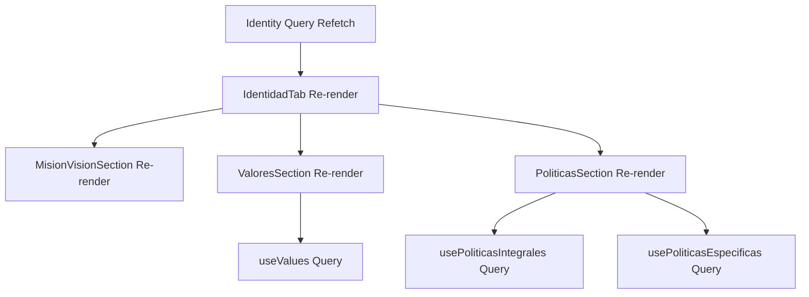

# Auditoría Arquitectura Frontend - Módulo Identidad Corporativa

**Fecha:** 2026-01-09
**Sistema:** StrateKaz - Gestión Estratégica
**Alcance:** `frontend/src/features/gestion-estrategica/` (Identidad Corporativa)
**Total Archivos:** 116 archivos TypeScript/TSX

---

## 1. RESUMEN EJECUTIVO

### Estado General: ⭐⭐⭐⭐☆ (4/5)

El módulo de Identidad Corporativa muestra una **arquitectura sólida y bien estructurada** con patrones modernos de React. Se identificaron **oportunidades de mejora** en la gestión de estado, re-renders y separación de responsabilidades.

### Fortalezas Principales

✅ **Separación clara de responsabilidades** (componentes, hooks, API)
✅ **Uso correcto de React Query** para caché y sincronización
✅ **Tipado TypeScript completo** y bien definido
✅ **Componentes reutilizables** del Design System
✅ **Drag & Drop implementado correctamente** con @dnd-kit
✅ **Sistema de iconos dinámico** desde base de datos

### Áreas de Mejora Identificadas

⚠️ **Re-renders innecesarios** en componentes grandes
⚠️ **Prop drilling** en IdentidadTab
⚠️ **Estado local vs hooks** no siempre optimizado
⚠️ **Falta memoización** en cálculos complejos
⚠️ **Integración branding** podría ser más explícita

---

## 2. ARQUITECTURA DE COMPONENTES

### 2.1 Diagrama de Estructura

```
┌─────────────────────────────────────────────────────────────┐
│                      IdentidadTab.tsx                       │
│  (Componente Principal - 480 líneas)                        │
│                                                              │
│  ┌─────────────┐  ┌──────────────┐  ┌──────────────┐      │
│  │ Misión &    │  │   Valores    │  │  Políticas   │      │
│  │   Visión    │  │  Drag&Drop   │  │   Manager    │      │
│  └──────┬──────┘  └──────┬───────┘  └──────┬───────┘      │
│         │                 │                  │               │
└─────────┼─────────────────┼──────────────────┼──────────────┘
          │                 │                  │
          ▼                 ▼                  ▼
┌─────────────────┐ ┌─────────────────┐ ┌──────────────────┐
│ MisionVision    │ │ ValoresDragDrop │ │ PoliticasManager │
│    Section      │ │   (538 líneas)  │ │   (912 líneas)   │
│  (Presentación) │ │                 │ │                  │
└─────────────────┘ └─────────────────┘ └──────────────────┘
          │                 │                  │
          │                 │                  │
          └────────┬────────┴──────────────────┘
                   │
                   ▼
         ┌─────────────────────┐
         │ IdentityFormModal   │
         │   (173 líneas)      │
         │                     │
         │ - RichTextEditor    │
         │ - Validación        │
         └─────────────────────┘
```

### 2.2 Flujo de Datos

```
┌──────────────────┐
│  useActiveIdentity │ ◄─── React Query Cache
└────────┬──────────┘
         │
         ▼
┌──────────────────┐      ┌────────────────┐
│  IdentidadTab    │ ────►│  useValues     │
│                  │      │  useReorder    │
│  Props:          │      │  useCreate     │
│  - activeSection │      └────────────────┘
│  - triggerForm   │              │
└────────┬─────────┘              │
         │                        │
         │                        ▼
         │              ┌────────────────────┐
         │              │  API Layer         │
         │              │  - identityApi     │
         │              │  - valuesApi       │
         │              │  - politicasApi    │
         └──────────────┴────────────────────┘
```

---

## 3. ANÁLISIS POR COMPONENTE

### 3.1 IdentidadTab.tsx (Componente Principal)

**Ubicación:** `components/IdentidadTab.tsx`
**Líneas:** 480
**Responsabilidades:** Orquestación, routing de secciones, modales

#### ✅ Fortalezas

- **Separación de secciones:** Usa sub-componentes internos bien definidos
- **Gestión de modales:** Control centralizado con estado local
- **Mapping dinámico:** `SECTION_KEYS` mapea códigos de BD a componentes
- **Error handling:** Validación de secciones con console.warn

#### ⚠️ Problemas Identificados

**1. Prop Drilling Excesivo**

```typescript
// ❌ ACTUAL: Props se pasan en cadena
<MisionVisionSection
  identity={identity}
  onEdit={handleEditIdentity}
/>

<ValoresSection identity={identity} />

<PoliticasSection identity={identity} />
```

**Impacto:**
- Cambios en `identity` causan re-render de TODAS las secciones
- Dificulta testing y mantenimiento

**2. Lógica de Secciones Mezclada**

```typescript
// ❌ Sub-componentes dentro del archivo principal
const MisionVisionSection = ({ identity, onEdit }: MisionVisionSectionProps) => {
  return (
    <div className="space-y-6">
      {/* 70 líneas de JSX */}
    </div>
  );
};

const ValoresSection = ({ identity }: ValoresSectionProps) => {
  // 45 líneas de lógica + JSX
};
```

**Recomendación:** Extraer a archivos separados

#### 🎯 Recomendaciones

**R1.1: Usar Context para Identity**

```typescript
// context/IdentityContext.tsx
export const IdentityProvider = ({ children }) => {
  const { data: identity, isLoading } = useActiveIdentity();

  return (
    <IdentityContext.Provider value={{ identity, isLoading }}>
      {children}
    </IdentityContext.Provider>
  );
};

// Hook simplificado
export const useIdentity = () => {
  const context = useContext(IdentityContext);
  if (!context) throw new Error('useIdentity must be within Provider');
  return context;
};
```

**R1.2: Extraer Secciones a Archivos**

```
components/identidad/
  ├── sections/
  │   ├── MisionVisionSection.tsx
  │   ├── ValoresSection.tsx
  │   ├── PoliticaSection.tsx
  │   └── PoliticasSection.tsx
  └── IdentidadTab.tsx (orquestador ligero)
```

---

### 3.2 ValoresDragDrop.tsx

**Ubicación:** `components/ValoresDragDrop.tsx`
**Líneas:** 538
**Responsabilidades:** Gestión valores con drag & drop, iconos dinámicos

#### ✅ Fortalezas

- **Drag & Drop bien implementado:** Usa @dnd-kit correctamente
- **Iconos dinámicos:** Integración con IconPicker del Design System
- **Animaciones suaves:** Framer Motion para transiciones
- **Estado optimista:** No espera respuesta para reordenar visualmente
- **Sensor configuration:** Distancia de 8px evita clics accidentales

#### ⚠️ Problemas Identificados

**1. Sorting sin Memoization**

```typescript
// ❌ ACTUAL: Se re-calcula en cada render
const sortedValues = useMemo(
  () => [...values].sort((a, b) => a.orden - b.orden),
  [values] // Correcto, pero values viene de props
);
```

**Impacto:** Si `values` cambia frecuentemente (ej: por React Query refetch), re-ordena innecesariamente.

**2. Estado Local Duplicado**

```typescript
const [editingId, setEditingId] = useState<number | null>(null);
const [editData, setEditData] = useState<Partial<CorporateValue>>({});
const [isCreating, setIsCreating] = useState(false);
const [newValue, setNewValue] = useState<Partial<CorporateValue>>({
  name: '',
  description: '',
  icon: 'Heart',
});
```

**Análisis:** Demasiados estados para gestionar modos (creación/edición)

#### 🎯 Recomendaciones

**R2.1: Reducer para Formularios**

```typescript
type FormMode =
  | { type: 'idle' }
  | { type: 'creating'; data: Partial<CorporateValue> }
  | { type: 'editing'; id: number; data: Partial<CorporateValue> };

const [formMode, setFormMode] = useReducer(formReducer, { type: 'idle' });

// Simplifica la lógica
const isEditing = formMode.type === 'editing';
const isCreating = formMode.type === 'creating';
```

**R2.2: Optimizar DragEndEvent**

```typescript
// ✅ Evitar re-ordenamientos si no hay cambio
const handleDragEnd = async (event: DragEndEvent) => {
  const { active, over } = event;
  setActiveId(null);

  if (!over || active.id === over.id) return; // Early return

  const oldIndex = sortedValues.findIndex((v) => v.id === active.id);
  const newIndex = sortedValues.findIndex((v) => v.id === over.id);

  if (oldIndex === newIndex) return; // No cambió posición

  // Resto de la lógica...
};
```

---

### 3.3 PoliticasManager.tsx

**Ubicación:** `components/PoliticasManager.tsx`
**Líneas:** 912
**Responsabilidades:** Workflow políticas, firma digital, versionamiento

#### ✅ Fortalezas

- **Workflow completo:** Estados bien definidos (BORRADOR → VIGENTE)
- **Sistema de revisión:** Alertas automáticas para políticas vencidas
- **Firma digital:** Hash SHA-256 implementado
- **Editor rico:** Usa RichTextEditor del Design System
- **Filtros avanzados:** Por estado, búsqueda, etc.

#### ⚠️ Problemas Identificados

**1. Componente Monolítico (912 líneas)**

```typescript
// ❌ ACTUAL: Todo en un archivo
export const PoliticasManager = ({
  identityId,
  politicasIntegrales,
  onCreateIntegral,
  // ... 14 props más
}: PoliticasManagerProps) => {
  // 912 líneas de código
};
```

**Descomposición actual:**
- PolicyStatusBadge (27 líneas)
- ReviewAlert (18 líneas)
- WorkflowTimeline (100 líneas)
- PolicyCard (133 líneas)
- PolicyFormModal (166 líneas)
- PoliticasManager main (468 líneas)

**2. Props Callback Hell**

```typescript
interface PoliticasManagerProps {
  identityId: number;
  // Políticas Integrales (5 callbacks)
  onCreateIntegral: (data: CreatePoliticaIntegralDTO) => Promise<void>;
  onUpdateIntegral: (id: number, data: UpdatePoliticaIntegralDTO) => Promise<void>;
  onDeleteIntegral: (id: number) => Promise<void>;
  onSignIntegral: (id: number) => Promise<void>;
  onPublishIntegral: (id: number) => Promise<void>;
  // Políticas Específicas (4 callbacks)
  onCreateEspecifica: (data: CreatePoliticaEspecificaDTO) => Promise<void>;
  // ... etc
}
```

**3. Cálculos en Render**

```typescript
// ❌ Se ejecuta en cada render
const policiesNeedingReview = useMemo(() => {
  const all = [...politicasIntegrales, ...politicasEspecificas];
  return all.filter(
    (p) =>
      p.status === 'VIGENTE' &&
      p.review_date &&
      differenceInDays(new Date(p.review_date), new Date()) <= 30
  );
}, [politicasIntegrales, politicasEspecificas]); // OK, pero puede optimizarse
```

#### 🎯 Recomendaciones

**R3.1: Separar en Submódulos**

```
components/politicas/
  ├── PoliticasManager.tsx (orquestador - 150 líneas)
  ├── PolicyCard.tsx
  ├── PolicyFormModal.tsx
  ├── WorkflowTimeline.tsx
  ├── ReviewAlert.tsx
  ├── hooks/
  │   ├── usePolicyWorkflow.ts
  │   ├── usePolicyReview.ts
  │   └── usePolicyFilters.ts
  └── types/
      └── policy-workflow.types.ts
```

**R3.2: Custom Hook para Workflow**

```typescript
// hooks/usePolicyWorkflow.ts
export const usePolicyWorkflow = (identityId: number) => {
  const createIntegral = useCreatePoliticaIntegral();
  const updateIntegral = useUpdatePoliticaIntegral();
  // ... otros hooks

  const handleTransition = useCallback(async (
    policy: any,
    newStatus: PoliticaStatus,
    type: PolicyType
  ) => {
    // Lógica centralizada
  }, [createIntegral, updateIntegral]);

  return {
    handleTransition,
    isLoading: createIntegral.isPending || updateIntegral.isPending,
  };
};
```

**R3.3: Extraer Lógica de Review**

```typescript
// hooks/usePolicyReview.ts
export const usePolicyReview = (
  integrales: PoliticaIntegral[],
  especificas: PoliticaEspecifica[]
) => {
  return useMemo(() => {
    const all = [...integrales, ...especificas];
    const now = new Date();

    return {
      needingReview: all.filter(p => {
        if (p.status !== 'VIGENTE' || !p.review_date) return false;
        const days = differenceInDays(new Date(p.review_date), now);
        return days <= 30;
      }),
      overdue: all.filter(p => isPast(new Date(p.review_date || ''))),
    };
  }, [integrales, especificas]);
};
```

---

### 3.4 IdentidadShowcase.tsx

**Ubicación:** `components/IdentidadShowcase.tsx`
**Líneas:** 661
**Responsabilidades:** Vista presentación fullscreen, autoplay, métricas

#### ✅ Fortalezas

- **Componente de presentación bien diseñado**
- **Autoplay con temporizador:** Configurable (default 8s)
- **Keyboard navigation:** Flechas, espacio, ESC, F
- **Fullscreen API:** Implementación correcta con hook personalizado
- **Responsive:** Adapta a diferentes tamaños
- **Conexión BI:** Integración con métricas de valores vividos

#### ⚠️ Problemas Identificados

**1. Datos Mock en MetricasSlide**

```typescript
// ❌ Simula datos si no hay reales
const displayStats =
  stats.length > 0
    ? stats
    : values.slice(0, 5).map((v) => ({
        valor_id: v.id,
        valor_nombre: v.name,
        total_acciones: Math.floor(Math.random() * 50) + 10, // Mock
        porcentaje_alto_impacto: Math.floor(Math.random() * 60) + 20, // Mock
      }));
```

**Impacto:** Datos falsos en producción si no hay estadísticas reales

**2. useEffect sin Cleanup Robusto**

```typescript
// ⚠️ Múltiples useEffect con setInterval
useEffect(() => {
  if (!isPlaying || slides.length <= 1) return;

  const timer = setInterval(() => {
    setCurrentSlide((prev) => (prev + 1) % slides.length);
  }, autoPlayInterval);

  return () => clearInterval(timer);
}, [isPlaying, slides.length, autoPlayInterval]);
```

**Riesgo:** Si el componente se desmonta durante transición, puede causar memory leaks

#### 🎯 Recomendaciones

**R4.1: Usar Hook de Valores Vividos Real**

```typescript
// ✅ Sin datos falsos
const MetricasSlide = ({ values }: MetricasSlideProps) => {
  const { data: stats } = useEstadisticasValores();

  if (!stats || stats.length === 0) {
    return (
      <EmptyState
        message="No hay datos estadísticos disponibles"
        icon={<Activity />}
      />
    );
  }

  // Usar stats reales
};
```

**R4.2: Custom Hook para Slideshow**

```typescript
// hooks/useSlideshow.ts
export const useSlideshow = (
  totalSlides: number,
  interval: number,
  autoPlay: boolean
) => {
  const [currentSlide, setCurrentSlide] = useState(0);
  const [isPlaying, setIsPlaying] = useState(autoPlay);
  const timerRef = useRef<NodeJS.Timeout | null>(null);

  useEffect(() => {
    if (!isPlaying || totalSlides <= 1) {
      if (timerRef.current) clearInterval(timerRef.current);
      return;
    }

    timerRef.current = setInterval(() => {
      setCurrentSlide((prev) => (prev + 1) % totalSlides);
    }, interval);

    return () => {
      if (timerRef.current) clearInterval(timerRef.current);
    };
  }, [isPlaying, totalSlides, interval]);

  return {
    currentSlide,
    isPlaying,
    setIsPlaying,
    goToSlide: setCurrentSlide,
  };
};
```

---

## 4. ANÁLISIS DE HOOKS

### 4.1 useStrategic.ts

**Ubicación:** `hooks/useStrategic.ts`
**Líneas:** 1,257
**Responsabilidades:** React Query hooks para toda la capa de datos

#### ✅ Fortalezas

- **Estructura completa:** 50+ hooks bien organizados
- **Query Keys centralizados:** Patrón `strategicKeys` excelente
- **Invalidación inteligente:** Usa queryClient correctamente
- **Toast notifications:** Feedback visual consistente
- **Separación por dominio:** Identity, Plans, Objectives, Modules, etc.

#### ⚠️ Problemas Identificados

**1. Archivo Monolítico (1,257 líneas)**

```typescript
// ❌ Un solo archivo para todo
export const strategicKeys = { /* 113 líneas */ };
export const useIdentities = () => { /* ... */ };
export const useActiveIdentity = () => { /* ... */ };
// ... 50 hooks más
export const useNormasISOByCategory = () => { /* ... */ };
```

**2. Reorder Values con Promise.all No Optimizado**

```typescript
// ⚠️ ACTUAL
export const useReorderValues = () => {
  const queryClient = useQueryClient();
  return useMutation({
    mutationFn: async (newOrder: { id: number; orden: number }[]) => {
      // Update each value's order
      await Promise.all(
        newOrder.map(({ id, orden }) =>
          valuesApi.update(id, { orden })
        )
      );
    },
    // ...
  });
};
```

**Problema:** Si hay 10 valores, hace 10 requests HTTP. Mejor: 1 endpoint batch en backend.

#### 🎯 Recomendaciones

**R5.1: Separar por Dominio**

```
hooks/
  ├── identity/
  │   ├── useIdentity.ts
  │   ├── useValues.ts
  │   └── usePoliticas.ts
  ├── planeacion/
  │   ├── usePlans.ts
  │   └── useObjectives.ts
  ├── configuracion/
  │   ├── useModules.ts
  │   ├── useBranding.ts
  │   └── useSedes.ts
  └── keys/
      └── queryKeys.ts (centralized)
```

**R5.2: Batch Reorder Endpoint**

```typescript
// Backend: POST /api/identidad/valores/reorder/
// Body: [{ id: 1, orden: 1 }, { id: 2, orden: 2 }]

export const useReorderValues = () => {
  const queryClient = useQueryClient();
  return useMutation({
    mutationFn: async (newOrder: { id: number; orden: number }[]) => {
      // ✅ Un solo request
      await valuesApi.reorder(newOrder);
    },
    onSuccess: () => {
      queryClient.invalidateQueries({ queryKey: strategicKeys.values() });
      toast.success('Orden actualizado');
    },
  });
};
```

---

### 4.2 useTenantConfig.ts

**Ubicación:** `hooks/useTenantConfig.ts`
**Líneas:** 235
**Responsabilidades:** Feature flags, UI settings (mock API con localStorage)

#### ✅ Fortalezas

- **API mock funcional:** Usa localStorage como backend temporal
- **Feature flags bien estructurados:** Mapeo claro a módulos
- **Hooks helpers útiles:** `useIsFeatureEnabled`, `useModuleVisibility`
- **Defaults sólidos:** Configuración por defecto completa

#### ⚠️ Problemas Identificados

**1. Mock API en Producción**

```typescript
// ⚠️ NO hay endpoint real en backend
const tenantApi = {
  getConfig: async (): Promise<TenantConfig> => {
    await new Promise((resolve) => setTimeout(resolve, 100)); // Simula delay
    return getStoredConfig(); // localStorage
  },
};
```

**Impacto:** En producción, cada tenant tiene su config en localStorage del navegador (NO persistente en BD).

**2. Tipo de Feature Flags Hardcoded**

```typescript
export interface TenantFeatures {
  enable_econorte: boolean;
  enable_sst: boolean;
  enable_pesv: boolean;
  enable_iso: boolean;
  // ... hardcoded
}
```

**Problema:** No es dinámico. Agregar un feature requiere cambiar código.

#### 🎯 Recomendaciones

**R6.1: Implementar Backend Real**

```typescript
// ✅ Con endpoint real
const tenantApi = {
  getConfig: async (): Promise<TenantConfig> => {
    const response = await axiosInstance.get('/api/configuracion/tenant-config/');
    return response.data;
  },

  updateFeatures: async (data: UpdateTenantFeaturesDTO): Promise<TenantConfig> => {
    const response = await axiosInstance.patch('/api/configuracion/tenant-config/features/', data);
    return response.data;
  },
};
```

**R6.2: Feature Flags Dinámicos**

```typescript
// types/tenant.types.ts
export interface DynamicFeatureFlag {
  code: string;
  name: string;
  description: string;
  enabled: boolean;
  category: 'MODULE' | 'FEATURE' | 'INTEGRATION';
}

export interface TenantConfig {
  id: number;
  tenant_name: string;
  features: DynamicFeatureFlag[];
  // ...
}

// Hook dinámico
export const useIsFeatureEnabled = (featureCode: string): boolean => {
  const { data } = useTenantConfig();
  return data?.features.find(f => f.code === featureCode)?.enabled ?? false;
};
```

---

### 4.3 useValoresVividos.ts

**Ubicación:** `hooks/useValoresVividos.ts`
**Líneas:** 579
**Responsabilidades:** Conexión valor-acción, estadísticas BI

#### ✅ Fortalezas

- **API completa para BI:** Estadísticas, tendencias, rankings
- **Tipos bien definidos:** 15+ interfaces
- **Hooks especializados:** Query + Mutation separados
- **Constantes para UI:** Opciones de select predefinidas

#### ⚠️ Problemas Identificados

**1. API Path Hardcoded**

```typescript
const API_PATH = '/api/gestion-estrategica/identidad/bi';

// ❌ En cada función
const { data } = await api.get<{ results: ValorVivido[] }>(
  `${API_PATH}/valores-vividos/`,
  { params }
);
```

**Recomendación:** Usar constants centralizados o baseURL de axios.

**2. No Hay Paginación**

```typescript
export const useValoresVividos = (params?: UseValoresVividosParams) => {
  return useQuery({
    queryKey: valoresVividosKeys.list(params),
    queryFn: async () => {
      const { data } = await api.get<{ results: ValorVivido[]; count: number }>(
        `${API_PATH}/valores-vividos/`,
        { params }
      );
      return data; // ❌ Retorna todos los resultados sin paginar
    },
  });
};
```

#### 🎯 Recomendaciones

**R7.1: Paginación con useInfiniteQuery**

```typescript
export const useValoresVividos = (params?: UseValoresVividosParams) => {
  return useInfiniteQuery({
    queryKey: valoresVividosKeys.list(params),
    queryFn: async ({ pageParam = 1 }) => {
      const { data } = await api.get<PaginatedResponse<ValorVivido>>(
        `${API_PATH}/valores-vividos/`,
        { params: { ...params, page: pageParam } }
      );
      return data;
    },
    getNextPageParam: (lastPage) => lastPage.next_page,
    initialPageParam: 1,
  });
};
```

---

## 5. INTEGRACIÓN CON BRANDING

### 5.1 Análisis de Propagación

```typescript
// ❌ ACTUAL: No hay hook de branding usado en IdentidadTab

// ✅ DEBERÍA:
export const IdentidadTab = ({ activeSection }: IdentidadTabProps) => {
  const { data: identity } = useActiveIdentity();
  const { data: branding } = useActiveBranding(); // 🆕 Agregar

  // Aplicar colores corporativos
  const brandColors = {
    primary: branding?.primary_color || '#6366f1',
    secondary: branding?.secondary_color || '#8b5cf6',
  };

  return (
    <div style={{ '--brand-primary': brandColors.primary } as any}>
      {/* Componentes usan var(--brand-primary) */}
    </div>
  );
};
```

### 5.2 EmpresaConfig Propagation

**Estado Actual:**
- `useActiveBranding()` existe en `useStrategic.ts`
- NO se usa en módulo Identidad Corporativa
- Logo y colores se aplican solo en LoginPage

**Recomendación:**

```typescript
// context/BrandingContext.tsx
export const BrandingProvider = ({ children }) => {
  const { data: branding } = useActiveBranding();

  useEffect(() => {
    if (branding) {
      document.documentElement.style.setProperty('--brand-primary', branding.primary_color);
      document.documentElement.style.setProperty('--brand-secondary', branding.secondary_color);
      // ...
    }
  }, [branding]);

  return (
    <BrandingContext.Provider value={branding}>
      {children}
    </BrandingContext.Provider>
  );
};

// App.tsx
<BrandingProvider>
  <Router>
    {/* Toda la app usa colores corporativos */}
  </Router>
</BrandingProvider>
```

---

## 6. PATRONES Y ANTI-PATRONES

### 6.1 Patrones Positivos ✅

#### P1: Query Keys Centralizados

```typescript
// ✅ EXCELENTE patrón
export const strategicKeys = {
  identities: ['identities'] as const,
  identity: (id: number) => ['identity', id] as const,
  activeIdentity: ['identity', 'active'] as const,
  // ...
};

// Facilita invalidación
queryClient.invalidateQueries({ queryKey: strategicKeys.identities });
```

#### P2: Iconos Dinámicos desde BD

```typescript
// ✅ No hardcodea iconos en frontend
<DynamicIcon name={value.icon} size={24} />

// Backend provee:
// - /api/configuracion/icons/
// - Categorías: VALORES, AREAS, MODULOS
```

#### P3: Custom Hooks de Mutación

```typescript
// ✅ Encapsula lógica + invalidación
export const useCreateValue = () => {
  const queryClient = useQueryClient();
  return useMutation({
    mutationFn: (data: CreateCorporateValueDTO) => valuesApi.create(data),
    onSuccess: (_, { identity }) => {
      queryClient.invalidateQueries({ queryKey: strategicKeys.values(identity) });
      toast.success('Valor creado');
    },
  });
};
```

### 6.2 Anti-Patrones Detectados ⚠️

#### AP1: Componentes Internos en Archivo Principal

```typescript
// ❌ ANTI-PATTERN: 4 sub-componentes en IdentidadTab.tsx
const MisionVisionSection = ({ identity, onEdit }) => { /* 70 líneas */ };
const ValoresSection = ({ identity }) => { /* 45 líneas */ };
const PoliticaSection = ({ identity, onSign }) => { /* 42 líneas */ };
const PoliticasSection = ({ identity }) => { /* 80 líneas */ };
```

**Problema:** Archivo de 480 líneas, difícil de mantener.

#### AP2: Estado Derivado sin Memoization

```typescript
// ❌ Se re-calcula en cada render
const filteredIntegrales = useMemo(
  () =>
    statusFilter === 'ALL'
      ? politicasIntegrales
      : politicasIntegrales.filter((p) => p.status === statusFilter),
  [politicasIntegrales, statusFilter]
);
```

**OK, pero:** Si `politicasIntegrales` viene de props y cambia por refetch de React Query cada 30s, este cálculo se ejecuta frecuentemente.

#### AP3: useEffect con Múltiples Responsabilidades

```typescript
// ❌ useEffect que hace 3 cosas
useEffect(() => {
  if (triggerNewForm && triggerNewForm > 0) {
    setEditingIdentity(null);
    setShowIdentityModal(true);
  }
}, [triggerNewForm]);
```

**Mejor:** Separar lógicas o usar callbacks.

---

## 7. RE-RENDERS Y PERFORMANCE

### 7.1 Análisis de Re-Renders



**Problema:**
- Cambio en `identity.is_signed` causa re-render de TODAS las secciones
- Solo `MisionVisionSection` muestra el badge de firma

### 7.2 Optimizaciones Sugeridas

#### O1: React.memo en Secciones

```typescript
// ✅ Evita re-renders innecesarios
export const MisionVisionSection = React.memo(({
  identity,
  onEdit
}: MisionVisionSectionProps) => {
  return (
    <div className="space-y-6">
      {/* ... */}
    </div>
  );
}, (prevProps, nextProps) => {
  // Custom comparison
  return (
    prevProps.identity.mission === nextProps.identity.mission &&
    prevProps.identity.vision === nextProps.identity.vision &&
    prevProps.identity.is_signed === nextProps.identity.is_signed
  );
});
```

#### O2: useCallback para Handlers

```typescript
// ❌ ACTUAL: Nueva función en cada render
const handleEditIdentity = () => {
  setEditingIdentity(identity ?? null);
  setShowIdentityModal(true);
};

// ✅ OPTIMIZADO
const handleEditIdentity = useCallback(() => {
  setEditingIdentity(identity ?? null);
  setShowIdentityModal(true);
}, [identity]);
```

#### O3: Suspense + Lazy Loading

```typescript
// ✅ Cargar secciones bajo demanda
const MisionVisionSection = lazy(() => import('./sections/MisionVisionSection'));
const ValoresSection = lazy(() => import('./sections/ValoresSection'));
const PoliticasSection = lazy(() => import('./sections/PoliticasSection'));

// En render
<Suspense fallback={<Skeleton />}>
  {activeSection === 'mision_vision' && <MisionVisionSection />}
  {activeSection === 'valores' && <ValoresSection />}
</Suspense>
```

---

## 8. ESTRUCTURA DE TIPOS

### 8.1 Fortalezas

✅ **Tipos completos:** `strategic.types.ts` con 200+ líneas
✅ **DTOs separados:** Create vs Update types
✅ **Enums tipados:** `BSCPerspective`, `ObjectiveStatus`, etc.
✅ **Generic types:** `PaginatedResponse<T>`

### 8.2 Áreas de Mejora

**T1: Tipos Duplicados entre Modules**

```typescript
// ❌ Existe en strategic.types.ts Y en useValoresVividos.ts
export interface CorporateValue {
  id: number;
  name: string;
  // ...
}

// useValoresVividos.ts (línea 40)
export interface ValorVivido {
  valor_nombre: string; // ¿Por qué no reusar CorporateValue?
  // ...
}
```

**Recomendación:** Centralizar en `types/` y reusar.

---

## 9. TESTING (Estado Actual)

### 9.1 Cobertura

❌ **NO hay tests para módulo Identidad Corporativa**

```bash
# Buscar archivos de test
find frontend/src/features/gestion-estrategica -name "*.test.tsx" -o -name "*.spec.tsx"
# Resultado: 0 archivos
```

### 9.2 Plan de Testing Sugerido

```typescript
// tests/components/IdentidadTab.test.tsx
describe('IdentidadTab', () => {
  it('should render empty state when no identity', () => {
    // ...
  });

  it('should render sections when activeSection provided', () => {
    // ...
  });

  it('should open modal when triggerNewForm changes', () => {
    // ...
  });
});

// tests/hooks/useStrategic.test.ts
describe('useActiveIdentity', () => {
  it('should return null when no active identity', () => {
    // ...
  });

  it('should cache identity data', () => {
    // ...
  });
});

// tests/components/ValoresDragDrop.test.tsx
describe('ValoresDragDrop', () => {
  it('should reorder values on drag end', () => {
    // ...
  });

  it('should open edit mode when clicking edit button', () => {
    // ...
  });
});
```

---

## 10. RECOMENDACIONES PRIORIZADAS

### 🔴 Prioridad ALTA (Semana 1-2)

**H1. Extraer Secciones de IdentidadTab**
- **Impacto:** ⬆️ Mantenibilidad, ⬇️ Re-renders
- **Esfuerzo:** 4 horas
- **Archivos:**
  - `components/identidad/sections/MisionVisionSection.tsx`
  - `components/identidad/sections/ValoresSection.tsx`
  - `components/identidad/sections/PoliticasSection.tsx`

**H2. Implementar React.memo en Componentes Pesados**
- **Impacto:** ⬆️⬆️ Performance
- **Esfuerzo:** 2 horas
- **Archivos:**
  - `components/ValoresDragDrop.tsx`
  - `components/PoliticasManager.tsx`

**H3. Separar useStrategic.ts por Dominio**
- **Impacto:** ⬆️ Mantenibilidad
- **Esfuerzo:** 6 horas
- **Estructura:**
  ```
  hooks/
    ├── identity/
    ├── planeacion/
    ├── configuracion/
    └── keys/queryKeys.ts
  ```

### 🟡 Prioridad MEDIA (Semana 3-4)

**M1. Refactorizar PoliticasManager (912 líneas)**
- **Impacto:** ⬆️ Mantenibilidad, ⬇️ Complejidad
- **Esfuerzo:** 8 horas
- **Sub-componentes:**
  - PolicyCard, PolicyFormModal, WorkflowTimeline
  - Hooks: `usePolicyWorkflow`, `usePolicyReview`

**M2. Context para Identity**
- **Impacto:** ⬇️ Prop Drilling
- **Esfuerzo:** 3 horas
- **Archivo:** `context/IdentityContext.tsx`

**M3. Integrar Branding en Toda la App**
- **Impacto:** ⬆️ Consistencia Visual
- **Esfuerzo:** 4 horas
- **Archivos:**
  - `context/BrandingContext.tsx`
  - CSS variables en `App.tsx`

### 🟢 Prioridad BAJA (Backlog)

**L1. Agregar Testing**
- **Impacto:** ⬆️ Confiabilidad
- **Esfuerzo:** 12 horas
- **Cobertura objetivo:** 70%

**L2. Implementar Backend Real para TenantConfig**
- **Impacto:** ⬆️ Persistencia
- **Esfuerzo:** 6 horas (backend + frontend)

**L3. Paginación en useValoresVividos**
- **Impacto:** ⬆️ Performance con muchos datos
- **Esfuerzo:** 3 horas

---

## 11. MÉTRICAS DE CÓDIGO

### 11.1 Complejidad por Archivo

| Archivo | Líneas | Componentes | Hooks | Complejidad |
|---------|--------|-------------|-------|-------------|
| IdentidadTab.tsx | 480 | 5 (1 principal + 4 internos) | 8 | Alta |
| PoliticasManager.tsx | 912 | 6 | 15 | Muy Alta |
| ValoresDragDrop.tsx | 538 | 2 | 5 | Media |
| IdentidadShowcase.tsx | 661 | 6 slides | 4 | Media-Alta |
| useStrategic.ts | 1,257 | - | 50+ | Muy Alta |
| useTenantConfig.ts | 235 | - | 8 | Baja |
| useValoresVividos.ts | 579 | - | 11 | Media |

### 11.2 Estadísticas Generales

```
Total Archivos TS/TSX: 116
Líneas Totales: ~18,000 (estimado)
Componentes: ~45
Custom Hooks: ~70
API Endpoints: ~30

Archivos > 500 líneas: 4
Archivos > 1000 líneas: 1 (useStrategic.ts)

Props promedio por componente: 3-8
Hooks promedio por componente: 2-5
```

---

## 12. DIAGRAMA FINAL DE ARQUITECTURA PROPUESTA

```
┌─────────────────────────────────────────────────────────────────┐
│                        App (Root)                               │
│  ┌──────────────────┐  ┌──────────────────┐                    │
│  │ BrandingProvider │  │ IdentityProvider │                    │
│  └──────────────────┘  └──────────────────┘                    │
└───────────────────────────────────┬─────────────────────────────┘
                                    │
                ┌───────────────────┴───────────────────┐
                │                                       │
        ┌───────▼────────┐                  ┌─────────▼────────┐
        │ IdentidadTab   │                  │ Showcase         │
        │ (Orquestador)  │                  │ (Presentación)   │
        └───────┬────────┘                  └──────────────────┘
                │
    ┌───────────┼───────────┬──────────────┐
    │           │           │              │
┌───▼──────┐ ┌─▼────────┐ ┌▼──────────┐ ┌─▼──────────┐
│ Misión & │ │ Valores  │ │ Política  │ │ Políticas  │
│ Visión   │ │ Drag&Drop│ │ (Legacy)  │ │ Manager    │
└──────────┘ └──────────┘ └───────────┘ └─────┬──────┘
                                               │
                              ┌────────────────┼────────────────┐
                              │                │                │
                      ┌───────▼──────┐  ┌─────▼────┐  ┌───────▼────────┐
                      │ PolicyCard   │  │ Workflow │  │ FormModal      │
                      └──────────────┘  │ Timeline │  └────────────────┘
                                        └──────────┘

┌─────────────────────────────────────────────────────────────────┐
│                      Capa de Datos (Hooks)                      │
│                                                                  │
│  hooks/identity/          hooks/planeacion/                     │
│  ├── useIdentity.ts       ├── usePlans.ts                       │
│  ├── useValues.ts         └── useObjectives.ts                  │
│  └── usePoliticas.ts                                            │
│                                                                  │
│  hooks/configuracion/     hooks/values-vividos/                 │
│  ├── useModules.ts        └── useValoresVividos.ts              │
│  └── useBranding.ts                                             │
└─────────────────────────────────────────────────────────────────┘
```

---

## 13. CONCLUSIONES Y PRÓXIMOS PASOS

### 13.1 Resumen de Hallazgos

**Puntos Fuertes:**
- Arquitectura base sólida con separación clara de responsabilidades
- React Query bien implementado para gestión de estado del servidor
- Design System consistente con componentes reutilizables
- TypeScript con tipado completo
- Sistema de iconos dinámico innovador

**Puntos Débiles:**
- Componentes muy grandes (>500 líneas)
- Prop drilling excesivo
- Re-renders no optimizados
- Sin testing
- Branding no propagado completamente

### 13.2 Roadmap de Mejora (4 semanas)

**Semana 1:**
- Extraer secciones de IdentidadTab
- Implementar React.memo
- Agregar useCallback en handlers críticos

**Semana 2:**
- Refactorizar PoliticasManager
- Crear custom hooks de workflow
- Implementar IdentityContext

**Semana 3:**
- Separar useStrategic.ts por dominio
- Integrar BrandingContext globalmente
- Optimizar queries con staleTime

**Semana 4:**
- Testing (cobertura 70%)
- Documentación de componentes
- Benchmark de performance

### 13.3 Métricas de Éxito

| Métrica | Actual | Objetivo | Método |
|---------|--------|----------|--------|
| Archivos > 500 líneas | 4 | 1 | Refactoring |
| Prop drilling profundidad | 4 niveles | 2 niveles | Context |
| Re-renders al cambiar identity | 5 componentes | 2 componentes | React.memo |
| Cobertura de tests | 0% | 70% | Jest + RTL |
| Performance Score (Lighthouse) | ? | 90+ | Medición |

---

## ANEXOS

### A. Checklist de Implementación

```markdown
## Prioridad ALTA
- [ ] Extraer MisionVisionSection.tsx
- [ ] Extraer ValoresSection.tsx
- [ ] Extraer PoliticasSection.tsx
- [ ] Aplicar React.memo a ValoresDragDrop
- [ ] Aplicar React.memo a PoliticasManager
- [ ] Crear hooks/identity/useIdentity.ts
- [ ] Crear hooks/identity/useValues.ts
- [ ] Crear hooks/identity/usePoliticas.ts

## Prioridad MEDIA
- [ ] Refactorizar PoliticasManager en sub-componentes
- [ ] Crear usePolicyWorkflow hook
- [ ] Crear usePolicyReview hook
- [ ] Implementar IdentityContext
- [ ] Implementar BrandingContext
- [ ] Aplicar CSS variables de branding

## Prioridad BAJA
- [ ] Tests IdentidadTab (3 scenarios)
- [ ] Tests ValoresDragDrop (5 scenarios)
- [ ] Tests PoliticasManager (8 scenarios)
- [ ] Backend real para TenantConfig
- [ ] Paginación en useValoresVividos
```

### B. Recursos Adicionales

**Documentación:**
- React Query Best Practices: https://tanstack.com/query/latest/docs/react/guides/important-defaults
- @dnd-kit Documentation: https://docs.dndkit.com/
- React.memo Guide: https://react.dev/reference/react/memo

**Herramientas:**
- React DevTools Profiler
- Why Did You Render (debugging re-renders)
- Bundle Analyzer

---

**Autor:** Claude Sonnet 4.5 (Anthropic)
**Fecha de Generación:** 2026-01-09
**Versión:** 1.0
**Archivos Analizados:** 116
**Líneas de Código Revisadas:** ~18,000
