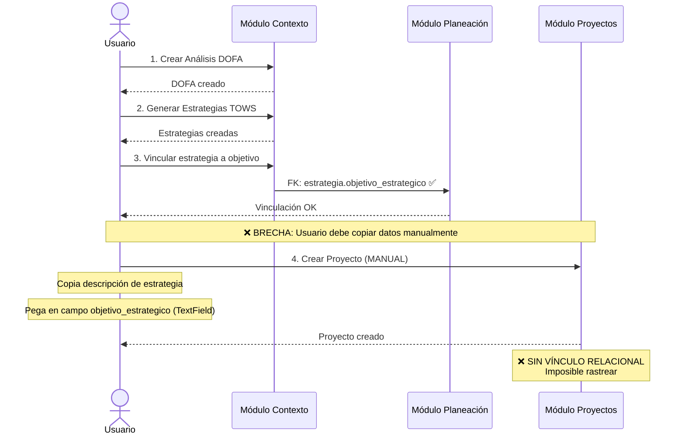
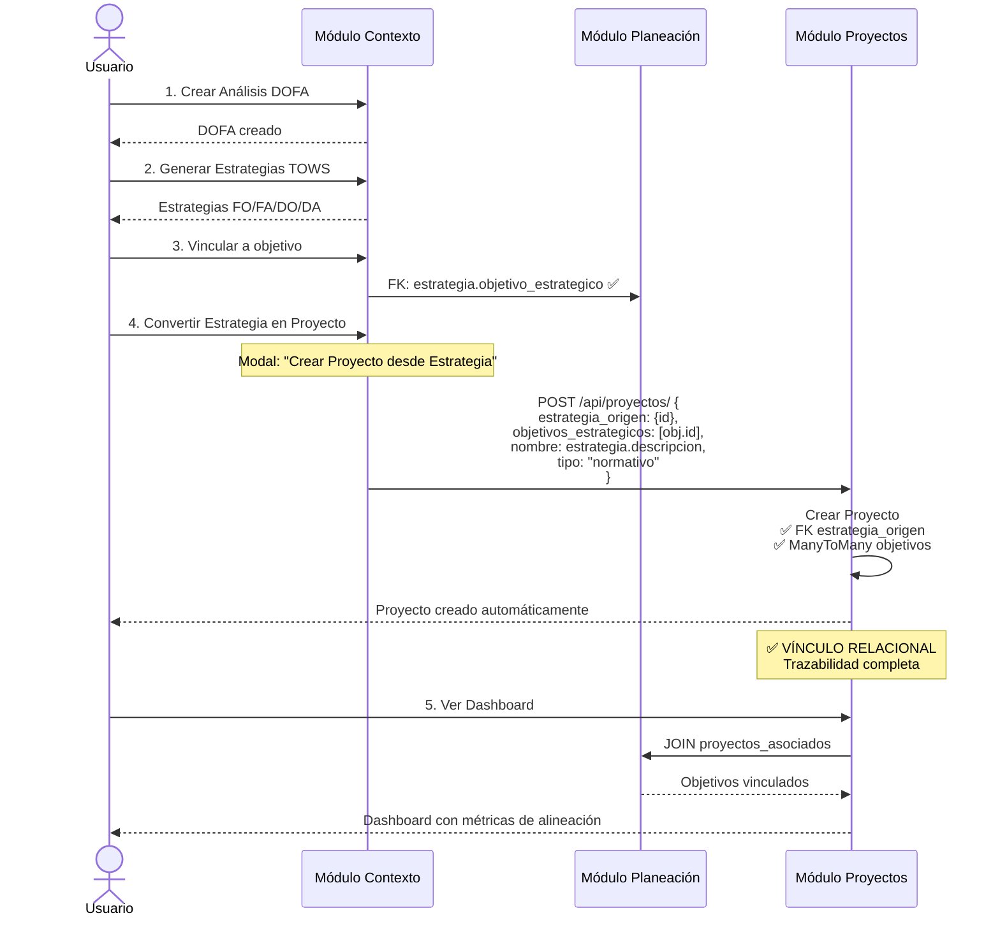

# Diagrama de Flujo de Datos Estratégico: Estado Actual vs Propuesto

**Fecha**: 2026-01-23
**Autor**: Claude Sonnet 4.5 - Data Architect
**Relacionado**: ANALISIS_ARQUITECTURA_DATOS_PLANEACION_PMI.md

---

## 1. DIAGRAMA DE FLUJO ACTUAL (AS-IS)

```
┌─────────────────────────────────────────────────────────────────────────┐
│                         CAPA 1: CONFIGURACIÓN                           │
│                          (Multi-Tenant Root)                            │
├─────────────────────────────────────────────────────────────────────────┤
│                                                                         │
│  ┌──────────────┐  ┌────────────┐  ┌──────────────┐  ┌─────────────┐  │
│  │ EmpresaConfig│  │ NormaISO   │  │ TipoCambio   │  │ Cargo       │  │
│  │ (Tenant)     │  │ (Catálogo) │  │ (Catálogo)   │  │ (Puestos)   │  │
│  └──────┬───────┘  └──────┬─────┘  └──────┬───────┘  └──────┬──────┘  │
│         │                 │                │                 │          │
│         │                 │                │                 │          │
└─────────┼─────────────────┼────────────────┼─────────────────┼──────────┘
          │                 │                │                 │
          │                 │                │                 │
          ↓                 ↓                ↓                 ↓
┌─────────────────────────────────────────────────────────────────────────┐
│                      CAPA 2: IDENTIDAD CORPORATIVA                      │
├─────────────────────────────────────────────────────────────────────────┤
│                                                                         │
│         ┌───────────────────────────────────────────┐                  │
│         │      CorporateIdentity (OneToOne)         │                  │
│         │  • Misión / Visión                        │                  │
│         │  • Alcance General del SIG                │                  │
│         │  • Alcance Geográfico                     │                  │
│         └───────┬─────────────┬─────────────┬───────┘                  │
│                 │             │             │                          │
│                 ↓             ↓             ↓                          │
│     ┌───────────────┐ ┌──────────────┐ ┌────────────────┐             │
│     │ AlcanceSistema│ │ Políticas    │ │ CorporateValue │             │
│     │ (por ISO)     │ │ Específicas  │ │ (Valores)      │             │
│     │               │ │ + Integrales │ │                │             │
│     └───────────────┘ └──────────────┘ └────────────────┘             │
│                                                                         │
└─────────────────────────────────────────────────────────────────────────┘
          │                                           │
          │                                           │
          ↓                                           ↓
┌─────────────────────────────────┐  ┌────────────────────────────────────┐
│  CAPA 3: ESTRUCTURA             │  │  CAPA 4: CONTEXTO ORGANIZACIONAL   │
│  ORGANIZACIONAL                 │  │  (Motor de Riesgos)                │
├─────────────────────────────────┤  ├────────────────────────────────────┤
│                                 │  │                                    │
│  ┌──────────────────┐           │  │  ┌────────────────────┐            │
│  │ Area             │           │  │  │ AnalisisDOFA       │            │
│  │ (Jerarquía)      │           │  │  │  ├─ FactorDOFA     │            │
│  │  • code          │           │  │  │  │   (F/O/D/A)     │            │
│  │  • parent        │───────────┼──┼──│  │   ├─ area: FK ✅ │            │
│  │  • manager       │           │  │  │  │                 │            │
│  │  • cost_center   │           │  │  │  ├─ EstrategiaTOWS│            │
│  └──────────────────┘           │  │  │     (FO/FA/DO/DA)│            │
│                                 │  │  │     ├─ area: FK ✅│            │
│                                 │  │  │     ├─ objetivo: FK ✅          │
│                                 │  │  └────────────────────┘            │
│                                 │  │                                    │
│                                 │  │  ┌────────────────────┐            │
│                                 │  │  │ AnalisisPESTEL     │            │
│                                 │  │  │  ├─ FactorPESTEL   │            │
│                                 │  │  │     (P/E/S/T/E/L)  │            │
│                                 │  │  └────────────────────┘            │
│                                 │  │                                    │
│                                 │  │  ┌────────────────────┐            │
│                                 │  │  │ FuerzaPorter       │            │
│                                 │  │  │  (5 Fuerzas)       │            │
│                                 │  │  └────────────────────┘            │
│                                 │  │                                    │
└─────────────────────────────────┘  └────────────────────────────────────┘
          │                                           │
          │                                           │
          ↓                                           ↓
┌─────────────────────────────────────────────────────────────────────────┐
│                   CAPA 5: PLANEACIÓN ESTRATÉGICA (BSC)                  │
├─────────────────────────────────────────────────────────────────────────┤
│                                                                         │
│  ┌────────────────────────────────────────────────────────────┐         │
│  │ StrategicPlan                                              │         │
│  │  • period_type: ANUAL/BIANUAL/TRIANUAL/QUINQUENAL         │         │
│  │  • status: BORRADOR/EN_REVISION/APROBADO/VIGENTE/CERRADO  │         │
│  └───────┬────────────────────────────────────────────────────┘         │
│          │                                                              │
│          ↓                                                              │
│  ┌────────────────────────────────────────────────────────────┐         │
│  │ StrategicObjective (Objetivos BSC)                         │         │
│  │  • bsc_perspective: Financiera/Clientes/Procesos/Aprendizaje│        │
│  │  • normas_iso: ManyToMany(NormaISO) ✅                     │         │
│  │  • areas_responsables: ManyToMany(Area) ✅                 │         │
│  │  • responsible_cargo: FK(Cargo) ✅                         │         │
│  │  • progress: 0-100%                                        │         │
│  │  • status: PENDIENTE/EN_PROGRESO/COMPLETADO/RETRASADO     │         │
│  └───────┬─────────────┬──────────────────────────────────────┘         │
│          │             │                                                │
│          │             └─────────────┐                                  │
│          ↓                           ↓                                  │
│  ┌──────────────┐          ┌──────────────────┐                        │
│  │ KPIObjetivo  │          │ MapaEstrategico  │                        │
│  │  • formula   │          │  ├─ CausaEfecto  │                        │
│  │  • target    │          │     (Relaciones) │                        │
│  │  • semáforo  │          └──────────────────┘                        │
│  └──────┬───────┘                                                      │
│         │                                                               │
│         ↓                                                               │
│  ┌──────────────┐                                                      │
│  │ MedicionKPI  │                                                      │
│  │ (Historial)  │                                                      │
│  └──────────────┘                                                      │
│                                                                         │
│  ┌────────────────────────────────────────────────────────────┐         │
│  │ GestionCambio                                              │         │
│  │  • tipo_cambio: FK(TipoCambio) ✅                          │         │
│  │  • related_objectives: ManyToMany(StrategicObjective) ✅   │         │
│  └────────────────────────────────────────────────────────────┘         │
│                                                                         │
└─────────────────────────────────────────────────────────────────────────┘
                               ║
                               ║  ❌ GAP CRÍTICO
                               ║  NO HAY FLUJO DE DATOS
                               ║
                               ↓
┌─────────────────────────────────────────────────────────────────────────┐
│                       CAPA 6: PROYECTOS PMI                             │
├─────────────────────────────────────────────────────────────────────────┤
│                                                                         │
│  ┌────────────────────────────────────────────────────────────┐         │
│  │ Portafolio                                                 │         │
│  │  • objetivo_estrategico: TextField ❌                      │         │
│  │    (DEBERÍA SER: ManyToMany(StrategicObjective))          │         │
│  └───────┬────────────────────────────────────────────────────┘         │
│          │                                                              │
│          ↓                                                              │
│  ┌────────────────────────────────────────────────────────────┐         │
│  │ Programa                                                   │         │
│  └───────┬────────────────────────────────────────────────────┘         │
│          │                                                              │
│          ↓                                                              │
│  ┌────────────────────────────────────────────────────────────┐         │
│  │ Proyecto                                                   │         │
│  │  ❌ SIN FK a StrategicObjective                            │         │
│  │  ❌ SIN FK a EstrategiaTOWS                                │         │
│  │  • tipo: MEJORA/IMPLEMENTACION/DESARROLLO/NORMATIVO        │         │
│  │  • estado: PROPUESTO → COMPLETADO                          │         │
│  │  • porcentaje_avance: 0-100%                               │         │
│  └───────┬────────────────────────────────────────────────────┘         │
│          │                                                              │
│          ├──────────────┬──────────────┬──────────────┬────────┐        │
│          ↓              ↓              ↓              ↓        ↓        │
│  ┌──────────────┐ ┌──────────┐ ┌──────────┐ ┌────────┐ ┌──────┐        │
│  │ProjectCharter│ │Interesado│ │Fase      │ │Actividad│ │Riesgo│        │
│  │(Acta)        │ │❌ SIN FK │ │          │ │(WBS)    │ │❌ SIN FK      │
│  │              │ │a Partes  │ │          │ │         │ │a Risk │       │
│  └──────────────┘ └──────────┘ └──────────┘ └────────┘ └──────┘        │
│                                                                         │
└─────────────────────────────────────────────────────────────────────────┘
```

---

## 2. DIAGRAMA DE FLUJO PROPUESTO (TO-BE)

```
┌─────────────────────────────────────────────────────────────────────────┐
│                         CAPA 1: CONFIGURACIÓN                           │
├─────────────────────────────────────────────────────────────────────────┤
│  ┌──────────────┐  ┌────────────┐  ┌──────────────┐  ┌─────────────┐  │
│  │ EmpresaConfig│  │ NormaISO   │  │ TipoCambio   │  │ Cargo       │  │
│  └──────┬───────┘  └──────┬─────┘  └──────┬───────┘  └──────┬──────┘  │
└─────────┼─────────────────┼────────────────┼─────────────────┼──────────┘
          ↓                 ↓                ↓                 ↓
┌─────────────────────────────────────────────────────────────────────────┐
│                      CAPA 2: IDENTIDAD CORPORATIVA                      │
├─────────────────────────────────────────────────────────────────────────┤
│         ┌───────────────────────────────────────────┐                  │
│         │      CorporateIdentity                    │                  │
│         └───────┬─────────────┬─────────────┬───────┘                  │
│                 ↓             ↓             ↓                          │
│     ┌───────────────┐ ┌──────────────┐ ┌────────────────┐             │
│     │ AlcanceSistema│ │ Políticas    │ │ CorporateValue │             │
│     └───────────────┘ └──────────────┘ └────────────────┘             │
└─────────────────────────────────────────────────────────────────────────┘
          ↓                                           ↓
┌─────────────────────────────────┐  ┌────────────────────────────────────┐
│  CAPA 3: ESTRUCTURA             │  │  CAPA 4: CONTEXTO ORGANIZACIONAL   │
├─────────────────────────────────┤  ├────────────────────────────────────┤
│  ┌──────────────────┐           │  │  ┌────────────────────┐            │
│  │ Area             │◄──────────┼──┼──┤ FactorDOFA         │            │
│  │                  │◄──────────┼──┼──┤   ├─ area: FK ✅   │            │
│  └──────────────────┘           │  │  │                    │            │
│                                 │  │  │ EstrategiaTOWS     │            │
│                                 │  │  │   ├─ area: FK ✅   │            │
│                                 │  │  │   ├─ objetivo: FK ✅│           │
│                                 │  │  │   ╚═══════════════╗│            │
│                                 │  │  └───────────────────╫┘            │
│                                 │  │                      ║              │
└─────────────────────────────────┘  └──────────────────────╫──────────────┘
          ↓                                                 ║
          ↓                                                 ║
┌─────────────────────────────────────────────────────────╬─────────────────┐
│                   CAPA 5: PLANEACIÓN ESTRATÉGICA        ║                 │
├─────────────────────────────────────────────────────────╬─────────────────┤
│  ┌────────────────────────────────────────────────────────────┐           │
│  │ StrategicPlan                                              │           │
│  └───────┬────────────────────────────────────────────────────┘           │
│          ↓                                                                │
│  ┌──────────────────────────────────────────────────────────────────┐    │
│  │ StrategicObjective ◄══════════════════════════════════════════╗  │    │
│  │  • bsc_perspective                                            ║  │    │
│  │  • normas_iso: ManyToMany ✅                                  ║  │    │
│  │  • areas_responsables: ManyToMany ✅                          ║  │    │
│  │  • proyectos_asociados: ← ManyToMany(Proyecto) ✅ NUEVO       ║  │    │
│  │  • portafolios: ← ManyToMany(Portafolio) ✅ NUEVO            ║  │    │
│  └───────┬──────────────────────────────────────────────────────╫──┘    │
│          │                                                       ║       │
│          ↓                                                       ║       │
│  ┌──────────────┐          ┌──────────────────┐                 ║       │
│  │ KPIObjetivo  │          │ MapaEstrategico  │                 ║       │
│  │  → MedicionKPI│         │  ├─ CausaEfecto  │                 ║       │
│  └──────────────┘          └──────────────────┘                 ║       │
│                                                                  ║       │
└──────────────────────────────────────────────────────────────────╫───────┘
                                                                   ║
                               ✅ FLUJO DE DATOS IMPLEMENTADO      ║
                               ══════════════════════════════════════
                                                                   ↓
┌─────────────────────────────────────────────────────────────────────────┐
│                       CAPA 6: PROYECTOS PMI                             │
├─────────────────────────────────────────────────────────────────────────┤
│                                                                         │
│  ┌────────────────────────────────────────────────────────────┐         │
│  │ Portafolio ✅ REFACTORIZADO                                │         │
│  │  • objetivos_estrategicos: ManyToMany(StrategicObjective) ✅│        │
│  │  • objetivo_estrategico_legacy: TextField (deprecated)     │         │
│  └───────┬────────────────────────────────────────────────────┘         │
│          │                                                              │
│          ↓                                                              │
│  ┌────────────────────────────────────────────────────────────┐         │
│  │ Programa ✅ NUEVO                                          │         │
│  │  • objetivos_estrategicos: ManyToMany(StrategicObjective) ✅│        │
│  └───────┬────────────────────────────────────────────────────┘         │
│          │                                                              │
│          ↓                                                              │
│  ┌────────────────────────────────────────────────────────────┐         │
│  │ Proyecto ✅ REFACTORIZADO                                  │         │
│  │  • objetivos_estrategicos: ManyToMany(StrategicObjective) ✅│        │
│  │  • estrategia_origen: FK(EstrategiaTOWS) ✅ NUEVO          │         │
│  │  • tipo: MEJORA/IMPLEMENTACION/DESARROLLO/NORMATIVO        │         │
│  │  • estado: PROPUESTO → COMPLETADO                          │         │
│  └───────┬────────────────────────────────────────────────────┘         │
│          │                                                              │
│          ├──────────────┬──────────────┬──────────────┬────────┐        │
│          ↓              ↓              ↓              ↓        ↓        │
│  ┌──────────────┐ ┌──────────┐ ┌──────────┐ ┌────────┐ ┌──────────┐    │
│  │ProjectCharter│ │Interesado│ │Fase      │ │Actividad│ │Riesgo    │    │
│  │              │ │ ✅ NUEVO │ │          │ │(WBS)    │ │ ✅ NUEVO │    │
│  │              │ │parte_int │ │          │ │         │ │riesgo_corp│   │
│  │              │ │FK ✅     │ │          │ │         │ │FK ✅      │   │
│  └──────────────┘ └──────────┘ └──────────┘ └────────┘ └──────────┘    │
│                                                                         │
│  NUEVAS CAPACIDADES:                                                    │
│  • Rastrear alineación estratégica de proyectos                        │
│  • Medir cumplimiento de objetivos mediante proyectos                  │
│  • Priorizar proyectos por impacto estratégico                         │
│  • Consolidar riesgos corporativos vs riesgos de proyecto              │
│  • Vincular partes interesadas corporativas con proyectos              │
│                                                                         │
└─────────────────────────────────────────────────────────────────────────┘
```

---

## 3. COMPARATIVA DE CAPACIDADES

### 3.1 Queries IMPOSIBLES en Estado Actual

| Query | Por qué es Imposible |
|-------|---------------------|
| **"Listar proyectos del objetivo OE-001"** | `Proyecto` NO tiene FK a `StrategicObjective` |
| **"Calcular % cumplimiento del objetivo via proyectos"** | Sin relación, imposible JOIN |
| **"Portafolios de la perspectiva Financiera"** | `Portafolio.objetivo_estrategico` es TextField |
| **"Proyectos sin objetivo estratégico"** | Sin FK, todos los proyectos están "desvinculados" |
| **"Presupuesto total por objetivo"** | Imposible SUM sin relación |
| **"Riesgos corporativos materializados en proyectos"** | `RiesgoProyecto` NO tiene FK a `Risk` |
| **"Partes interesadas en múltiples proyectos"** | `InteresadoProyecto` NO tiene FK central |

### 3.2 Queries HABILITADAS por Refactorización

```python
# Query 1: Proyectos por Objetivo Estratégico
objetivo = StrategicObjective.objects.get(code='OE-001')
proyectos = objetivo.proyectos_asociados.all()
# SQL: SELECT * FROM proyecto p
#      INNER JOIN proyecto_objetivos po ON po.proyecto_id = p.id
#      WHERE po.strategicobjective_id = {objetivo.id}

# Query 2: Cumplimiento de Objetivo
objetivo = StrategicObjective.objects.get(code='OE-001')
total = objetivo.proyectos_asociados.count()
completados = objetivo.proyectos_asociados.filter(
    estado=Proyecto.Estado.COMPLETADO
).count()
cumplimiento_pct = (completados / total) * 100 if total > 0 else 0

# Query 3: Portafolios por Perspectiva BSC
from django.db.models import Q

portafolios_financieros = Portafolio.objects.filter(
    objetivos_estrategicos__bsc_perspective='FINANCIERA'
).distinct()

# Query 4: Presupuesto Total por Objetivo
from django.db.models import Sum

presupuesto_objetivo = StrategicObjective.objects.filter(
    code='OE-001'
).aggregate(
    presupuesto_total=Sum('proyectos_asociados__presupuesto_aprobado'),
    presupuesto_ejecutado=Sum('proyectos_asociados__costo_real')
)

# Query 5: Objetivos sin Proyectos (GAP Analysis)
objetivos_sin_proyectos = StrategicObjective.objects.annotate(
    num_proyectos=Count('proyectos_asociados')
).filter(num_proyectos=0, is_active=True)

# Query 6: Proyectos de Estrategias TOWS
estrategia = EstrategiaTOWS.objects.get(tipo='FO', descripcion__contains='Digital')
proyectos_derivados = estrategia.proyectos_derivados.all()

# Query 7: Riesgos Corporativos en Proyectos
riesgos_extremos = RiesgoProyecto.objects.filter(
    riesgo_corporativo__nivel_riesgo__gte=15,  # Riesgos extremos
    is_materializado=False
).select_related('proyecto', 'riesgo_corporativo')

# Query 8: Dashboard Ejecutivo - Cobertura Estratégica
from django.db.models import Avg, Count, Sum

dashboard = StrategicObjective.objects.filter(
    plan__status='VIGENTE',
    is_active=True
).annotate(
    num_proyectos=Count('proyectos_asociados'),
    presupuesto_total=Sum('proyectos_asociados__presupuesto_aprobado'),
    avance_promedio=Avg('proyectos_asociados__porcentaje_avance')
).values(
    'code', 'name', 'bsc_perspective',
    'num_proyectos', 'presupuesto_total', 'avance_promedio'
)
```

---

## 4. MATRIZ DE IMPACTO DE LA REFACTORIZACIÓN

### 4.1 Impacto en Módulos

| Módulo | Impacto | Cambios Requeridos | Esfuerzo |
|--------|---------|-------------------|----------|
| **Planeación Estratégica** | Alto | Agregar `related_name='proyectos_asociados'` en modelos | Bajo (0.5 días) |
| **Proyectos PMI** | Crítico | Agregar FK, migrar datos, actualizar serializers | Alto (5 días) |
| **Motor Riesgos** | Medio | Agregar `related_name='riesgos_proyecto'` | Bajo (0.5 días) |
| **Motor Cumplimiento** | Medio | Agregar `related_name='proyectos'` | Bajo (0.5 días) |
| **Analytics** | Alto | Crear nuevas vistas materializadas | Medio (3 días) |
| **Frontend (React)** | Crítico | Actualizar formularios, dashboards, selectores | Alto (8 días) |

### 4.2 Beneficios Cuantificables

| Beneficio | Métrica | Valor Actual | Valor Post-Refactorización |
|-----------|---------|--------------|---------------------------|
| **Queries JOIN** | Tiempo de respuesta | N/A (imposible) | <200ms (con índices) |
| **Dashboards Estratégicos** | Disponibles | 0 | 5 dashboards nuevos |
| **Trazabilidad** | Proyectos rastreables | 0% | 100% |
| **Duplicación de Datos** | Riesgos duplicados | ~30% | 0% (FK a tabla central) |
| **Reportes Ejecutivos** | Generables | Manual (Excel) | Automáticos (SQL) |
| **Alineación Estratégica** | Medible | No | Sí (% cumplimiento) |

---

## 5. DIAGRAMA DE SECUENCIA: CREACIÓN DE PROYECTO DESDE ESTRATEGIA

### 5.1 Flujo AS-IS (Actual - Manual)



### 5.2 Flujo TO-BE (Propuesto - Automatizado)



---

## 6. CÓDIGO DE IMPLEMENTACIÓN

### 6.1 Modelos Refactorizados

```python
# ============================================================================
# ARCHIVO: backend/apps/gestion_estrategica/gestion_proyectos/models.py
# ============================================================================

from django.db import models
from django.conf import settings
from django.core.validators import MinValueValidator, MaxValueValidator
from apps.core.base_models import BaseCompanyModel


class Portafolio(BaseCompanyModel):
    """Agrupación estratégica de programas y proyectos"""

    codigo = models.CharField(max_length=20, verbose_name='Código')
    nombre = models.CharField(max_length=200, verbose_name='Nombre')
    descripcion = models.TextField(blank=True, verbose_name='Descripción')

    # ✅ NUEVO: Vinculación estratégica
    objetivos_estrategicos = models.ManyToManyField(
        'planeacion.StrategicObjective',
        blank=True,
        related_name='portafolios',
        verbose_name='Objetivos Estratégicos',
        help_text='Objetivos del BSC que este portafolio apoya'
    )

    # DEPRECATED: Campo legacy para migración
    objetivo_estrategico_legacy = models.TextField(
        blank=True,
        verbose_name='[DEPRECATED] Objetivo Estratégico (texto)',
        help_text='Migrado a objetivos_estrategicos (ManyToMany). Ver migración 000X.'
    )

    presupuesto_asignado = models.DecimalField(
        max_digits=18, decimal_places=2, default=0,
        verbose_name='Presupuesto Asignado'
    )
    responsable = models.ForeignKey(
        settings.AUTH_USER_MODEL, on_delete=models.SET_NULL,
        null=True, blank=True, related_name='portafolios_responsable'
    )
    fecha_inicio = models.DateField(null=True, blank=True)
    fecha_fin = models.DateField(null=True, blank=True)

    class Meta:
        verbose_name = 'Portafolio'
        verbose_name_plural = 'Portafolios'
        unique_together = ['empresa', 'codigo']
        ordering = ['nombre']
        db_table = 'gestion_proyectos_portafolio'
        indexes = [
            models.Index(fields=['empresa', 'is_active'], name='portafolio_emp_act_idx'),
        ]

    def __str__(self):
        return f"{self.codigo} - {self.nombre}"

    @property
    def num_objetivos(self):
        """Número de objetivos estratégicos vinculados"""
        return self.objetivos_estrategicos.count()

    @property
    def perspectivas_bsc(self):
        """Lista de perspectivas BSC cubiertas"""
        return self.objetivos_estrategicos.values_list(
            'bsc_perspective', flat=True
        ).distinct()


class Programa(BaseCompanyModel):
    """Agrupación de proyectos relacionados"""

    portafolio = models.ForeignKey(
        Portafolio, on_delete=models.CASCADE,
        related_name='programas', verbose_name='Portafolio'
    )
    codigo = models.CharField(max_length=20, verbose_name='Código')
    nombre = models.CharField(max_length=200, verbose_name='Nombre')
    descripcion = models.TextField(blank=True, verbose_name='Descripción')

    # ✅ NUEVO: Vinculación estratégica
    objetivos_estrategicos = models.ManyToManyField(
        'planeacion.StrategicObjective',
        blank=True,
        related_name='programas',
        verbose_name='Objetivos Estratégicos',
        help_text='Objetivos del BSC que este programa apoya'
    )

    responsable = models.ForeignKey(
        settings.AUTH_USER_MODEL, on_delete=models.SET_NULL,
        null=True, blank=True, related_name='programas_responsable'
    )
    presupuesto = models.DecimalField(
        max_digits=18, decimal_places=2, default=0, verbose_name='Presupuesto'
    )
    fecha_inicio = models.DateField(null=True, blank=True)
    fecha_fin = models.DateField(null=True, blank=True)

    class Meta:
        verbose_name = 'Programa'
        verbose_name_plural = 'Programas'
        unique_together = ['empresa', 'codigo']
        ordering = ['nombre']
        db_table = 'gestion_proyectos_programa'

    def __str__(self):
        return f"{self.codigo} - {self.nombre}"


class Proyecto(BaseCompanyModel):
    """Proyecto individual - Entidad principal"""

    class Estado(models.TextChoices):
        PROPUESTO = 'propuesto', 'Propuesto'
        INICIACION = 'iniciacion', 'Iniciación'
        PLANIFICACION = 'planificacion', 'Planificación'
        EJECUCION = 'ejecucion', 'Ejecución'
        MONITOREO = 'monitoreo', 'Monitoreo y Control'
        CIERRE = 'cierre', 'Cierre'
        COMPLETADO = 'completado', 'Completado'
        CANCELADO = 'cancelado', 'Cancelado'
        SUSPENDIDO = 'suspendido', 'Suspendido'

    class Prioridad(models.TextChoices):
        ALTA = 'alta', 'Alta'
        MEDIA = 'media', 'Media'
        BAJA = 'baja', 'Baja'

    class TipoProyecto(models.TextChoices):
        MEJORA = 'mejora', 'Mejora Continua'
        IMPLEMENTACION = 'implementacion', 'Implementación'
        DESARROLLO = 'desarrollo', 'Desarrollo'
        INFRAESTRUCTURA = 'infraestructura', 'Infraestructura'
        NORMATIVO = 'normativo', 'Cumplimiento Normativo'
        OTRO = 'otro', 'Otro'

    programa = models.ForeignKey(
        Programa, on_delete=models.SET_NULL, null=True, blank=True,
        related_name='proyectos', verbose_name='Programa'
    )
    codigo = models.CharField(max_length=30, verbose_name='Código')
    nombre = models.CharField(max_length=200, verbose_name='Nombre')
    descripcion = models.TextField(blank=True, verbose_name='Descripción')
    tipo = models.CharField(
        max_length=20, choices=TipoProyecto.choices,
        default=TipoProyecto.MEJORA, verbose_name='Tipo de Proyecto'
    )
    estado = models.CharField(
        max_length=20, choices=Estado.choices,
        default=Estado.PROPUESTO, db_index=True, verbose_name='Estado'
    )
    prioridad = models.CharField(
        max_length=10, choices=Prioridad.choices,
        default=Prioridad.MEDIA, verbose_name='Prioridad'
    )

    # ========================================================================
    # ✅ NUEVO: VINCULACIÓN ESTRATÉGICA
    # ========================================================================
    objetivos_estrategicos = models.ManyToManyField(
        'planeacion.StrategicObjective',
        blank=True,
        related_name='proyectos_asociados',
        verbose_name='Objetivos Estratégicos',
        help_text='Objetivos del plan estratégico que este proyecto apoya',
        db_table='gestion_proyectos_proyecto_objetivos'
    )

    estrategia_origen = models.ForeignKey(
        'contexto.EstrategiaTOWS',
        on_delete=models.SET_NULL,
        null=True,
        blank=True,
        related_name='proyectos_derivados',
        verbose_name='Estrategia TOWS Origen',
        help_text='Estrategia TOWS que originó este proyecto (si aplica)',
        db_index=True
    )
    # ========================================================================

    # Fechas
    fecha_propuesta = models.DateField(auto_now_add=True)
    fecha_inicio_plan = models.DateField(null=True, blank=True)
    fecha_fin_plan = models.DateField(null=True, blank=True)
    fecha_inicio_real = models.DateField(null=True, blank=True)
    fecha_fin_real = models.DateField(null=True, blank=True)

    # Recursos
    presupuesto_estimado = models.DecimalField(
        max_digits=18, decimal_places=2, default=0
    )
    presupuesto_aprobado = models.DecimalField(
        max_digits=18, decimal_places=2, default=0
    )
    costo_real = models.DecimalField(
        max_digits=18, decimal_places=2, default=0
    )

    # Avance
    porcentaje_avance = models.PositiveSmallIntegerField(
        default=0,
        validators=[MinValueValidator(0), MaxValueValidator(100)]
    )

    # Responsables
    sponsor = models.ForeignKey(
        settings.AUTH_USER_MODEL, on_delete=models.SET_NULL,
        null=True, blank=True, related_name='proyectos_sponsor'
    )
    gerente_proyecto = models.ForeignKey(
        settings.AUTH_USER_MODEL, on_delete=models.SET_NULL,
        null=True, blank=True, related_name='proyectos_gerente'
    )

    # ✅ NUEVO: Cargos de responsables (normalización)
    sponsor_cargo = models.ForeignKey(
        'core.Cargo', on_delete=models.SET_NULL,
        null=True, blank=True,
        related_name='proyectos_sponsor_cargo',
        verbose_name='Cargo del Sponsor'
    )
    gerente_cargo = models.ForeignKey(
        'core.Cargo', on_delete=models.SET_NULL,
        null=True, blank=True,
        related_name='proyectos_gerente_cargo',
        verbose_name='Cargo del Gerente'
    )

    justificacion = models.TextField(blank=True)
    beneficios_esperados = models.TextField(blank=True)

    class Meta:
        verbose_name = 'Proyecto'
        verbose_name_plural = 'Proyectos'
        unique_together = ['empresa', 'codigo']
        ordering = ['-created_at']
        db_table = 'gestion_proyectos_proyecto'
        indexes = [
            models.Index(fields=['empresa', 'estado'], name='proy_emp_est_idx'),
            models.Index(fields=['empresa', 'prioridad'], name='proy_emp_pri_idx'),
            # ✅ NUEVO: Índice para FK estrategia
            models.Index(fields=['estrategia_origen'], name='proy_estrategia_idx'),
        ]

    def __str__(self):
        return f"{self.codigo} - {self.nombre}"

    @property
    def variacion_costo(self):
        """CV = EV - AC (Earned Value - Actual Cost)"""
        return self.presupuesto_aprobado * (self.porcentaje_avance / 100) - self.costo_real

    @property
    def indice_desempeno_costo(self):
        """CPI = EV / AC"""
        if self.costo_real > 0:
            ev = self.presupuesto_aprobado * (self.porcentaje_avance / 100)
            return round(ev / float(self.costo_real), 2)
        return 1.0

    @property
    def perspectivas_bsc_cubiertas(self):
        """Lista de perspectivas BSC que este proyecto cubre"""
        return self.objetivos_estrategicos.values_list(
            'bsc_perspective', flat=True
        ).distinct()

    @property
    def normas_iso_aplicables(self):
        """Normas ISO aplicables según objetivos vinculados"""
        from apps.gestion_estrategica.configuracion.models import NormaISO
        return NormaISO.objects.filter(
            objetivos_estrategicos__in=self.objetivos_estrategicos.all()
        ).distinct()


class RiesgoProyecto(models.Model):
    """Riesgos del proyecto"""

    # ... campos existentes ...

    proyecto = models.ForeignKey(
        Proyecto, on_delete=models.CASCADE, related_name='riesgos'
    )
    codigo = models.CharField(max_length=20)
    tipo = models.CharField(max_length=15, choices=...)
    descripcion = models.TextField()
    probabilidad = models.CharField(max_length=15, choices=...)
    impacto = models.CharField(max_length=15, choices=...)

    # ✅ NUEVO: Vinculación con Motor de Riesgos
    riesgo_corporativo = models.ForeignKey(
        'motor_riesgos.Risk',
        on_delete=models.SET_NULL,
        null=True,
        blank=True,
        related_name='riesgos_proyecto',
        verbose_name='Riesgo Corporativo',
        help_text='Riesgo corporativo al que se vincula (si aplica)',
        db_index=True
    )

    # ... resto de campos ...

    class Meta:
        verbose_name = 'Riesgo del Proyecto'
        verbose_name_plural = 'Riesgos del Proyecto'
        unique_together = ['proyecto', 'codigo']
        indexes = [
            # ✅ NUEVO: Índice para FK riesgo corporativo
            models.Index(
                fields=['riesgo_corporativo', 'is_materializado'],
                name='riesgo_proy_corp_mat_idx'
            ),
        ]


class InteresadoProyecto(models.Model):
    """Stakeholders del proyecto"""

    # ... campos existentes ...

    proyecto = models.ForeignKey(
        Proyecto, on_delete=models.CASCADE, related_name='interesados'
    )
    nombre = models.CharField(max_length=200)
    cargo_rol = models.CharField(max_length=100, blank=True)

    # ✅ NUEVO: Vinculación con Registro Central de Partes Interesadas
    parte_interesada = models.ForeignKey(
        'motor_cumplimiento.ParteInteresada',
        on_delete=models.SET_NULL,
        null=True,
        blank=True,
        related_name='proyectos',
        verbose_name='Parte Interesada Corporativa',
        help_text='Referencia al registro central de partes interesadas',
        db_index=True
    )

    # ... resto de campos ...
```

---

## 7. MÉTRICAS Y DASHBOARDS HABILITADOS

### 7.1 Dashboard: Cobertura Estratégica

```python
# backend/apps/analytics/dashboard_gerencial/views.py

from django.db.models import Count, Sum, Avg, Q, F
from apps.gestion_estrategica.planeacion.models import StrategicObjective
from apps.gestion_estrategica.gestion_proyectos.models import Proyecto


def dashboard_cobertura_estrategica(request):
    """
    Dashboard de cobertura estratégica del plan.

    Muestra qué objetivos tienen proyectos asociados y su nivel de avance.
    """
    plan_activo = StrategicPlan.get_active()

    cobertura = StrategicObjective.objects.filter(
        plan=plan_activo,
        is_active=True
    ).annotate(
        num_proyectos=Count('proyectos_asociados'),
        presupuesto_total=Sum('proyectos_asociados__presupuesto_aprobado'),
        costo_real_total=Sum('proyectos_asociados__costo_real'),
        avance_promedio=Avg('proyectos_asociados__porcentaje_avance'),
        proyectos_completados=Count(
            'proyectos_asociados',
            filter=Q(proyectos_asociados__estado='completado')
        ),
        proyectos_en_ejecucion=Count(
            'proyectos_asociados',
            filter=Q(proyectos_asociados__estado__in=['ejecucion', 'monitoreo'])
        )
    ).values(
        'code', 'name', 'bsc_perspective',
        'num_proyectos', 'presupuesto_total', 'costo_real_total',
        'avance_promedio', 'proyectos_completados', 'proyectos_en_ejecucion'
    ).order_by('bsc_perspective', 'code')

    # Calcular métricas agregadas por perspectiva BSC
    perspectivas = StrategicObjective.BSC_PERSPECTIVE_CHOICES
    resumen_bsc = []

    for perspectiva_code, perspectiva_nombre in perspectivas:
        objetivos_perspectiva = cobertura.filter(bsc_perspective=perspectiva_code)

        resumen_bsc.append({
            'perspectiva': perspectiva_nombre,
            'total_objetivos': objetivos_perspectiva.count(),
            'objetivos_con_proyectos': objetivos_perspectiva.filter(
                num_proyectos__gt=0
            ).count(),
            'total_proyectos': sum(o['num_proyectos'] for o in objetivos_perspectiva),
            'presupuesto_total': sum(
                o['presupuesto_total'] or 0 for o in objetivos_perspectiva
            ),
            'avance_promedio': sum(
                o['avance_promedio'] or 0 for o in objetivos_perspectiva
            ) / objetivos_perspectiva.count() if objetivos_perspectiva.count() > 0 else 0
        })

    return {
        'cobertura_objetivos': list(cobertura),
        'resumen_bsc': resumen_bsc,
        'plan': {
            'name': plan_activo.name,
            'period_type': plan_activo.period_type,
            'start_date': plan_activo.start_date,
            'end_date': plan_activo.end_date,
            'progress': plan_activo.progress
        }
    }
```

### 7.2 KPIs Calculables

| KPI | Fórmula | Código |
|-----|---------|--------|
| **Cobertura de Objetivos** | `(Objetivos con Proyectos / Total Objetivos) * 100` | `objetivos.filter(num_proyectos__gt=0).count() / objetivos.count() * 100` |
| **Cumplimiento Estratégico** | `(Proyectos Completados / Total Proyectos) * 100` | `proyectos.filter(estado='completado').count() / proyectos.count() * 100` |
| **ROI por Objetivo** | `(Beneficios / Costo) * 100` | `SUM(proyectos.beneficios) / SUM(proyectos.costo_real) * 100` |
| **Varianza Presupuestaria** | `Presupuesto Aprobado - Costo Real` | `SUM(presupuesto_aprobado) - SUM(costo_real)` |
| **Índice de Alineación** | `Proyectos con Objetivo / Total Proyectos` | `proyectos.filter(objetivos__isnull=False).count() / proyectos.count()` |

---

## 8. CRONOGRAMA DE IMPLEMENTACIÓN

### Sprint N (2 semanas) - CRÍTICO

**Semana 1:**
- [x] Análisis de arquitectura (COMPLETADO - este documento)
- [ ] Diseño de modelos refactorizados
- [ ] Crear migrations con `null=True, blank=True`
- [ ] Agregar campos `*_legacy`
- [ ] Ejecutar migrations en DEV

**Semana 2:**
- [ ] Escribir script de migración de datos
- [ ] Ejecutar migración de datos en DEV
- [ ] Validar integridad referencial
- [ ] Actualizar serializers
- [ ] Actualizar viewsets
- [ ] Tests unitarios

### Sprint N+1 (2 semanas) - ALTO

**Semana 1:**
- [ ] Actualizar formularios frontend (Proyecto, Portafolio)
- [ ] Crear selector de Objetivos Estratégicos
- [ ] Crear modal "Convertir Estrategia en Proyecto"
- [ ] Tests de integración

**Semana 2:**
- [ ] Dashboard de Cobertura Estratégica
- [ ] Vistas de alineación BSC
- [ ] Reportes ejecutivos
- [ ] Documentación técnica

### Sprint N+2 (1 semana) - MEDIO

- [ ] Vincular RiesgoProyecto → Risk
- [ ] Vincular InteresadoProyecto → ParteInteresada
- [ ] Optimización de índices
- [ ] Vistas materializadas
- [ ] Capacitación a usuarios

---

**FIN DEL DOCUMENTO**

---

**Siguiente Paso**: Implementar migración de Portafolio y Proyecto según este diseño.

**Archivos Relacionados**:
- `ANALISIS_ARQUITECTURA_DATOS_PLANEACION_PMI.md` (análisis detallado)
- `backend/apps/gestion_estrategica/gestion_proyectos/models.py` (código a modificar)
- `backend/apps/gestion_estrategica/planeacion/models.py` (código a modificar)
